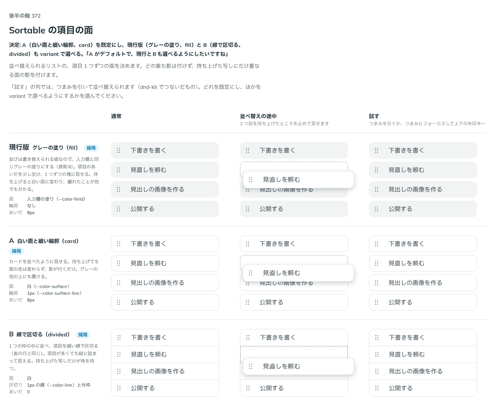

# 0337. Sortable の項目の面は白い面と細い輪郭（card）が既定

- ステータス: Accepted
- 日付: 2026-09-28
- ラウンド: 後半 軸 372

## 背景

Sortable の項目 1 つずつの面（通常時の塗りと輪郭）を、`variant` の候補で比べました。どの案も、持ち上げていない通常時には影を付けません（ページと同じレイヤー、原則1）。

## 候補

比較は、決めた時点のコミット `435d0ab` の比較のストーリー（`design/stories/axis-372-sortable-surface.stories.tsx`）です。列は通常・並べ替えの途中（2 つ目を持ち上げたところ）・試す（実際に dnd-kit で引ける）です。

| 案        | variant   | 内容                                                                                                                                                              |
| --------- | --------- | ----------------------------------------------------------------------------------------------------------------------------------------------------------------- |
| 現行版    | `fill`    | 入力欄と同じグレーの塗り（原則8）。項目のあいだを 8px 空ける。持ち上げると白い面に変わり、離れたことが色でも分かる                                                |
| A（採用） | `card`    | 白い面（`--color-surface`）と細い輪郭（`--color-surface-line`）。カードを並べたように見せる。持ち上げても面の色は変わらず、影が付くだけ。グレーの地の上にも置ける |
| B         | `divided` | 1 つの枠の中に並べ、項目を細い線で区切る（表の行と同じ）。項目が多くても縦に詰まって見える。持ち上げた写しだけが角を持つ                                          |

## 決定

**項目の面は `variant` で選べるようにし、既定は A（`card`、白い面と細い輪郭）にします。現行版（`fill`）と B（`divided`）も選べます。**

## 理由

ユーザーの返事の原文です。

> A がデフォルトで、現行とBも選べるようにしたいですね

## 影響

- `src/components/sortable/Sortable.tsx`: `variant`（`'card' | 'fill' | 'divided'`、既定 `'card'`）と型 `SortableVariant` を持ちます
- `design/stories/axis-372-sortable-surface.stories.tsx` は消しました

## 原則への反映

反映なし。`fill` は原則8「編集できる欄はグレーの塗り」に沿った書き換えられる値の見た目、`card` はページと同じレイヤーで影を付けない原則1の範囲内、`divided` は表の行の区切りと同じ扱いです。既定を 1 つ決め、ほかを選べるようにする点は原則20の範囲内です。

## 比較画像

決めた時点のコミットは `435d0ab` です。`git checkout 435d0ab && pnpm storybook` で、比較のストーリー（`Design Review/372 Sortableの項目の面`）を決めたときの部品のまま開けます。
