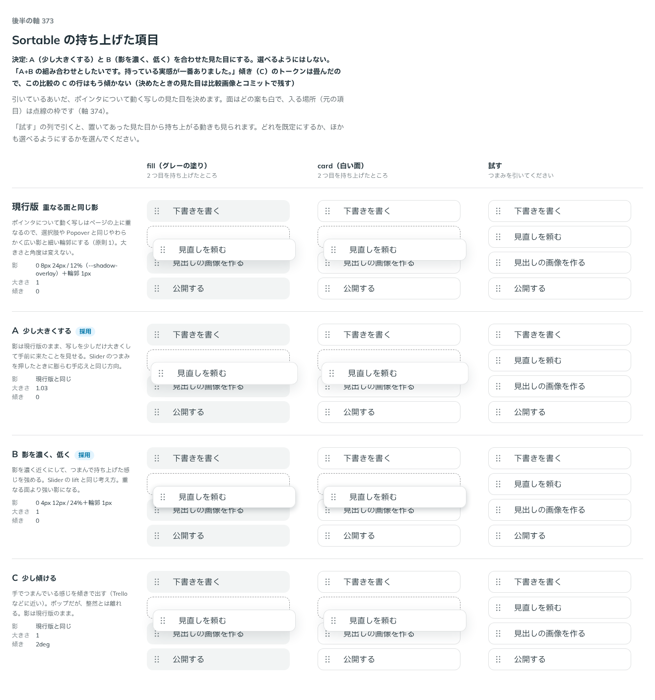

# 0338. Sortable の持ち上げた項目は、少し大きくして影を濃く近づける

- ステータス: Accepted
- 日付: 2026-09-28
- ラウンド: 後半 軸 373

## 背景

引いているあいだ、ポインタについて動く持ち上げた項目（dragging）の見た目を決めます。ページの上に重なるので、原則1の「重なる面」の扱いが基準になりますが、Sortable はつまんで持ち上げている実感も伝えたい部品です。軸 373 で、重なる面と同じ影のままにする案と、大きさ・影の濃さ・傾きを変える案を比べました。

## 候補

比較は、決めた時点のコミット `435d0ab` の比較のストーリー（`design/stories/axis-373-sortable-lifted.stories.tsx`）です。列は fill・card（それぞれ 2 つ目を持ち上げたところ）・試す（実際に引ける）です。

| 案                       | 影                                           | 大きさ | 傾き |
| ------------------------ | -------------------------------------------- | ------ | ---- |
| 現行版                   | 重なる面と同じやわらかく広い影＋輪郭 1px     | 1      | 0    |
| A                        | 現行版と同じ                                 | 1.03   | 0    |
| B                        | 濃く低い影（現行版より濃く近い）＋輪郭 1px   | 1      | 0    |
| C                        | 現行版と同じ                                 | 1      | 2deg |
| 採用: A + B の組み合わせ | 濃く低い影（重なる面より濃く近い）＋輪郭 1px | 1.03   | 0    |

## 決定

**持ち上げた項目は、A（少し大きくする）と B（影を濃く、低く）を組み合わせた見た目にします。選べるようにはしません。** 面は白（`--color-surface`）、少しだけ大きくし（1.03 倍）、影は重なる面の影（`--shadow-overlay`）より濃く近づけます。傾き（C）は採らず、比べるためだけに置いていたトークン（`--sortable-lifted-rotate`）は畳みました。

## 理由

ユーザーの返事の原文です。

> A+B の組み合わせとしたいです。持っている実感が一番ありました。

現行版の「重なる面と同じ影」は、選択肢や Popover と見分けがつかず、つまんで持ち上げている実感が薄いという評価でした。大きさと影を両方合わせることで、[ADR-0317](./0317-slider-press-effect.md)（Slider を押しているあいだ、つまみを膨らませる）と同じ「つかんで持ち上げる手応え」の方向になります。

## 影響

- `design/tokens.css`: `--sortable-lifted-shadow`（重なる面より濃く近い影）・`--sortable-lifted-scale`（1.03）を既定の値に畳みました。比べるために置いていた `--sortable-lifted-rotate` は消しました
- `src/components/sortable/Sortable.tsx`: 持ち上げた項目（`data-dragging`）に、少し大きくする・影を濃くする変化を、押す動きと同じ長さ・緩急で付けます。出るときは、置いてあった見た目（大きさ 1・影なし）から持ち上がります
- `design/stories/axis-373-sortable-lifted.stories.tsx` は消しました
- 比較の C（傾き）の行は、トークンを畳んだあとはもう傾きません。決めたときの見た目は比較画像とコミットで残します

## 原則への反映

**原則1 の文を書き換えました。** 「重なる面には、やわらかく広い影を付けます」の直後に、つまんで持ち上げて動かしているものも重なる面として扱い、影は重なる面よりも一段濃く近づけ、少しだけ大きくして、つかんでいる感触を出す旨を足しました（放すと元の高さに戻ります）。これまでの原則1 は、重なる面の影を「やわらかく広い影」の 1 種類だけで説明していましたが、Sortable の持ち上げた項目は意図してそれより濃く近い影にしており、既存の文のままでは説明できませんでした。

## 比較画像

決めた時点のコミットは `435d0ab` です。`git checkout 435d0ab && pnpm storybook` で、比較のストーリー（`Design Review/373 Sortableの持ち上げた項目`）を決めたときの部品のまま開けます。
