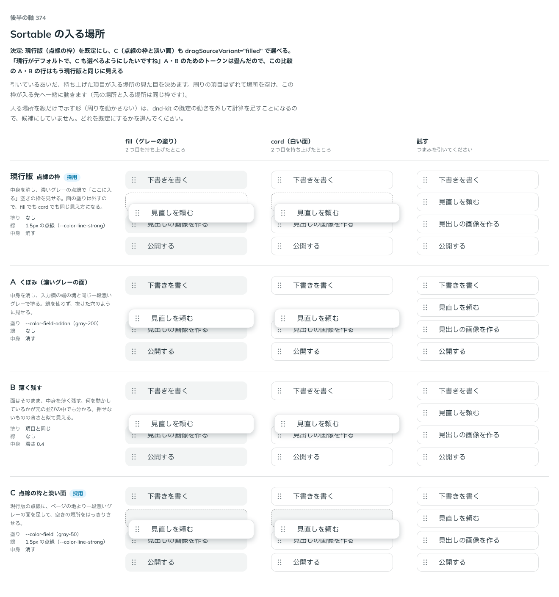

# 0339. Sortable の入る場所は点線の枠が既定（淡い面も選べる）

- ステータス: Accepted
- 日付: 2026-09-28
- ラウンド: 後半 軸 374

## 背景

引いているあいだ、元の項目が変わる「入る場所」（dragSource）の見た目を決めます。dnd-kit は元の項目を入る場所へ動かし、周りをずらして空けるので、元の場所と入る場所は同じ要素です。入る場所を線だけで示す形（周りを動かさない）は、dnd-kit の既定の動きを外して計算を足すことになるため、候補にしていません。

## 候補

比較は、決めた時点のコミット `435d0ab` の比較のストーリー（`design/stories/axis-374-sortable-drop-slot.stories.tsx`）です。列は fill・card（それぞれ 2 つ目を持ち上げたところ）・試す（実際に引ける）です。

| 案             | 塗り                                    | 線                                    | 中身            |
| -------------- | --------------------------------------- | ------------------------------------- | --------------- |
| 現行版（採用） | なし                                    | 1.5px の点線（`--color-line-strong`） | 消す            |
| A              | 濃いグレーの面（`--color-field-addon`） | なし                                  | 消す            |
| B              | 項目と同じ                              | なし                                  | 濃さ 0.4 で残す |
| C（採用）      | 淡いグレーの面（`--color-field`）       | 1.5px の点線（`--color-line-strong`） | 消す            |

## 決定

**現行版（点線の枠だけ）を既定にし、C（点線の枠＋淡い面）も `dragSourceVariant="filled"` で選べるようにします。** A・B は採りません。比べるために置いていたトークンは、A・B 用の分を畳みました。

## 理由

ユーザーの返事の原文です。

> 現行がデフォルトで、C も選べるようにしたいですね

## 影響

- `src/components/sortable/Sortable.tsx`・`SortableItem`: `dragSourceVariant`（`'outline' | 'filled'`、既定 `'outline'`）と型 `SortableDragSourceVariant` を持ちます
- `design/tokens.css`: `--sortable-source-line-width`・`--sortable-source-line-color` を既定の値（点線・`--color-line-strong`）に畳みました。A・B のために置いていたトークンは消しました
- `design/stories/axis-374-sortable-drop-slot.stories.tsx` は消しました。この比較の A・B の行は、トークンを畳んだあとはもう現行版と同じ見た目です

## 原則への反映

反映なし。読み取り専用の欄が塗りを持たせず破線の輪郭で形だけを残す扱い（原則8・原則12「線の種類や書き方で分ける」）と同じ、線の種類で「ここには値がない（入る予定の場所）」ことを表す考え方の範囲内です。既定を 1 つ決め、ほかを選べるようにする点は原則20の範囲内です。

## 比較画像

決めた時点のコミットは `435d0ab` です。`git checkout 435d0ab && pnpm storybook` で、比較のストーリー（`Design Review/374 Sortableの入る場所`）を決めたときの部品のまま開けます。
