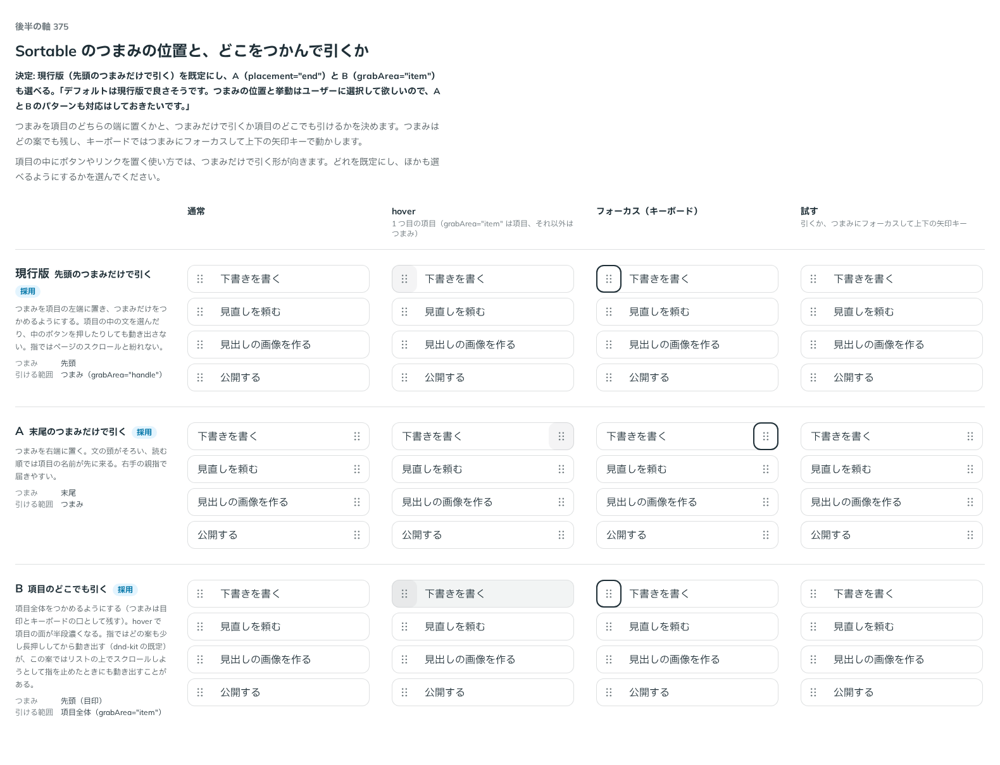

# 0340. Sortable のつまみは先頭のつまみだけで引くのが既定（末尾・項目全体も選べる）

- ステータス: Accepted
- 日付: 2026-09-28
- ラウンド: 後半 軸 375

## 背景

つまみを項目のどちらの端に置くか（`SortableHandle` の `placement`）と、つまみだけで引くか項目のどこでも引けるか（`grabArea`）を決めます。どの案もつまみは残します。キーボードで動かす口（フォーカスが止まる場所）を兼ねるためです。

## 候補

比較は、決めた時点のコミット `435d0ab` の比較のストーリー（`design/stories/axis-375-sortable-grab.stories.tsx`）です。列は通常・hover・フォーカス（キーボード）・試すです。

| 案             | つまみ       | 引ける範囲                    | 内容                                                                                                         |
| -------------- | ------------ | ----------------------------- | ------------------------------------------------------------------------------------------------------------ |
| 現行版（採用） | 先頭         | つまみ（`grabArea="handle"`） | 項目の中の文を選んだり、中のボタンを押したりしても動き出さない。指ではページのスクロールと紛れない           |
| A（採用）      | 末尾         | つまみ                        | 文の頭がそろい、読む順では項目の名前が先に来る。右手の親指で届きやすい                                       |
| B（採用）      | 先頭（目印） | 項目全体（`grabArea="item"`） | hover で項目の面が半段濃くなる。指ではリストの上でスクロールしようとして指を止めたときにも動き出すことがある |

## 決定

**現行版（先頭のつまみだけで引く）を既定にし、A（`placement="end"`）と B（`grabArea="item"`）も選べるようにします。**

## 理由

ユーザーの返事の原文です。

> デフォルトは現行版で良さそうです。つまみの位置と挙動はユーザーに選択して欲しいので、AとBのパターンも対応はしておきたいです。

## 影響

- `src/components/sortable/Sortable.tsx`: `grabArea`（`'handle' | 'item'`、既定 `'handle'`）と型 `SortableGrabArea` を持ちます
- `src/components/sortable/Sortable.tsx`（`SortableHandle`）: `placement`（`'start' | 'end'`、既定 `'start'`）を持ちます
- `grabArea="item"` では、`hover:` で項目の面を半段濃くします（原則3。入力欄と同じ手応え）
- `design/stories/axis-375-sortable-grab.stories.tsx` は消しました

## 原則への反映

反映なし。`grabArea="item"` の hover は原則3「hover は手応え、押すと沈む」の範囲内、つまみの端は原則20「既定を 1 つ決め、ほかの形は選べるようにする」の範囲内です。

## 比較画像

決めた時点のコミットは `435d0ab` です。`git checkout 435d0ab && pnpm storybook` で、比較のストーリー（`Design Review/375 Sortableのつまみ`）を決めたときの部品のまま開けます。
