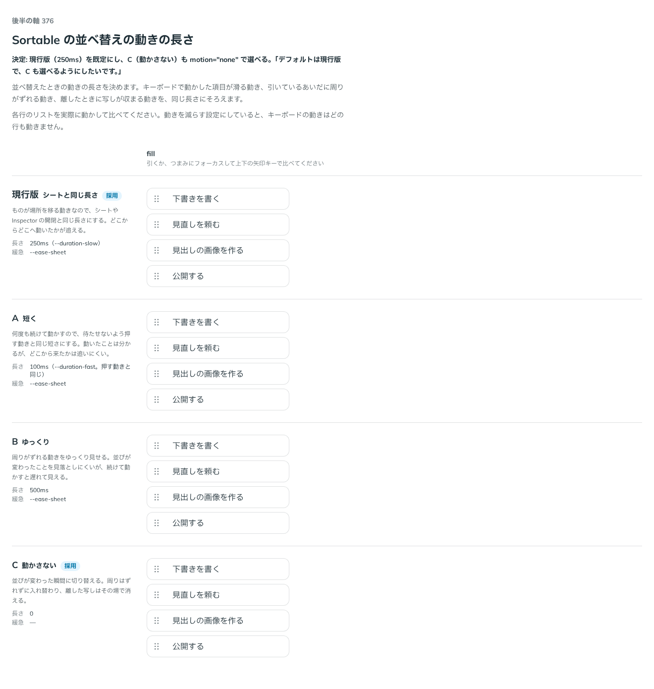

# 0341. Sortable の並べ替えの動きはシートと同じ長さが既定（動かさないも選べる）

- ステータス: Accepted
- 日付: 2026-09-28
- ラウンド: 後半 軸 376

## 背景

並べ替えたときの動きの長さを決めます。3 つの動き（キーボードで動かした項目が滑る動き、引いているあいだに周りがずれる動き、離したときに写しが収まる動き）を、同じ長さにそろえます。前の 2 つは Sortable 本体（`--sortable-move-duration`）、後の 2 つは dnd-kit を使うレシピ（`useSortable` の `transition`、`DragOverlay` の `dropAnimation`）が担います。

## 候補

比較は、決めた時点のコミット `435d0ab` の比較のストーリー（`design/stories/axis-376-sortable-motion.stories.tsx`）です。実際に引くか、つまみにフォーカスして上下の矢印キーで比べます。

| 案             | 長さ                                     | 内容                                                                                                  |
| -------------- | ---------------------------------------- | ----------------------------------------------------------------------------------------------------- |
| 現行版（採用） | 250ms（`--duration-slow`。シートと同じ） | ものが場所を移る動きなので、シートや Inspector の開閉と同じ長さにする。どこからどこへ動いたかが追える |
| A              | 100ms（押す動きと同じ）                  | 何度も続けて動かすので、待たせないよう短くする。動いたことは分かるが、どこから来たかは追いにくい      |
| B              | 500ms                                    | 周りがずれる動きをゆっくり見せる。並びが変わったことを見落としにくいが、続けて動かすと遅れて見える    |
| C（採用）      | 0（動かさない）                          | 並びが変わった瞬間に切り替える。周りはずれずに入れ替わり、離した写しはその場で消える                  |

## 決定

**現行版（250ms、シートと同じ長さ）を既定にし、C（`motion="none"`、動かさない）も選べるようにします。** A・B は採りません。

## 理由

ユーザーの返事の原文です。

> デフォルトは現行版で、C も選べるようにしたいです。

## 影響

- `src/components/sortable/Sortable.tsx`: `motion`（`'slide' | 'none'`、既定 `'slide'`）と型 `SortableMotion` を持ちます。`motion="none"` は `--sortable-move-duration` を 0 にします
- `src/recipes/sortable-dnd-kit.tsx`: `useSortable` の `transition` と `DragOverlay` の `dropAnimation` を、部品と同じ 250ms・`--ease-sheet` にそろえます。`motion="none"` にするときは、レシピ側にも `null` を渡す旨を Docs に書きます
- `design/stories/axis-376-sortable-motion.stories.tsx` は消しました

## 原則への反映

反映なし。原則14「場所をまっすぐ移る印（トグルのノブ、タブの印）は、滑らせます」の範囲内の長さの決定です。動きを選べることは原則14・20の範囲内です。

## 比較画像

決めた時点のコミットは `435d0ab` です。`git checkout 435d0ab && pnpm storybook` で、比較のストーリー（`Design Review/376 Sortableの動きの長さ`）を決めたときの部品のまま開けます。
