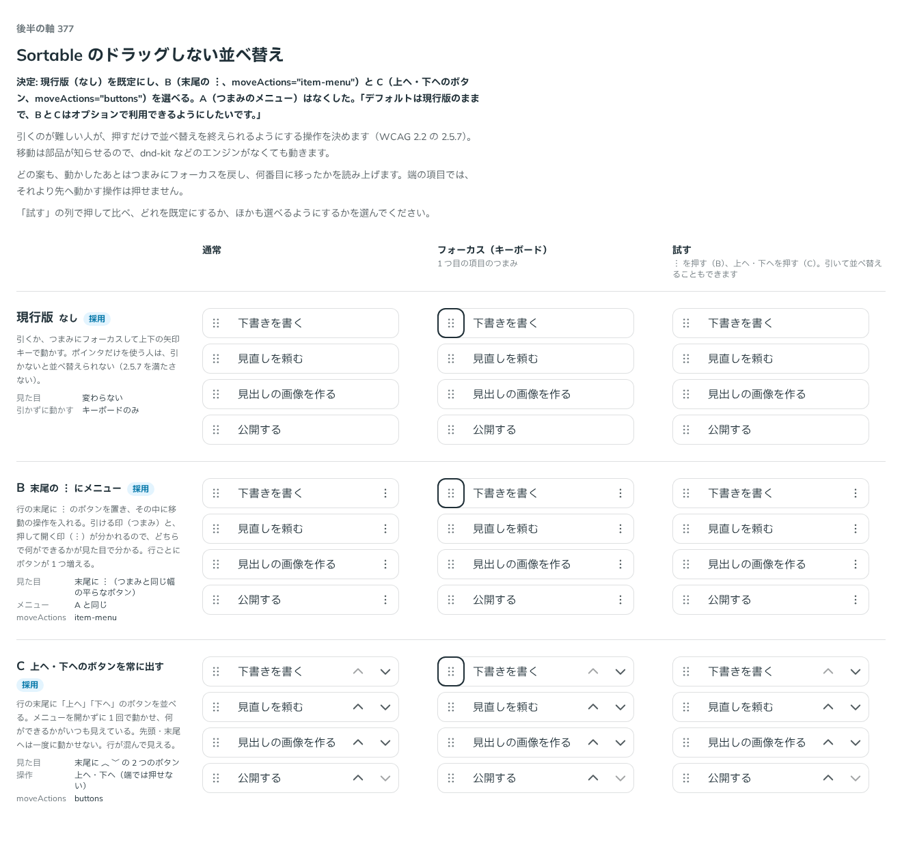

# 0342. Sortable のドラッグしない並べ替えは既定でなし（メニュー・ボタンも選べる）

- ステータス: Accepted
- 日付: 2026-09-28
- ラウンド: 後半 軸 377

## 背景

引くのが難しい人（ポインタだけを使う人）が、押すだけで並べ替えを終えられるようにする操作を決めます（WCAG 2.2 の 2.5.7 Dragging Movements）。ドラッグか、つまみにフォーカスして上下の矢印キーでしか動かせないと、この基準を満たしません。移動は `Sortable` 自身が `onValueChange` で知らせるので、dnd-kit などのエンジンがなくても動きます（[ADR-0336](./0336-sortable-keyboard-and-recipe.md)）。参考にしたのは、旧版 dnd-kit のアクセシビリティ対応を扱った [SmartHR のブログ](https://tech.smarthr.jp/entry/2026/02/17/183648) です。

## 候補

比較は、決めた時点のコミット `435d0ab` の比較のストーリー（`design/stories/axis-377-sortable-move-actions.stories.tsx`）です。列は通常・フォーカス（キーボード）・試す（︙ を押す、上へ・下へを押す）です。

| 案             | moveActions   | 内容                                                                                                                                     |
| -------------- | ------------- | ---------------------------------------------------------------------------------------------------------------------------------------- |
| 現行版（採用） | `'none'`      | 引くか、つまみにフォーカスして上下の矢印キーで動かす。ポインタだけを使う人は、引かないと並べ替えられない（2.5.7 を満たさない）           |
| B（採用）      | `'item-menu'` | 行の末尾に ︙ のボタンを置き、その中に移動の操作（上へ・下へ・先頭へ・末尾へ）を入れる。引ける印（つまみ）と押して開く印（︙）が分かれる |
| C（採用）      | `'buttons'`   | 行の末尾に「上へ」「下へ」のボタンを並べる。メニューを開かずに 1 回で動かせるが、先頭・末尾へは一度に動かせない                          |

軸のはじめには「つまみのメニュー」案（A）もありましたが、返事の前に外しています。

## 決定

**現行版（`moveActions="none"`）を既定のまま残し、B（`item-menu`）と C（`buttons`）をオプションとして選べるようにします。**

## 理由

ユーザーの返事の原文です。

> デフォルトは現行版のままで、BとCはオプションで利用できるようにしたいです。

どの案も、動かしたあとはつまみにフォーカスを戻し、「N 番目に移しました」を読み上げます。端の項目では、それより先へ動かす操作を押せなくします。ボタンの読み上げの名前には、つまみと同じく項目の名前を前に付けます（「下書きを書くを上へ移動」）。

## 影響

- `src/components/sortable/Sortable.tsx`: `moveActions`（`'none' | 'item-menu' | 'buttons'`、既定 `'none'`）と型 `SortableMoveActions` を持ちます。文字は `moveUpLabel`・`moveDownLabel`・`moveFirstLabel`・`moveLastLabel`・`moveMenuName` で差し替えられます
- `src/components/sortable/SortableMoveActions.tsx`: `item-menu`（Menu を使った ︙）と `buttons`（上へ・下への 2 ボタン）を持ちます。どちらも項目の末尾に接した塊で、末尾のつまみがあればその手前に並びます
- `design/stories/axis-377-sortable-move-actions.stories.tsx` は消しました
- 純正のレシピ（`src/recipes/sortable-dnd-kit.tsx`）は、`moveActions="item-menu"` を指定します。写した人のアプリの既定になりやすいので、ドラッグだけの形を広めないためです（PR #84 のレビューを受けて 2026-09-28 に決めました。ユーザーの返事: 「84はAでよさそうです。」）

## 原則への反映

反映なし。動かしたあとにフォーカスを戻し 1 回だけ読み上げる部分は原則15、既定を `none` にしつつほかを選べるようにする部分は原則20の範囲内です。

## 比較画像

決めた時点のコミットは `435d0ab` です。`git checkout 435d0ab && pnpm storybook` で、比較のストーリー（`Design Review/377 Sortableのドラッグしない並べ替え`）を決めたときの部品のまま開けます。
