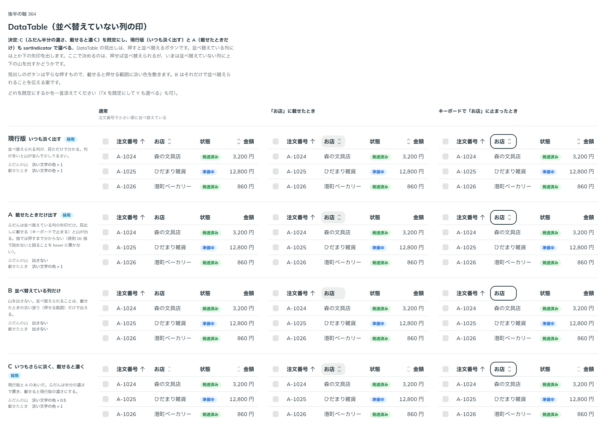

# 0344. DataTable の並べ替えていない列の印は、ふだん半分の濃さ・載せると濃くが既定（いつも淡く・載せたときだけも選べる）

- ステータス: Accepted
- 日付: 2026-09-28
- ラウンド: 後半 軸 364

## 背景

DataTable の見出し（`DataTableHeader`）は、`onSortClick` を渡すと押して並べ替えるボタンになります。並べ替えている列には、いつも上か下の矢印（本文の色）を出します。ここで決めるのは、押せば並べ替えられるが、いまは並べ替えていない列に出す上下の山（`SortNoneIcon`）の濃さです。

## 候補

比較は、決めた時点のコミット `6dab745` の比較のストーリー（`design/stories/axis-364-data-table-sort-indicator.stories.tsx`）です。列は通常・「お店」の見出しに載せたとき・キーボードで「お店」に止まったときです。

| 案                                        | ふだんの山         | 載せたとき       |
| ----------------------------------------- | ------------------ | ---------------- |
| 現行版（いつも淡く出す）                  | 淡い文字の色 × 1   | 淡い文字の色 × 1 |
| A（載せたときだけ出す）                   | 出さない           | 淡い文字の色 × 1 |
| B（並べ替えている列だけ）                 | 出さない           | 出さない         |
| C（いつもさらに淡く、載せると濃く。採用） | 淡い文字の色 × 0.5 | 淡い文字の色 × 1 |

## 決定

**既定は C（ふだんは半分の濃さで置き、載せると濃くする）にします。** 現行版（いつも淡く出す）と A（載せたときだけ出す）も、`sortIndicator`（`'subtle' | 'always' | 'hover'`）で選べます。B（並べ替えている列だけ）は採りません。

- `sortIndicator="subtle"`（既定）: C。ふだんは `--data-table-sort-idle` を 0.5、載せる（またはキーボードで止まる）と `--data-table-sort-hover` の 1 にします
- `sortIndicator="always"`: 現行版。ふだんから 1
- `sortIndicator="hover"`: A。ふだんは 0、載せたときだけ 1。指で操作しているとき（`--density-coarse` が 1）は、載せる操作がないので、ふだんから出します（原則16）

山の色は、並べ替えても見出しの文字が動かないよう、濃さを 0 にしても場所は取ります。

## 理由

ユーザーの返事の原文です。

> 364 C でお願いします。現行版とAも選べるようにしたいです。見た目として結構主張が強いなと思ったので、C をデフォルトに据えています

現行版の「いつも淡く出す」は、列が多いと山が並んで主張が強く見えます。C は、現行版と A（載せたときだけ）のあいだの濃さにすることで、並べ替えられる列だと分かる情報量を保ちながら、ふだんの主張を弱めます。

## 却下した案と理由

- **B（並べ替えている列だけ）**: 選ばれませんでした。並べ替えられることを、見出しに載せたときの淡い塗り（押せる範囲）だけで伝える案でしたが、ユーザーは山を残す C を選びました

## 影響

- `src/components/data-table/DataTable.tsx`: `sortIndicator`（`'subtle' | 'always' | 'hover'`、既定 `'subtle'`）と型 `DataTableSortIndicator` を持ちます。値は `--data-table-sort-idle`・`--data-table-sort-hover` に書き、`DataTableHeader` の `SortNoneIcon` がそれを読みます
- 比較のストーリー `design/stories/axis-364-data-table-sort-indicator.stories.tsx` は消しました

## 原則への反映

反映なし。原則16「指で読めないと困ることは、マウスを載せて出る補足に置きません」の、指のときはいつも出す扱いの通りです。

## 比較画像

決めた時点のコミットは `6dab745` です。`git checkout 6dab745 && pnpm storybook` で、比較のストーリー（`Design Review/364 DataTable（並べ替えていない列の印）`）を決めたときの部品のまま開けます。
