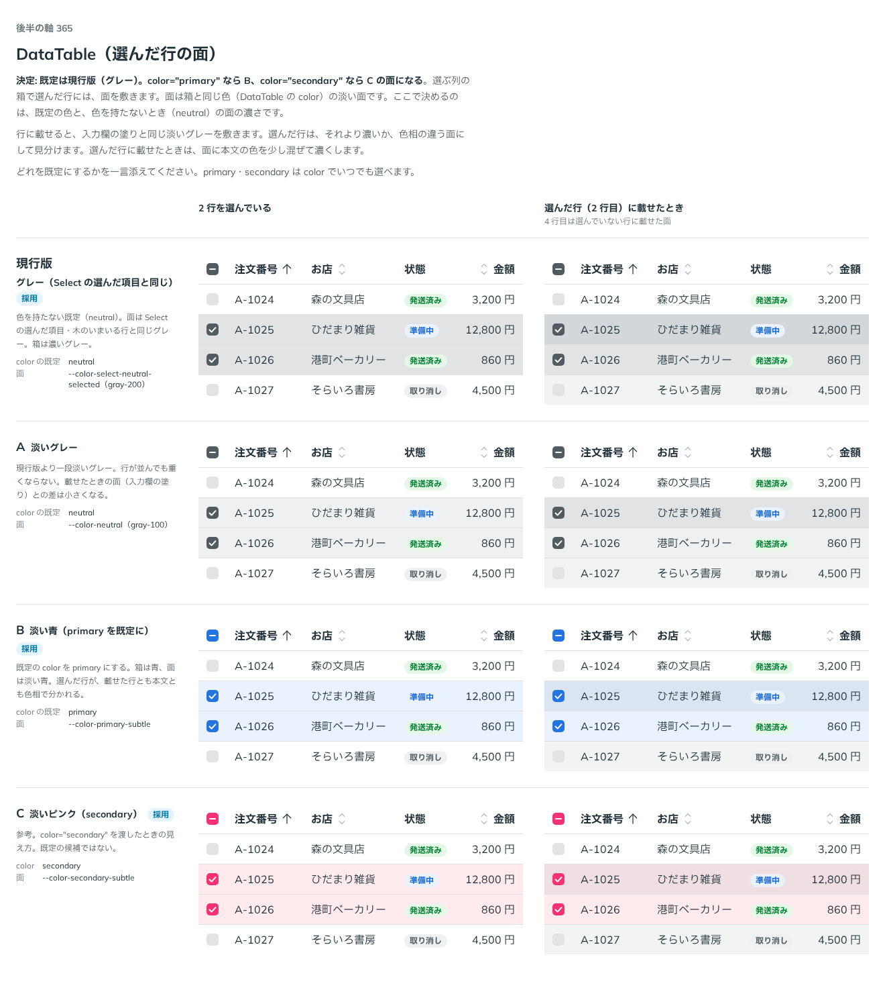

# 0345. DataTable の選んだ行の面は、現行版（グレー）が既定。color で primary・secondary の淡い面も選べる

- ステータス: Accepted
- 日付: 2026-09-28
- ラウンド: 後半 軸 365

## 背景

選ぶ列の箱（`DataTableSelectCell`）で選んだ行には、`DataTableRow` が面を敷きます。原則6「色は役割で持つ」の「選んでいることを示す印は、部品の色に従う」に沿い、面は選ぶ箱と同じ色（DataTable の `color`）の淡い面にします。ここで決めるのは、既定の `color` と、色を持たないとき（`neutral`）の面の濃さです。行に載せたときの面（入力欄の塗りと同じ淡いグレー）より濃くして、載せただけの行と見分ける必要があります。

## 候補

比較は、決めた時点のコミット `6dab745` の比較のストーリー（`design/stories/axis-365-data-table-selected-row.stories.tsx`）です。列は 2 行を選んでいるところと、選んだ行に載せたところです。

| 案                            | color の既定                         | 面                                            |
| ----------------------------- | ------------------------------------ | --------------------------------------------- |
| 現行版（グレー。採用）        | `neutral`                            | `--color-select-neutral-selected`（gray-200） |
| A（淡いグレー）               | `neutral`                            | `--color-neutral`（gray-100）                 |
| B（淡い青。primary を既定に） | `primary`                            | `--color-primary-subtle`                      |
| C（淡いピンク。参考）         | （`color="secondary"` を渡したとき） | `--color-secondary-subtle`                    |

## 決定

**既定は現行版（`color="neutral"`。Select の選んだ項目・木のいまいる行と同じグレー）にします。** `color="primary"` を渡すと B（淡い青）、`color="secondary"` を渡すと C（淡いピンク）の面になります。A（淡いグレー）は採りません。

選んだ行に載せたときは、面に本文の色を少し混ぜて濃くします（`DataTableRow` の `data-selected:hover:[--data-table-row-bg:color-mix(...)]`）。

## 理由

ユーザーの返事の原文です。

> 365 現行がデフォルトで、color を指定している場合は B や C のようになる、という形でお願いします。

現行版のグレー（gray-200）は、Select の選んだ項目・Tree のいまいる行と同じ濃さで、部品をまたいで「選んでいる」ことの見え方をそろえます。色を指定すれば B・C の色付きの面になるので、A（淡いグレー）は既定を変える提案でしたが、採用されませんでした。

## 却下した案と理由

- **A（淡いグレー）**: 選ばれませんでした。現行版より一段淡くする案でしたが、ユーザーは現行版の濃さのままでよいという返事でした

## 影響

- `src/components/data-table/DataTable.tsx`: `color`（`ChoiceColor`。`'primary' | 'secondary' | 'neutral'`、既定 `'neutral'`）を持ちます。値は `--data-table-row-selected` に書き、選ぶ箱（`DataTableSelectCell`・`DataTableSelectHeader`）にも `DataTableContext` で渡します
- `src/components/data-table/DataTableRow.tsx`: `selected` を渡すと `--data-table-row-selected` の面を敷きます
- 比較のストーリー `design/stories/axis-365-data-table-selected-row.stories.tsx` は消しました

## 原則への反映

反映なし。原則6「色は役割で持つ」の「選んだものは部品の色の濃い塗り」の通りです。

## 比較画像

決めた時点のコミットは `6dab745` です。`git checkout 6dab745 && pnpm storybook` で、比較のストーリー（`Design Review/365 DataTable（選んだ行の面）`）を決めたときの部品のまま開けます。
