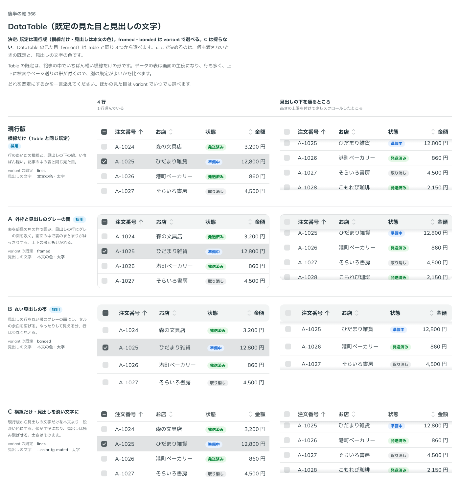

# 0346. DataTable の既定の見た目は現行版（横線だけ・見出しは本文の色）。ほかの Table の見た目も variant で選べる

- ステータス: Accepted
- 日付: 2026-09-28
- ラウンド: 後半 軸 366

## 背景

DataTable の見た目（`variant`）は `Table` と同じ 3 つ（`lines`・`framed`・`banded`。[ADR-0090](./0090-table.md)）から選べます。`Table` の既定は、記事の中でいちばん軽い `lines`（横線だけ）です。データの表は画面の主役になり、行も多く、上下に検索やページ送りの帯が付くので、DataTable では別の既定がよいかを見ました。あわせて、見出しの文字の色（本文の色のまま出すか、一段淡くするか）も比べました。

## 候補

比較は、決めた時点のコミット `6dab745` の比較のストーリー（`design/stories/axis-366-data-table-head.stories.tsx`）です。列は 4 行（1 行選んでいる）と、見出しの下を通るところ（高さの上限を付けて少しスクロールしたところ）です。

| 案                                | variant の既定 | 見出しの文字             |
| --------------------------------- | -------------- | ------------------------ |
| 現行版（横線だけ。採用）          | `lines`        | 本文の色・太字           |
| A（外枠と見出しのグレーの面）     | `framed`       | 本文の色・太字           |
| B（丸い見出しの帯）               | `banded`       | 本文の色・太字           |
| C（横線だけ・見出しを淡い文字に） | `lines`        | `--color-fg-muted`・太字 |

## 決定

**既定は現行版（`variant="lines"`・見出しは本文の色）にします。** `framed`（A）・`banded`（B）も `variant` で選べます。C（見出しを淡い文字に）は採りません。

## 理由

ユーザーの返事の原文です。

> 366 現行がデフォルトで、table の他の見た目も選べるようにしたいです。C の薄くなっている版はナシで大丈夫です。

データの表だからといって既定を重くする理由はなく、`Table` と同じいちばん軽い見た目を DataTable の既定にもそろえます。C（見出しを淡く）は、値を主役にして見出しを読み飛ばせるようにする案でしたが、採用されませんでした。見出しの文字は本文の色・太字のまま残ります。

## 却下した案と理由

- **C（見出しを淡い文字に）**: 選ばれませんでした。見出しの文字は本文の色のまま残します

## 影響

- `src/components/data-table/DataTable.tsx`: `variant`（`TableVariant`。`'lines' | 'framed' | 'banded'`、既定 `'lines'`）を持ちます。クラス列は `Table` と同じ `tableStyles`（`framedFrame`・`framed`・`banded`）を使います
- 見出しの文字の色は、`variant` によらず本文の色・太字のままです（`tableStyles.cells` の `[&_thead_th]:font-bold`）
- 比較のストーリー `design/stories/axis-366-data-table-head.stories.tsx` は消しました

## 原則への反映

反映なし。既存の `Table` の決定（[ADR-0090](./0090-table.md)）をそのまま DataTable の既定にも当てています。

## 比較画像

決めた時点のコミットは `6dab745` です。`git checkout 6dab745 && pnpm storybook` で、比較のストーリー（`Design Review/366 DataTable（既定の見た目と見出しの文字）`）を決めたときの部品のまま開けます。
