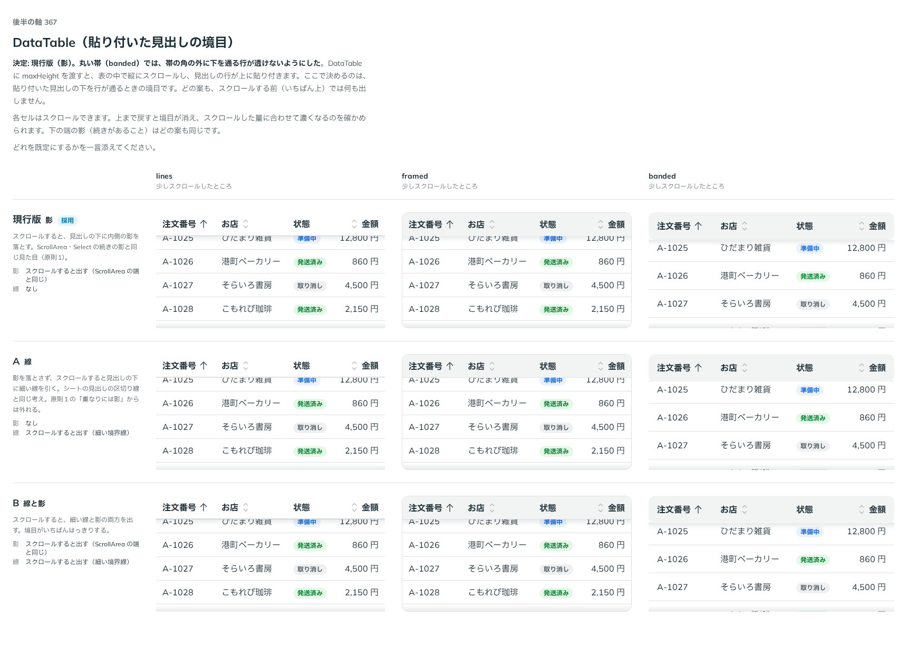

# 0347. DataTable の貼り付いた見出しの境目は、現行版（影）のまま。banded は帯を ::before に描き、影が角にかからないようにする

- ステータス: Accepted（banded の角丸の外に下の行が透けない部分は [ADR-0473](./0473-data-table-banded-sticky-corner.md) で置き換え）
- 日付: 2026-09-28
- ラウンド: 後半 軸 367

## 背景

DataTable に `maxHeight` を渡すと、表の中で縦にスクロールし、見出しの行が上に貼り付きます。原則1「ページの一部でも、スクロールした内容が下を通るようになったら、重なりとして扱います」に沿い、貼り付いた見出しの下を行が通るときは境目を出します。境目の付け方（影・線・両方）と、`banded`（丸い見出しの帯）で角丸の外に下を通る行が透けない作りを比べました。

## 候補

比較は、決めた時点のコミット `6dab745` の比較のストーリー（`design/stories/axis-367-data-table-sticky-edge.stories.tsx`）です。列は `lines`・`framed`・`banded`（どれも少しスクロールしたところ）です。

| 案                 | 影                                              | 線                                 |
| ------------------ | ----------------------------------------------- | ---------------------------------- |
| 現行版（影。採用） | スクロールすると出す（`ScrollArea` の端と同じ） | なし                               |
| A（線）            | なし                                            | スクロールすると出す（細い境界線） |
| B（線と影）        | スクロールすると出す                            | スクロールすると出す               |

`lines` の見出しにはもとから下の線があるので、線の案の違いは `framed`・`banded` で見えます。

## 決定

**現行版（影）のままにします。** 線の案（A・B）は採りません。

あわせて、`banded`（丸い見出しの帯）の帯を、見出しの `th` そのものではなく `th::before` に描くようにしました。貼り付いたとき、帯の角丸の外側に下を通る行が透けて見えないようにするためです。影は、帯の角丸にかからないよう、四角いままの `th` の下の辺から落とします。

- 影は `[&_thead_th]:after:...` で `th` の下（`top-full`）に描き、濃さはスクロールした量（`--cue-top`）に合わせます
- `banded` の帯は `[&_thead_th]:before:...bg-field...` で `th::before` に描き、角丸（`rounded-s-control`・`rounded-e-control`）は帯（`::before`）だけに付け、`th` 自身は四角いまま残します

## 理由

ユーザーの返事の原文です。

> 367 現行版に揃えたいですが、角丸のヘッダーの場合に ScrollArea の影の落とし方が自然な形になるようにしたいですね。

境目は、`ScrollArea`・`Select` の続きの影と同じ見た目（内側の影）にそろえます（原則1）。線の案は、原則1 の「重なりには影」の考え方から外れるため採りませんでした。`banded` の帯を `::before` に分けたのは、返事の「角丸のヘッダーの場合に…影の落とし方が自然な形になるように」を受けた直しです。帯そのものに角丸を付けたままだと、貼り付いた見出しが下の行の上を通るとき、帯の角の外側（四角い `th` の範囲）に行が透けて見えていました。

## 却下した案と理由

- **A（線）**: 選ばれませんでした。影を出さず、細い線だけで境目を出す案です。原則1 の「重なりには内側の影を落とす」から外れます
- **B（線と影）**: 選ばれませんでした。境目をいちばんはっきりさせる案でしたが、現行版の影だけで足りるという返事でした

## 影響

- `src/components/data-table/DataTable.tsx`: `banded` の見出しの帯を `th::before` に描くよう直しました（`before:pointer-events-none before:absolute before:inset-0 before:-z-1 before:bg-field`、角丸は `before:rounded-s-control`・`before:rounded-e-control`）。影（`after:...`）は `th` の下の辺から、`variant` によらず同じ形で落とします
- 見出しの行はいつも `sticky` です。枠の高さに上限がなければ縦にスクロールしないので動かず、`maxHeight`（や、利用者がレイアウトで決めた枠の高さ）でスクロールするときだけ貼り付きます（[ADR-0343](./0343-data-table-separate-from-table.md)）
- 比較のストーリー `design/stories/axis-367-data-table-sticky-edge.stories.tsx` は消しました
- のちに、`banded` の `th` を地の色で塗るのをやめ、帯の角丸の外に下の行が見えるようにしました。スクロールした分だけ帯の下の角を四角にして影と合わせる形は [ADR-0473](./0473-data-table-banded-sticky-corner.md) です
- のちに、縦のつまみの溝を、貼り付いた見出しの行の下から始めるようにしました（見出しに重ねない。見出しの行の高さは `use-sticky-head-height.ts` が測ります）

## 原則への反映

反映なし。原則1「ページの一部でも、スクロールした内容が下を通るようになったら、重なりとして扱います」・「途中で切れる端に内側の影を落とすのが基本です」の通りです。

## 比較画像

決めた時点のコミットは `6dab745` です。`git checkout 6dab745 && pnpm storybook` で、比較のストーリー（`Design Review/367 DataTable（貼り付いた見出しの境目）`）を決めたときの部品のまま開けます。
