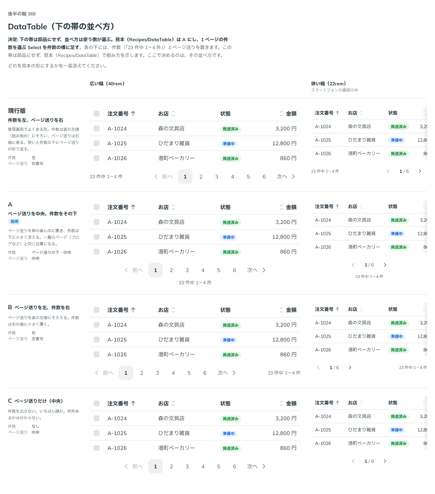

# 0348. DataTable の下の帯（件数とページ送り）は部品にせず recipe で組む。純正レシピは A（ページ送りを中央、その下に件数と 1 ページの件数の Select）

- ステータス: Accepted
- 日付: 2026-09-28
- ラウンド: 後半 軸 368

## 背景

表の下には、件数（「23 件中 1〜4 件」）とページ送り（`Pagination`）を置きます。原則20「部品にするほどでない組み合わせは、部品にせず、組み合わせの見本として示します」に沿い、この帯を DataTable の一部にするか、レシピ（[ADR-0335](./0335-headless-look-only-recipes.md)・[ADR-0132](./0132-recipes.md)）で示すかと、示すならどの並べ方を見本にするかを決めました。

## 候補

比較は、決めた時点のコミット `6dab745` の比較のストーリー（`design/stories/axis-368-data-table-footer.stories.tsx`）です。列は広い幅（40rem）と狭い幅（22rem。スマートフォンの画面の中）です。

| 案                                        | 件数                 | ページ送り |
| ----------------------------------------- | -------------------- | ---------- |
| 現行版（件数を左、ページ送りを右）        | 左                   | 右寄せ     |
| A（ページ送りを中央、件数をその下。採用） | ページ送りの下・中央 | 中央       |
| B（ページ送りを左、件数を右）             | 右                   | 左寄せ     |
| C（ページ送りだけ・中央）                 | なし                 | 中央       |

## 決定

**下の帯は部品にせず、並べ方は使う側が選びます。純正レシピ（`src/recipes/data-table/OrdersDataTable.tsx`）は A（ページ送りを中央、その下に件数）にし、1 ページの件数を選ぶ `Select` を件数の横に足しました。**

- `Pagination` を帯の中央に、幅いっぱい（`w-full`）で置きます
- その下に、件数の文（`Text`）と、1 ページの件数を選ぶ `Select`（5 件・10 件・20 件）を横に並べます
- ページが 1 ページしかないとき（`table.getPageCount() <= 1`）は `Pagination` を出しません

## 理由

ユーザーの返事の原文です。

> 368 これは recipe の中身だと思うので、配置はユーザーが自由に選択すべきかなと思っています。純正レシピの見た目としては、A が好みかなと思っています。一度に表示される件数を変更するなどの需要もありそうですね。

下の帯は表そのものの見た目の決定ではなく、置いた画面の作りに依存します（管理画面なら現行版、一覧のページなら A）。部品にはせず、レシピで示す形にしました。純正レシピの並べ方は A で、ユーザーの「一度に表示される件数を変更するなどの需要もありそう」という返事を受け、1 ページの件数を選ぶ `Select` を足しました。

## 却下した案と理由

なし（DataTable 自体の見た目としては何も決めていません。A・B・C・現行版はどれも、使う側がそのまま組める並べ方です）。

## 影響

- DataTable に下の帯の props・部品は足しません
- `src/recipes/data-table/OrdersDataTable.tsx`: 下の帯を A の並び（`Pagination` を中央、その下に件数の `Text` と 1 ページの件数の `Select`）で組みました。件数の文は `Select` の欄（ラベルの下）の高さの中央にそろえます
- 比較のストーリー `design/stories/axis-368-data-table-footer.stories.tsx` は消しました
- backlog に足す未決事項: `Pagination` を帯に置くときの `min-w-0` の要否（狭い幅で `Select` と並べたときに縮むか）

## 原則への反映

反映なし。原則20「部品にするほどでない組み合わせは、部品にせず、組み合わせの見本として示します」の通りです。

## 比較画像

決めた時点のコミットは `6dab745` です。`git checkout 6dab745 && pnpm storybook` で、比較のストーリー（`Design Review/368 DataTable（下の帯の並べ方）`）を決めたときの部品のまま開けます。
