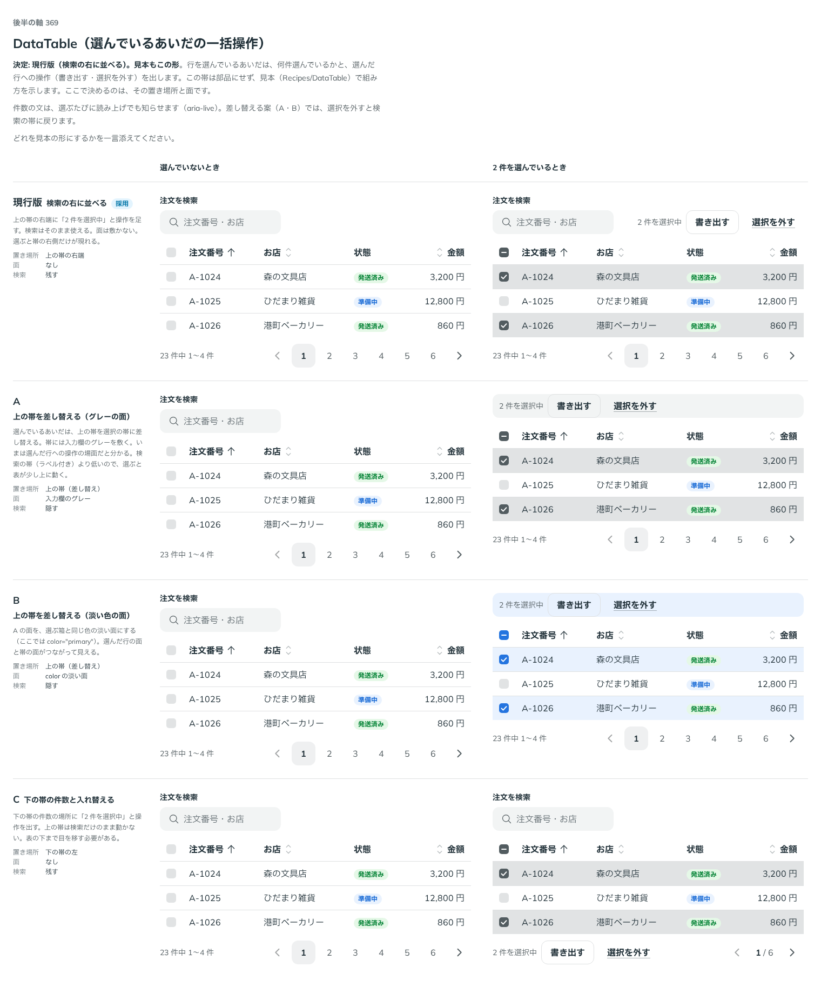

# 0349. DataTable で行を選んでいるあいだの件数と一括操作は、現行版（検索の右に並べる）のまま

- ステータス: Accepted
- 日付: 2026-09-28
- ラウンド: 後半 軸 369

## 背景

行を選んでいるあいだは、何件選んでいるかと、選んだ行への操作（書き出す・選択を外す）を出します。この帯も、下の帯（[ADR-0348](./0348-data-table-footer-recipe.md)）と同じく部品にせず、レシピ（`src/recipes/data-table/OrdersDataTable.tsx`）で組み方を示します。ここで決めるのは、選んでいるあいだの件数と操作の置き場所と、面の有無です。

## 候補

比較は、決めた時点のコミット `6dab745` の比較のストーリー（`design/stories/axis-369-data-table-selection-bar.stories.tsx`）です。列は選んでいないときと、2 件を選んでいるときです。

| 案                                  | 置き場所           | 面             | 検索 |
| ----------------------------------- | ------------------ | -------------- | ---- |
| 現行版（検索の右に並べる。採用）    | 上の帯の右端       | なし           | 残す |
| A（上の帯を差し替える・グレーの面） | 上の帯（差し替え） | 入力欄のグレー | 隠す |
| B（上の帯を差し替える・淡い色の面） | 上の帯（差し替え） | color の淡い面 | 隠す |
| C（下の帯の件数と入れ替える）       | 下の帯の左         | なし           | 残す |

## 決定

**現行版（検索の右に並べる）のままにします。** レシピの見本もこの形です。

- 上の帯の右端に「N 件を選択中」の文（`aria-live="polite"`）と、`書き出す`（`Button variant="outline"`）・`選択を外す`（`Button variant="underline"`）を足します
- 検索欄はそのまま残し、面は敷きません
- 選ぶたびに、件数の文を読み上げでも知らせます（`aria-live`）

## 理由

ユーザーの返事の原文です。

> 369 現行かなと思いました。

上の帯を選択の帯に差し替える案（A・B）は、検索がいったん隠れる分、選択を外したときに検索の状態へ戻る動きが要り、下の帯に置く案（C）は表の下まで目を移す必要があります。現行版は、検索を残したまま帯の右側だけが現れるので、いちばん変化が少ない形です。

## 却下した案と理由

- **A（上の帯を差し替える・グレーの面）**: 選ばれませんでした。検索の帯より低いため、選ぶと表が少し上に動く問題もありました
- **B（上の帯を差し替える・淡い色の面）**: 選ばれませんでした。A と同じ理由です
- **C（下の帯の件数と入れ替える）**: 選ばれませんでした。選んだことに気づくには表の下まで目を移す必要がありました

## 影響

- DataTable に選択の帯の props・部品は足しません
- `src/recipes/data-table/OrdersDataTable.tsx`: 上の帯（検索）の右に、選んでいるときだけ件数の文と操作のボタンを足しました
- 比較のストーリー `design/stories/axis-369-data-table-selection-bar.stories.tsx` は消しました

## 原則への反映

反映なし。原則20「部品にするほどでない組み合わせは、部品にせず、組み合わせの見本として示します」の通りです。

## 比較画像

決めた時点のコミットは `6dab745` です。`git checkout 6dab745 && pnpm storybook` で、比較のストーリー（`Design Review/369 DataTable（選んでいるあいだの一括操作）`）を決めたときの部品のまま開けます。
