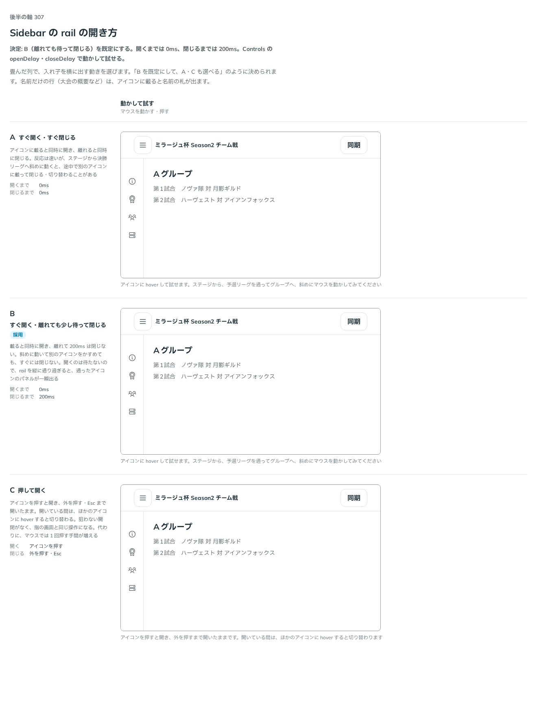

# 0354. Sidebar の rail は、アイコンに載ったら待たずに開き、離れても 200ms は閉じない

- ステータス: Accepted
- 日付: 2026-09-24
- ラウンド: 後半 軸 307

## 背景

畳んだ列（rail）で入れ子を hover で横に出すとき、開くタイミングと閉じるタイミングを決めました。斜めにマウスを動かしてパネルへ移るあいだに閉じてしまうかが焦点です。

## 候補

比較は、決めた時点のコミット `fceaea2` の比較のストーリー（`design/stories/axis-307-sidebar-rail-open.stories.tsx`）です。マウスを動かして試す枠です。

| 案        | 内容                                                 |
| --------- | ---------------------------------------------------- |
| A         | すぐ開く・すぐ閉じる（採らない）                     |
| B（既定） | すぐ開く・離れても少し待って閉じる                   |
| C         | 押して開く。外を押す・Esc まで開いたまま（採らない） |

## 決定

**既定は B です。アイコンに載ったら待たずに開き、離れても 200ms は閉じません（`openDelay` 0ms・`closeDelay` 200ms が既定で、props で変えられます）。A・C は採りません。指の画面（hover がない）とキーボード（Enter・→ で開き、Esc で閉じる）は、押して開きます。入れ子のない行（アイコンだけの行）は、載ると名前の札が出ます。**

## 理由

ユーザーの返事の原文です。

> 307: 斜めに動かしたときの間隔は B がよいですね。時間はもう少し調整したいです。
> openDelay:0, closeDelay: 200 でデフォルトどうですかね。

斜めに動かしたとき、アイコンからパネルに着く前に閉じると、選べません。離れても少し待てば、その間にパネルへ移れます。時間は調整したいという返事だったので、props で変えられるようにします。指とキーボードは hover に頼れないので、押して開きます。

## 影響

- `src/components/sidebar/`: `Sidebar` の `openDelay`（既定 0）・`closeDelay`（既定 200）を公開します。畳んだ列の入れ子の面は Menu で描くので、Menu に `openOnHover`・`openDelay`・`closeDelay` を足しました。Base UI の入れ子の面は、奥の面から出ても手前の面を閉じないので、Sidebar の側で、マウスが行と面のどこにもないまま `closeDelay` が過ぎたら、まとめて閉じます
- 比較のストーリー `design/stories/axis-307-sidebar-rail-open.stories.tsx` は消しました

## 原則への反映

反映なし。

## 比較画像

決めた時点のコミットは `fceaea2` です。`git checkout fceaea2 && pnpm storybook` で、比較のストーリー（`Design Review/307 Sidebar の rail の開き方`）を決めたときの部品のまま開けます。
