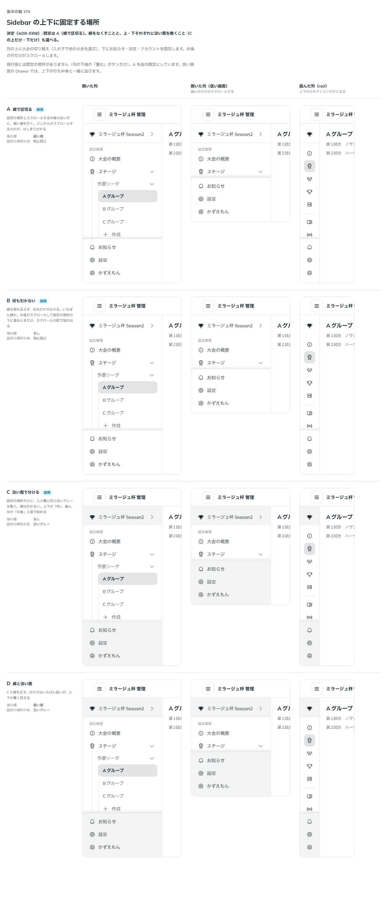

# 0358. Sidebar の上下に固定する場所は、線で区切るのが既定（線なし・上下個別の淡い面も選べる）

- ステータス: Accepted
- 日付: 2026-09-29
- ラウンド: 後半 軸 379

## 背景

Sidebar の列の上に大会の切り替え、下にお知らせ・設定・アカウントを固定し、真ん中の行だけをスクロールさせたい場面があります（`Sidebar` の `header`・`footer`）。固定の場所と、スクロールする中身のあいだをどう分けるかを決めました。

## 候補

比較は、決めた時点のコミット `2caa320` の比較のストーリー（`design/stories/axis-379-sidebar-edges.stories.tsx`）です。開いた列・低い画面（真ん中がスクロールする）・畳んだ列（rail）を並べています。

| 案        | 境の線 | 固定の場所の地 |
| --------- | ------ | -------------- |
| A（既定） | 細い線 | 列と同じ       |
| B         | なし   | 列と同じ       |
| C         | なし   | 淡いグレー     |
| D         | 細い線 | 淡いグレー     |

## 決定

**既定は A（固定の場所とスクロールする中身のあいだに、細い線を引く）です。** 線をなくすこと（`hideEdgeLine`）と、上・下それぞれに淡い面を敷くこと（C の上だけ・下だけ、`showHeaderFill`・`showFooterFill`）も選べます。D（線と淡い面の両方）は、既定の組み合わせには含めず、`hideEdgeLine={false}` と `showHeaderFill`／`showFooterFill` を一緒に渡せば作れます。

## 理由

ユーザーの返事の原文です。

> 基本は現行版と思っていますが、線なしと、上下個別に淡い面にもできるようになっていると良さそうと思いました。下に使うことは少なそうですが、上については現在の階層を表すのにはいいかなと。

線で区切るのがいちばん静かで、どこからがスクロールするのかもはっきり分かります。上の固定の場所に淡い面を敷けると、いまいる大会やワークスペースの階層を、列の中身と分けて見せられます。下は使う場面が少なそうなので、既定では敷かず、選べる形だけ残します。

## 影響

- `src/components/sidebar/Sidebar.tsx`: `hideEdgeLine`（既定 `false`）、`showHeaderFill`（既定 `false`）、`showFooterFill`（既定 `false`）を公開します
- `design/tokens.css`: `--sidebar-edge-fill` を持ちます
- 比較のストーリー `design/stories/axis-379-sidebar-edges.stories.tsx` は消しました

## 原則への反映

反映なし。

## 比較画像

決めた時点のコミットは `2caa320` です。`git checkout 2caa320 && pnpm storybook` で、比較のストーリー（`Design Review/379 Sidebar の上下に固定する場所`）を決めたときの部品のまま開けます。
