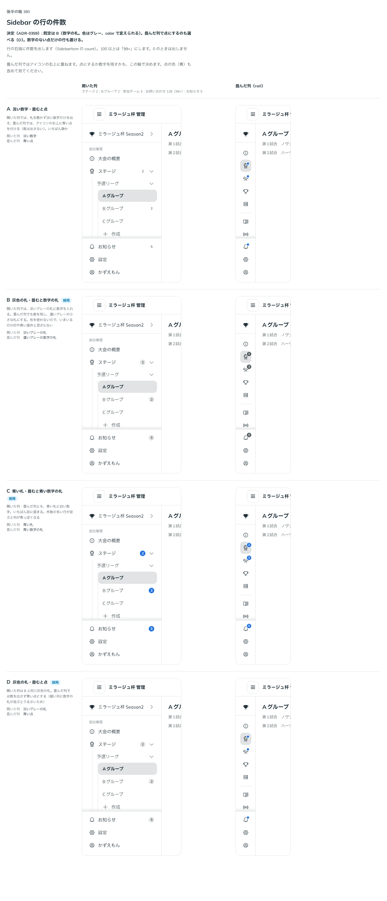

# 0359. Sidebar の行の件数は、グレーの数字の札が既定（色は選べる。畳んだ列は数字か点を選べる）

- ステータス: Accepted
- 日付: 2026-09-29
- ラウンド: 後半 軸 380

## 背景

未入力の結果・承認待ちのチーム・お問い合わせの件数のように、Sidebar の行に件数を出したい場面があります。開いた列では行の右端に、畳んだ列（rail）ではアイコンの右上に重ねます。件数の見せ方（札の色・畳んだ列で数字を残すか点にするか）を決めました。

## 候補

比較は、決めた時点のコミット `2caa320` の比較のストーリー（`design/stories/axis-380-sidebar-count.stories.tsx`）です。開いた列（ステージ 2・Bグループ 2・参加チーム 3・お問い合わせ 128（99+）・お知らせ 5）と畳んだ列を並べています。

| 案        | 開いた列      | 畳んだ列         |
| --------- | ------------- | ---------------- |
| A         | 淡い数字      | 青い点           |
| B（既定） | 灰色の札      | 濃いグレーの数字 |
| C         | 青い札        | 青い数字         |
| D         | 灰色の札（B） | 青い点           |

## 決定

**既定は B（淡いグレーの札に数字。畳んだ列でも数字を残す）です。** 札は `SidebarItem` の `badge` に、Badge と同じ名前の値をまとめて渡します（`{ count, max, shape, color, collapsedShape }`）。色は `color`（`neutral`・`primary`・`secondary`・`info`・`success`・`warning`・`danger`。既定 `neutral`）で変えられます。畳んだ列で数字ではなく点にすることは、`Sidebar` の `collapsedItemBadgeShape="dot"`（D）で選べ、行ごとには `collapsedShape` で上書きできます。数字を出さず点だけを付けたい行（新しいものがある、など）は `{ shape: 'dot' }` です。100 を超える件数は「99+」にします（`max`、既定 `99`）。0 のときは出しません。

props の形は、決めたあと（2026-09-29）に見直しました。はじめは `count`・`countMax`・`showDot`・`color` を別々の props にしていましたが、`showDot` は props だけでは何の点か読みにくく、`color` は Sidebar の `color`（いまいる行の色）と同じ名前で意味が違いました。行ごとに畳んだときの形を変えたい場面もあるため、札の設定を 1 つのオブジェクトにまとめました。Badge の要素そのものを受け取る形も考えましたが、渡された要素の props は部品が読まない決まりのため、畳んだときに数字を点へ変えられず、採りませんでした。

## 理由

ユーザーの返事の原文です。

> 基本は数字が反映され、たたんだ時に点にするかは選べる、としたいです（そもそも項目自体に数字ではなく点だけの可能性もありそう。）色についてはデフォルトグレーで、color で変更できるとしたいです。

件数はそれ自体が情報なので、畳んだ列でも既定では数字を残します。列が細いと数字の札が並んでうるさくなる場面もあるため、点にする形も選べるようにします。色は既定でグレーにし、注意を引きたい件数だけ `color` で目立たせられるようにします。C（いつも青）は、件数の多い行が並ぶと列全体が青っぽく見えるため採りません。

## 却下した案と理由

- **A（淡い数字・畳むと点）**: 選ばれませんでした。開いた列でも件数の存在感が弱く、畳んだ列では数字が消えてしまいます
- **C（青い札・畳むと青い数字の札）**: 選ばれませんでした。件数の多い行が並ぶと、列全体が青く見えてしまいます

## 影響

- `src/components/sidebar/SidebarItem.tsx`: `badge`（型 `SidebarItemBadge`: `count`・`max`（既定 `99`）・`shape`（`SidebarBadgeShape`）・`color`（`SidebarBadgeColor`、既定 `neutral`）・`collapsedShape`）を公開します
- `src/components/sidebar/Sidebar.tsx`: `collapsedItemBadgeShape`（`'count' | 'dot'`、既定 `'count'`）を公開します
- `design/tokens.css`: `--sidebar-count-bg`・`--sidebar-count-fg`・`--sidebar-mark-bg`・`--sidebar-mark-fg` を持ちます
- 比較のストーリー `design/stories/axis-380-sidebar-count.stories.tsx` は消しました

## 原則への反映

反映なし。

## 比較画像

決めた時点のコミットは `2caa320` です。`git checkout 2caa320 && pnpm storybook` で、比較のストーリー（`Design Review/380 Sidebar の行の件数`）を決めたときの部品のまま開けます。
