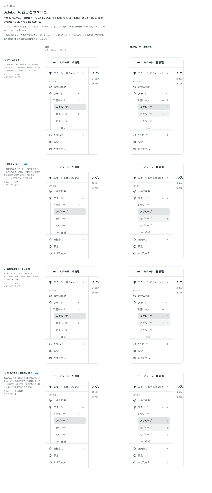

# 0360. Sidebar の行ごとのメニューの印は、DataTable の並べ替えの印と同じ見せ方（ふだん半分の濃さ・載せると濃く）

- ステータス: Accepted
- 日付: 2026-09-29
- ラウンド: 後半 軸 381

## 背景

Sidebar の行（グループ・リーグの行、アカウントの行など）に、名前を変える・複製・削除などの操作をメニューで持たせたい場面があります（`SidebarItem` の `menu`）。行の右端に ︙ のボタンを重ね、押すとメニューが開きます。このボタンを、ふだんどれだけの濃さで見せるかを決めました。畳んだ列（rail）では出しません。

## 候補

比較は、決めた時点のコミット `2caa320` の比較のストーリー（`design/stories/axis-381-sidebar-row-menu.stories.tsx`）です。通常と、「Bグループ」の行に載せたときを並べています。

| 案        | ふだん     | 載せたとき | いまいる行 |
| --------- | ---------- | ---------- | ---------- |
| A         | 見せる     | 見せる     | 見せる     |
| B         | 隠す       | 見せる     | 隠す       |
| C         | 隠す       | 見せる     | 見せる     |
| D（既定） | 半分の濃さ | 濃く       | 半分の濃さ |

## 決定

**既定は D（DataTable の並べ替えていない列の印〔[ADR-0344](./0344-data-table-sort-indicator.md)〕と同じ見せ方。ふだんは半分の濃さで置き、行に載せる・キーボードでフォーカスすると濃くする）です。** `Sidebar` の `itemMenuIndicator`（`'subtle' | 'always' | 'hover'`、既定 `'subtle'`）で、A（`always`。いつも濃く）と B（`hover`。載せたときだけ）も選べます。`hover` は、指で操作しているとき（`--density-coarse` が 1）はふだんから出します（原則16）。C（載せたときだけ＋いまいる行だけ濃く）は採りません。

行の並べ替えは Sidebar 自身には持たせません。Sortable（dnd-kit のレシピ）と組み合わせる形を考えていますが、この軸では決めていません。

## 理由

ユーザーの返事の原文です。

> DataTable のソートできるときの表示と揃えたいです。アクションがあるなら、基本は表示する認識です。表示しないようにもできる、となっていた気がします。

DataTable の並べ替えの印と揃えることで、部品をまたいで「ふだんは半分の濃さ、載せると濃く」という読み方が共通になります。操作があることは、行が多くても静かに伝わり、必要なら `always`・`hover` に切り替えられます。

## 却下した案と理由

- **C（載せたときだけ＋いまいる行だけ濃く）**: 選ばれませんでした。DataTable の印と見せ方がそろわず、いまいる行だけ扱いを変える理由もありません

## 影響

- `src/components/sidebar/SidebarItem.tsx`: `menu`・`menuName`（既定 `'その他の操作'`）を公開します
- `src/components/sidebar/Sidebar.tsx`: `itemMenuIndicator`（`SidebarIndicator`。`'subtle' | 'always' | 'hover'`、既定 `'subtle'`）を公開します。型 `SidebarIndicator` は `SidebarSection` の `collapsible` の印（[ADR-0363](./0363-sidebar-section-collapse.md)）とも共有します
- `design/tokens.css`: `--sidebar-indicator-subtle-opacity` を持ちます
- `design/backlog.md`: 行を並べ替える操作は、この軸には含めず未決のまま残します
- 比較のストーリー `design/stories/axis-381-sidebar-row-menu.stories.tsx` は消しました

## 原則への反映

反映なし。原則16「指で読めないと困ることは、マウスを載せて出る補足に置きません」の、指のときはいつも出す扱いの通りです。

## 比較画像

決めた時点のコミットは `2caa320` です。`git checkout 2caa320 && pnpm storybook` で、比較のストーリー（`Design Review/381 Sidebar の行ごとのメニュー`）を決めたときの部品のまま開けます。
