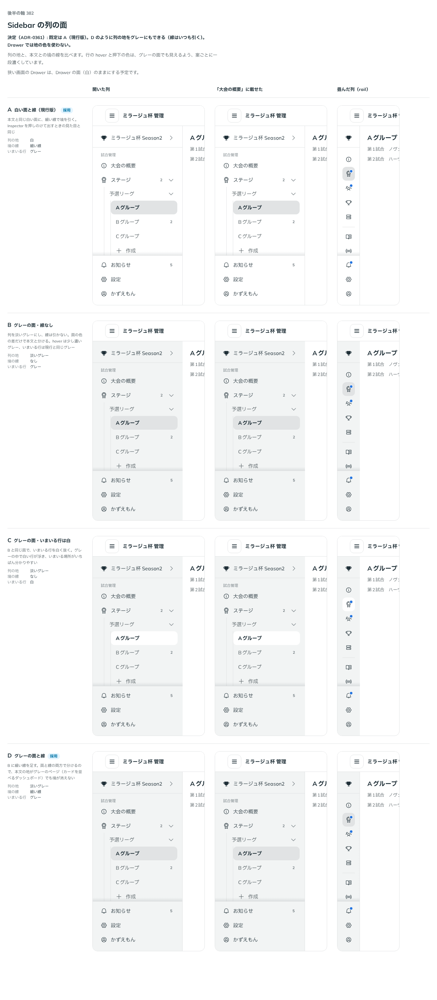

# 0361. Sidebar の列の面は、現行版（白い面と線）が既定。グレーの面も選べる

- ステータス: Accepted
- 日付: 2026-09-29
- ラウンド: 後半 軸 382

## 背景

Sidebar の列の地の色と、本文との境の線の引き方を決めました。ダッシュボードでは、列を一段沈んだグレーにする例もよく見られます。

## 候補

比較は、決めた時点のコミット `2caa320` の比較のストーリー（`design/stories/axis-382-sidebar-surface.stories.tsx`）です。開いた列・「大会の概要」に載せたとき・畳んだ列（rail）を並べています。

| 案        | 列の地     | 境の線 | いまいる行 |
| --------- | ---------- | ------ | ---------- |
| A（既定） | 白         | 細い線 | グレー     |
| B         | 淡いグレー | なし   | グレー     |
| C         | 淡いグレー | なし   | 白         |
| D         | 淡いグレー | 細い線 | グレー     |

## 決定

**既定は A（現行版。白い面に細い線で境を引く）です。** `Sidebar` の `variant`（`'plain' | 'muted'`、既定 `'plain'`）で、D のように列の地をグレーにすること（`'muted'`）も選べます。本文との境の線は、地の色によらずいつも引きます。狭い画面の Drawer では、`variant` を無視し、Drawer の面（白）のままにします。

## 理由

ユーザーの返事の原文です。

> 基本は現行で、D のように背景全体の色は変更できるのが望ましそうです（線は必須）Drawer においては、背景色は無視で問題ありません。

白い面が本文と同じ地続きの見た目で、いちばん癖がありません。列を主役にしたいダッシュボードでは、地をグレーにして本文と分けられるようにします。線は、地の色によらず境の手がかりとして残します。Drawer は重なる面として別の面を持つので、列の地の色を引き継ぐ必要はありません。

## 却下した案と理由

- **B（グレーの面・線なし）**: 選ばれませんでした。線は必須という返事だったため、線のない形は既定にも選択肢にも含めません
- **C（グレーの面・いまいる行は白）**: 選ばれませんでした。いまいる行の色は、[ADR-0353](./0353-sidebar-current.md) で決めたグレーの面のままにします

## 影響

- `src/components/sidebar/Sidebar.tsx`: `variant`（`SidebarVariant`。`'plain' | 'muted'`、既定 `'plain'`）を公開します
- `design/tokens.css`: `--sidebar-bg`・`--sidebar-edge-fill` を持ちます
- 比較のストーリー `design/stories/axis-382-sidebar-surface.stories.tsx` は消しました

## 原則への反映

反映なし。

## 比較画像

決めた時点のコミットは `2caa320` です。`git checkout 2caa320 && pnpm storybook` で、比較のストーリー（`Design Review/382 Sidebar の列の面`）を決めたときの部品のまま開けます。
