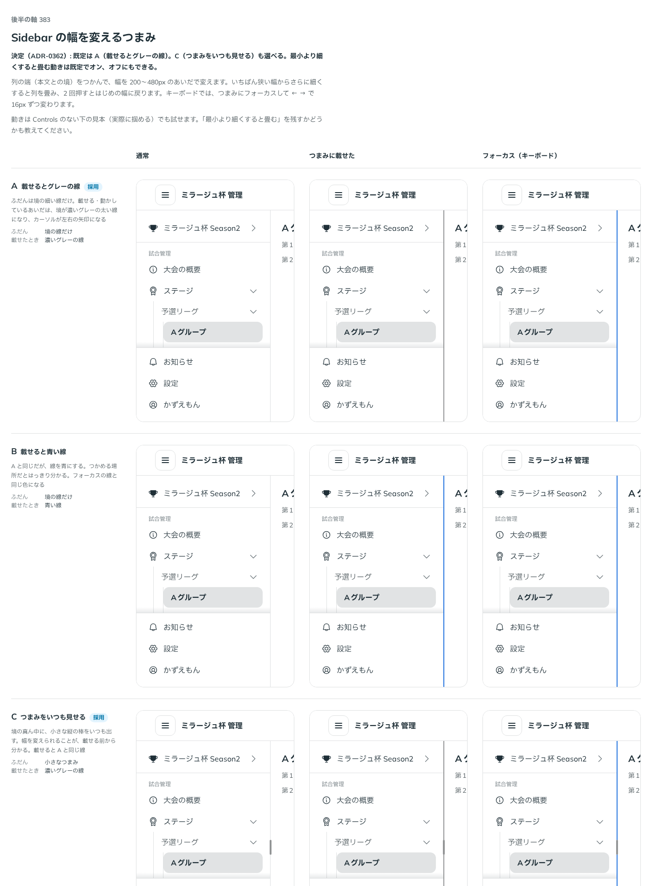

# 0362. Sidebar の幅を変えるつまみは、載せると線が出るのが既定（つまみをいつも見せるも選べる）。細くすると畳む動きは既定でオン

- ステータス: Accepted
- 日付: 2026-09-29
- ラウンド: 後半 軸 383

## 背景

列の端（本文との境）をつかんで、Sidebar の幅を変えたい場面があります（`SidebarLayout` の `resizable`）。つまみの見せ方と、いちばん狭い幅よりさらに細くしたときに列を畳む動きを決めました。

## 候補

比較は、決めた時点のコミット `2caa320` の比較のストーリー（`design/stories/axis-383-sidebar-resize.stories.tsx`）です。通常・つまみに載せたとき・キーボードでフォーカスしたときを並べています。

| 案        | ふだん       | 載せたとき          |
| --------- | ------------ | ------------------- |
| A（既定） | 境の線だけ   | 濃いグレーの線      |
| B         | 境の線だけ   | 青い線              |
| C         | 小さなつまみ | 濃いグレーの線（A） |

## 決定

**既定は A（ふだんは境の細い線だけ。つまみに載せる・動かしているあいだ・フォーカスすると、境が濃いグレーの太い線になる）です。** `SidebarLayout` の `resizeHandle`（`'line' | 'grip'`、既定 `'line'`）で、C（`'grip'`。境の真ん中に小さな縦のつまみをいつも出す）も選べます。

幅は 200〜480px のあいだで変わり（`minWidth`・`maxWidth`）、いちばん狭い幅からさらに 48px 細くすると列を畳みます（`collapseOnResize`、既定 `true`）。この動きはオフにもできます。キーボードでは、つまみにフォーカスして ← → で 16px ずつ、Home・End で最小・最大、つまみを 2 回押すとはじめの幅（`defaultWidth`）に戻ります。

## 理由

ユーザーの返事の原文です。

> デフォルトは A で、C も選べる、でよさそうです。自動でたたむ動きは、デフォルトはオンで、オフにもできるようにしたいです。

境の線だけのほうが、ふだんの列はいちばん静かです。幅を変えられることに気づきにくい画面もあるため、つまみをいつも見せる C も選べるようにします。狭くしすぎたときに自動で畳む動きは、Sidebar の rail への切り替え（[ADR-0350](./0350-sidebar-placement.md)）と一貫した挙動なので既定でオンにしつつ、畳ませたくない使い方のためにオフも用意します。

## 却下した案と理由

- **B（載せると青い線）**: 選ばれませんでした。青はフォーカスの線の色でもあるため、載せただけの状態と紛れます

## 影響

- `src/components/sidebar/SidebarLayout.tsx`: `resizable`（既定 `false`）・`width`・`defaultWidth`・`onWidthChange`・`minWidth`（既定 `200`）・`maxWidth`（既定 `480`）・`resizeHandle`（`SidebarResizeHandle`。`'line' | 'grip'`、既定 `'line'`）・`collapseOnResize`（既定 `true`）を公開します
- `src/components/sidebar/Sidebar.tsx`: `resizeName`（つまみの読み上げの名前、既定 `'列の幅'`）を公開します
- `design/tokens.css`: `--sidebar-handle-hit`・`--sidebar-handle-line-width` を持ちます
- 比較のストーリー `design/stories/axis-383-sidebar-resize.stories.tsx` は消しました

## 原則への反映

反映なし。

## 比較画像

決めた時点のコミットは `2caa320` です。`git checkout 2caa320 && pnpm storybook` で、比較のストーリー（`Design Review/383 Sidebar の幅を変えるつまみ`）を決めたときの部品のまま開けます。
