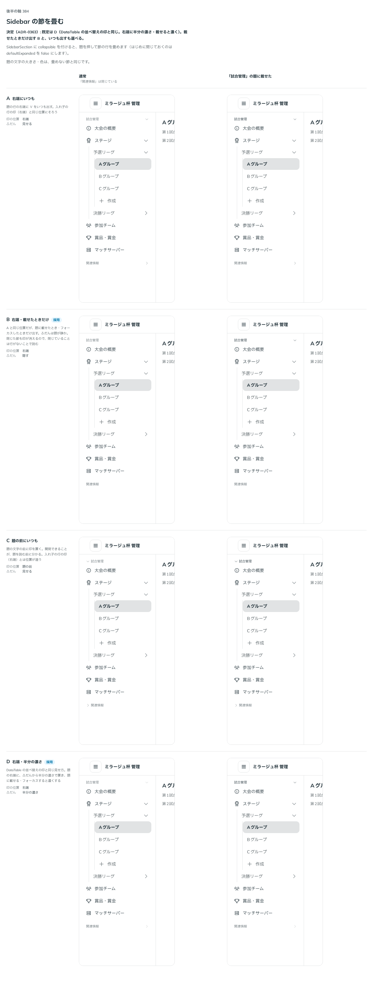

# 0363. Sidebar の畳める節の開閉の印は、DataTable の並べ替えの印と同じ見せ方（右端に半分の濃さ・載せると濃く）

- ステータス: Accepted
- 日付: 2026-09-29
- ラウンド: 後半 軸 384

## 背景

SidebarSection の題を押して、節の中の行をまとめて畳みたい場面があります（`collapsible`）。開閉の印を、どこに、どれだけの濃さで置くかを決めました。畳んだ列（rail）では節を畳みません。

## 候補

比較は、決めた時点のコミット `2caa320` の比較のストーリー（`design/stories/axis-384-sidebar-section-collapse.stories.tsx`）です。通常（「関連情報」は閉じている）と、「試合管理」の題に載せたときを並べています。

| 案        | 印の位置 | ふだん     |
| --------- | -------- | ---------- |
| A         | 右端     | 見せる     |
| B         | 右端     | 隠す       |
| C         | 題の前   | 見せる     |
| D（既定） | 右端     | 半分の濃さ |

## 決定

**既定は D（DataTable の並べ替えていない列の印〔[ADR-0344](./0344-data-table-sort-indicator.md)〕・行ごとのメニューの印〔[ADR-0360](./0360-sidebar-item-menu.md)〕と同じ見せ方。題の右端に、ふだんから半分の濃さで置き、題に載せる・フォーカスすると濃くする）です。** `Sidebar` の `sectionIndicator`（`SidebarIndicator`。既定 `'subtle'`）で、B（`'hover'`。載せたときだけ）と A（`'always'`。いつも見せる）も選べます。C（題の前に置く）は採りません。題の文字の大きさ・色は、畳めない節と同じです。

## 理由

ユーザーの返事の原文です。

> 381 と同じく DataTable の挙動に揃えます。閉じられるなら、基本はアイコンを表示する認識です。

DataTable・行ごとのメニューと同じ「ふだん半分の濃さ、載せると濃く」にそろえることで、部品をまたいで開閉・操作できる印の読み方が一貫します。閉じられる節であることは、ふだんから薄く見えているほうが気づきやすいので、B（隠す）ではなく D を既定にします。

## 却下した案と理由

- **C（題の前にいつも）**: 選ばれませんでした。入れ子の行の開閉の印（右端）と位置がそろわず、部品の中で印の位置が 2 通りになります

## 影響

- `src/components/sidebar/SidebarSection.tsx`: `collapsible`（既定 `false`）・`expanded`・`defaultExpanded`（既定 `true`）・`onExpandedChange` を公開します
- `src/components/sidebar/Sidebar.tsx`: `sectionIndicator`（`SidebarIndicator`。既定 `'subtle'`）を公開します
- 比較のストーリー `design/stories/axis-384-sidebar-section-collapse.stories.tsx` は消しました

## 原則への反映

反映なし。

## 比較画像

決めた時点のコミットは `2caa320` です。`git checkout 2caa320 && pnpm storybook` で、比較のストーリー（`Design Review/384 Sidebar の節を畳む`）を決めたときの部品のまま開けます。
