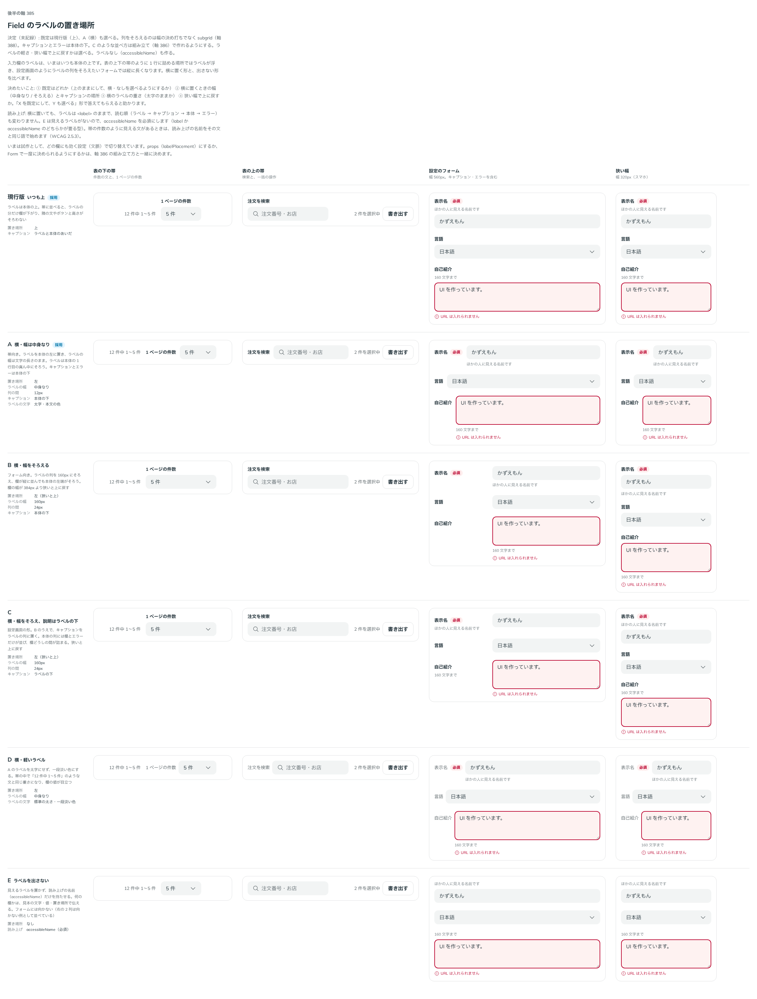

# 0365. 入力欄のラベルは上が既定で、横（本体の左）に置くことも、見えるラベルを置かないこともできる

- ステータス: Accepted
- 日付: 2026-09-29
- ラウンド: 後半 軸 385

## 背景

入力欄のラベルは、原則 4 の 3 層のとおり、いつも本体の上にありました。表の上下の帯のように 1 行に詰めて並べる場所では、上のラベルが浮いて見えます（DataTable のレシピの「1 ページの件数」の Select と、上の帯の検索欄）。設定画面のようにラベルの列をそろえたいフォームでは、縦に長くなります。ここでは、ラベルの置き場所と、見えるラベルを置かない形を決めます。

## 候補

比較は、決めた時点のコミット `341bb8d` の比較のストーリー（`design/stories/axis-385-field-label-placement.stories.tsx`）です。列は、表の下の帯・表の上の帯・設定のフォーム（560px）・狭い幅（320px）です。

| 案                                    | 置き場所       | ラベルの幅       | キャプション | ラベルの文字         |
| ------------------------------------- | -------------- | ---------------- | ------------ | -------------------- |
| 現行版（いつも上。採用・既定）        | 上             | —                | ラベルの下   | 太字                 |
| A（横・幅は中身なり。採用・選べる）   | 左             | 中身なり         | 本体の下     | 太字                 |
| B（横・幅をそろえる）                 | 左（狭いと上） | 160px で決め打ち | 本体の下     | 太字                 |
| C（横・幅をそろえ、説明はラベルの下） | 左（狭いと上） | 160px で決め打ち | ラベルの下   | 太字                 |
| D（横・軽いラベル）                   | 左             | 中身なり         | 本体の下     | 標準の太さ・一段淡い |
| E（ラベルを出さない）                 | なし           | —                | 本体の上     | —                    |

## 決定

**既定は現行版（上）のままにし、A（横）も `labelPlacement="start"` で選べるようにします。** ほかの案の要素は、次の形で取り入れます。

- 列をそろえる（B）は、幅を決め打ちにしません。親を 2 列の grid にし、欄を subgrid で乗せる `FieldGroup` を足します。ラベルの列は、中で最も長いラベルの幅になります
- キャプションと状態の行は、横に置いたときも本体の下です
- 説明をラベルの下に置く形（C）は、組み立て（[ADR-0366](./0366-field-composition.md)）で作れます。FieldGroup の中で子を 2 つの箱に分けると、1 つ目がラベルの列に乗ります
- ラベルの軽さ（D）と、狭い幅で上に戻すかは、選べるようにします（[ADR-0367](./0367-field-start-defaults.md)）
- ラベルを出さない形（E）も作ります。`label` を省くときは `accessibleName` を必須にします（型 `FieldNamed`。どちらか一方が要る）。見えない文字のラベルとして置くので、読み上げの名前と Form のエラーの一覧の名前にもなります

## 理由

ユーザーの返事の原文です。

> そもそもラベルやヘルプテキストがセットになっている挙動自体を見直した方がいいのかも？（自分で Field を使って組み立ててもらう？）と思っています。label をなしで許容するなら、accessibleName は必須にしたいです。

> 385 デフォルトは現行版で、A のような横並びもできるようにしたいです。B のように揃えるかどうかは幅決め打ちとせず、css subgrid をユーザー側で利用するか、subgrid を適用できる使い方を付け加える形で対応したいです。キャプションやエラーが入力欄の下に出るのは自然でいいと思いました。C のような使い方についても、組み方次第でできるようにしたいですね。ラベルの軽さも選べるのが望ましいと思います。自動で折りたたむかも選べるようにしたいですね。ラベルナシも対応したいです。

幅を決め打ちにすると、ラベルの長さが変わるたびに値を直すことになります。subgrid なら、並んだ欄のうち最も長いラベルに列が合います。

## 却下した案と理由

- **B・C の 160px の決め打ち**: 採りませんでした。列そろえは FieldGroup（subgrid）で行います
- **C を部品の props で持つこと**: 採りませんでした。組み立てで作れるようにします
- **E を既定の形の 1 つにすること**: フォームには向かないので、選べる形にとどめます

## 影響

- 入力欄と Field に `labelPlacement`（`top`・`start`）・`accessibleName` を足しました。公開の props の型は `FieldNamed<…>` で、label か accessibleName のどちらかが要ります
- `FieldGroup` を足しました（2 列の grid・入れ物。中の欄の既定を `start` にする）
- Form のエラーの一覧は、欄の名前を Field の根（`data-slot="field"`）の中のラベルから読むようにしました。横置きと組み立てでは、状態の行とラベルが兄弟とは限らないためです
- DataTable のレシピ: 下の帯の「1 ページの件数」は横のラベル（軽い）に、上の帯の検索欄はラベルを出さない形（accessibleName）にしました。[ADR-0348](./0348-data-table-footer-recipe.md) の下の帯の並びはそのままです
- 比較のストーリーは消しました

## 原則への反映

原則 4 の文を書き換えました。名前はふつう本体の上で、1 行に詰める帯や列をそろえるフォームでは左に置くこと、左の列は最も長いラベルの幅にそろえること、見えるラベルを置かないときも読み上げには名前を届けることを書きました。

## 比較画像

決めた時点のコミットは `341bb8d` です。`git checkout 341bb8d && pnpm storybook` で、比較のストーリー（`Design Review/385 Field のラベルの置き場所`）を決めたときの部品のまま開けます。
