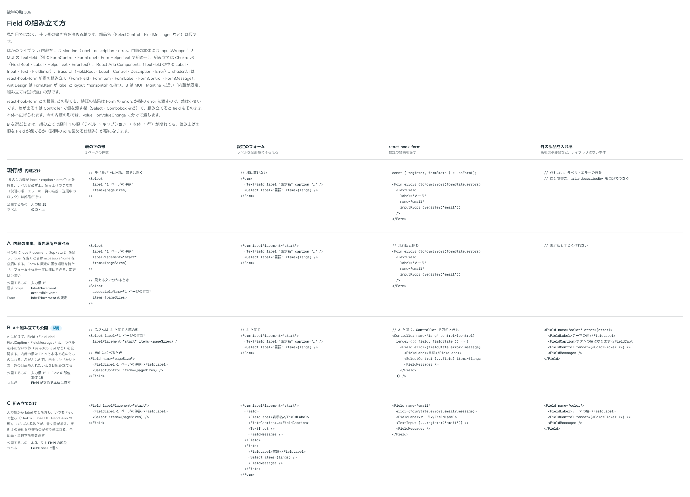

# 0366. 入力欄は内蔵の形のまま、Field の部位とラベルを持たない本体も公開して組み立てられるようにする

- ステータス: Accepted
- 日付: 2026-09-29
- ラウンド: 後半 軸 386

## 背景

入力欄は label・caption・errorText を内蔵し、読み上げのつなぎ（説明の順、エラーの一覧の名前、送信中のロック）を部品が持っています。並べ方を変えたいとき（説明をラベルの列に置くなど）や、ライブラリにない本体（色を選ぶ部品など）を入れたいときに、手段がありませんでした。見た目ではなく、使う側の書き方を決める軸です。

## 候補

比較は、決めた時点のコミット `341bb8d` の比較のストーリー（`design/stories/axis-386-field-composition.stories.tsx`）です。列は、表の下の帯・設定のフォーム・react-hook-form・外の部品を入れる、の 4 つの書き方です。

| 案                                | 公開するもの                                    |
| --------------------------------- | ----------------------------------------------- |
| 現行版（内蔵だけ）                | 入力欄                                          |
| A（内蔵のまま、置き場所を選べる） | 入力欄（labelPlacement・accessibleName を足す） |
| B（A＋組み立ても公開。採用）      | 入力欄＋Field の部位＋ラベルを持たない本体      |
| C（組み立てだけ）                 | Field の部位＋本体                              |

ほかのライブラリは、内蔵が既定で組み立ては逃げ道（Mantine・MUI）、組み立てだけ（Chakra v3・React Aria・Base UI）、react-hook-form 前提の組み立て（shadcn/ui）に分かれます。B は MUI・Mantine に近い形です。

## 決定

**B を採用します。** A を先に入れる段階は踏まず、同じ変更で一度に入れます。

- `Field` は、文（label・caption・errorText など）と欄の状態（押せない・待っている・エラー・必須）を持ち、文脈で中に渡します
- 部位は `FieldLabel`・`FieldCaption`・`FieldMessages` です。部位は文を持たず、どこに出すかだけを決めます。読み上げの説明の順（キャプション → エラー → 警告 → 成功 → 情報）は、並べ方によらず Field が決めます
- ラベルを持たない本体を `<部品名>Control`（`TextFieldControl`・`SelectControl` など）で公開します。内蔵の入力欄は、Field と本体を標準の並べ方で組んだものになります
- ライブラリにない本体は `FieldControl` の `render` で包みます。id・説明のつながり・エラーの状態・押せない状態を付けます
- 本体がボタンの部品（Select など）や、選択肢を並べるグループは、組み立てで置いたときも本体の側からラベルの描き方を Field に知らせます

## 理由

ユーザーの返事の原文です。

> この形が理想形と思いつつ、他のライブラリと比較するとどこまでカバーするか迷っているところです（内蔵の方が楽だが、組み立ての方が柔軟性は上がる。react-hook-form などとの親和性も気になる。）

> 386 B がいいなあと思ったのですが、どのくらい複雑になりますか？

> 386 先にAを入れる慎重さは現状のフェーズではいらないかなと思いました。Typography の変更とは別の pr にして一気に対応しちゃうでいい気がしました。

react-hook-form との相性は、検証の結果を Form の errors か欄の errorText に渡す点ではどの形も同じです。Controller で値を渡す欄では、組み立てのほうが field をそのまま本体へ広げられます。

## 却下した案と理由

- **現行版**: 並べ方を変える手段がありません
- **A だけ**: B の一部として入れました。段階を分ける必要はないと判断しました
- **C**: 書く量が増え、原則 4 の骨組みを守る責任が使う側に移ります。全部品と全見本の書き直しも要ります

## 影響

- 公開: `Field`・`FieldLabel`・`FieldCaption`・`FieldMessages`・`FieldControl`・`FieldGroup` と、各入力欄の `<部品名>Control`・`<部品名>ControlProps`
- 入力欄の props は、外枠の props と本体の props に分けて扱います（`splitFieldProps`）。内蔵の入力欄の見た目と DOM は変えていません
- 比較のストーリーは消しました

## 原則への反映

反映なし。組み立てても骨組み（ラベル / 本体 / キャプション）と読み上げの順は変わらないので、原則 4 の文はそのままです（置き場所の書き換えは [ADR-0365](./0365-field-label-placement.md)）。

## 比較画像

決めた時点のコミットは `341bb8d` です。`git checkout 341bb8d && pnpm storybook` で、比較のストーリー（`Design Review/386 Field の組み立て方`）を開けます。
