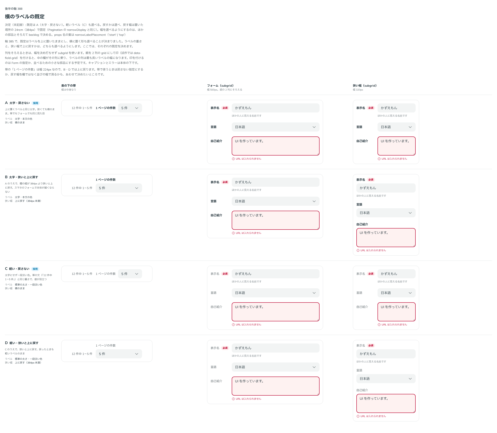

# 0367. 横に置くラベルは太字で、狭くても戻さないのが既定。軽いラベルと、24rem 未満で上に戻す形も選べる

- ステータス: Accepted
- 日付: 2026-09-29
- ラウンド: 後半 軸 388

## 背景

[ADR-0365](./0365-field-label-placement.md) で、ラベルを横に置く形を足し、ラベルの重さと狭い幅で上に戻すかは選べるようにすると決めました。ここではそれぞれの既定と、戻す幅を決めます。

## 候補

比較は、決めた時点のコミット `341bb8d` の比較のストーリー（`design/stories/axis-388-field-start-defaults.stories.tsx`）です。列は、表の下の帯・FieldGroup のフォーム（560px）・狭い幅（320px）です。

| 案                              | ラベル                 | 狭い幅                 |
| ------------------------------- | ---------------------- | ---------------------- |
| A（太字・戻さない。採用・既定） | 太字・本文の色         | 横のまま               |
| B（太字・狭いと上に戻す）       | 太字・本文の色         | 上に戻す（384px 未満） |
| C（軽い・戻さない。選べる）     | 標準の太さ・一段淡い色 | 横のまま               |
| D（軽い・狭いと上に戻す）       | 標準の太さ・一段淡い色 | 上に戻す（384px 未満） |

## 決定

**A（太字・戻さない）を既定にします。** 軽いラベルは `labelVariant="muted"`、上に戻すのは `narrowLabelPlacement="top"` で選べます。

- 戻す幅は、置いた場所の 24rem（384px）で固定します。Pagination の `narrowDisplay` と同じ幅です
- 置いた場所は、FieldGroup の中では並び全体、それ以外では欄そのものです。FieldGroup の中の欄は入れ物（container）にしません。入れ物にすると、中身の幅が親の列（auto）に伝わらず、列がそろわないためです
- props の名前は、Pagination の `narrowDisplay` にならって `narrowLabelPlacement` にしました。`collapse`（Timeline）は、開閉の部品 Collapsible と紛れるので避けました

## 理由

ユーザーの返事の原文です。

> 388 太字、戻さないをデフォルトに。細字も選択できつつ、ブレークポイントは選べるとよさそうです。ほかのコンポーネントでは類似処理はなさそうでしょうか？

> 388 一旦現状の固定値としましょう。任意ブレイクポイントはほかのコンポーネントと揃えるために backlog 行きにします。prop名は collapse 以外にないでしょうかね

幅に応じて並びを切り替える部品は、ほかに Timeline（28rem）・Gallery・Pagination（どれも固定）と、画面の幅の段を選べる Grid があります。幅を選べるようにするのは、これらとそろえて決めます（backlog）。

## 却下した案と理由

- **B・D を既定にすること**: 帯のように欄が細い場所で、意図せず上に戻ってしまいます
- **戻す幅を選べるようにすること**: いまはしません。ほかの部品とそろえて backlog で決めます

## 影響

- 入力欄と Field・FieldGroup に `labelVariant`（`default`・`muted`）・`narrowLabelPlacement`（`start`・`top`）を足しました
- 比較のストーリーは消しました

## 原則への反映

原則 4 に、帯では横のラベルを一段淡くできること、狭い場所では上に戻せることを書きました（[ADR-0365](./0365-field-label-placement.md) と同じ書き換え）。

## 比較画像

決めた時点のコミットは `341bb8d` です。`git checkout 341bb8d && pnpm storybook` で、比較のストーリー（`Design Review/388 横のラベルの既定`）を開けます。
