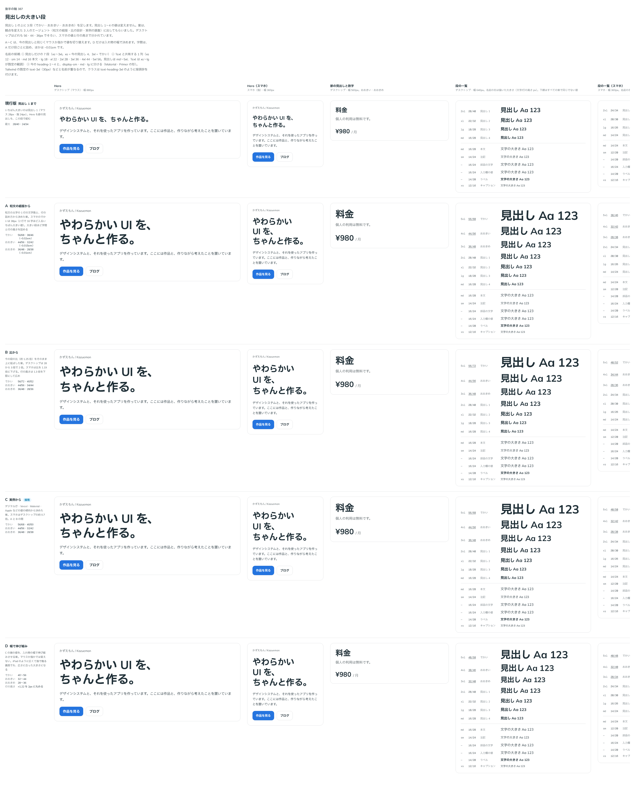

# 0369. 文字の大きさの段は、Text と Heading で共有する xs〜5xl。トークンとクラスは heading-・body- を付ける

- ステータス: Accepted
- 日付: 2026-09-29
- ラウンド: 後半 軸 387

## 背景

見出しの大きい段（[ADR-0368](./0368-display-type-scale.md)）を足すと、見出しは 7 段になります。今の Heading の `size` は数字（`1` が最も大きい）で、その上に足す段の名前と、Text の大きさ（`md`・`sm`）との関係を決める必要がありました。Text で「¥980」のような大きな文字を出せない問題もありました（backlog）。

## 候補

比較は [ADR-0368](./0368-display-type-scale.md) と同じストーリーの説明に、3 つの名前の付け方を並べました（決めた時点のコミット `fbc1e5c`）。

- ① 見出しだけの 7 段（xs〜3xl）
- ② Text と共有する 1 列（xs 12・sm 14・md 16・lg 18・xl 22・2xl 28・3xl 36・4xl 44・5xl 56。値はマウスのとき）
- ③ 今の heading-1〜4 と、display-sm・md・lg に分ける（Material・Primer の形）

## 決定

**② を採用します。** Text と Heading の `size` は、同じ段の名前（`xs`〜`5xl`）を使います。

- Heading の `size` は `md`〜`5xl` です。既定は段から決まり、h1 は `2xl`、h2 は `xl`、h3 は `lg`、h4〜h6 は `md` です（今の 1〜4 段と同じ大きさ）
- Text の `size` は `xs`〜`5xl` です。`md` が本文、`sm` が注記、`xs` はキャプションと同じ大きさ、`lg` 以上は見出しと同じ大きさで、太さは `weight` で決めます
- Stat の数字の大きさ（`size`）も `md`〜`5xl` です（今の `heading-1`・`heading-2`・`heading-3`・`body` は `2xl`・`xl`・`lg`・`md`）
- トークンとクラスには接頭辞を付けます。見出しの段は `--text-heading-md`〜`5xl`（クラス `text-heading-5xl` など）、本文は今の `--text-body`・`--text-body-sm` のままです。Tailwind の既定の `text-xl` などは上書きしません

## 理由

ユーザーの返事の原文です。

> 数字は振りなおして良いと思っていますが、そもそも数字ではなく xl, lg, md, sm, xs のようなデザイントークンに振り分けた方が直感的ではあると思いました。Text は Heading 同様に選べるのがいいかなと思いました。

> 名前は xs-5xl で違和感ないです。tailwind の既定を上書きしないのには理由がありますか？

> なるほど。提案してもらった heading- body- で良さそうですね。

- Text の今の `md`・`sm` がそのまま使え、Heading と Text で同じ名前が同じ大きさを指します
- トークンは `@theme` から利用者の Tailwind のクラスになります（[ADR-0076](./0076-token-structure.md)）。`--text-xl` などの名前にすると、利用者がこのライブラリと関係なく書いた `text-xl` まで値が変わり（20→22 など）、指で操作する端末では小さくなります。そのため、トークンとクラスには接頭辞を付け、`size` の値だけを尺度名にします

## 却下した案と理由

- **①**: Text の `md`（16）と見出しの `md`（22 相当）が同じ名前で別の大きさになり、紛らわしいため
- **③**: 見出しの中で名前の付け方が 2 つに分かれ、Text とも共有できないため

## 影響

- Heading の `size` が `1`〜`4` から `md`〜`2xl` に変わります（破壊的な変更。`size={2}` は `size="xl"`）
- Stat の `size` の値が変わります（破壊的な変更）
- トークン・クラスの `heading-1`〜`4` は `heading-2xl`・`xl`・`lg`・`md` になりました。Prose の見出しの余白のトークン（`--prose-heading-1-before` など）は要素の段を指すので、そのままです
- props.md の `size` の決まりを書き換え、[ADR-0237](./0237-size-scale.md) に追記しました
- backlog の「Text に大きい文字の段がありません」を消しました

## 原則への反映

反映なし。名前は props とトークンの決まりで、原則には書きません。

## 比較画像

[ADR-0368](./0368-display-type-scale.md) と同じ画像です。

決めた時点のコミットは `fbc1e5c` です。
