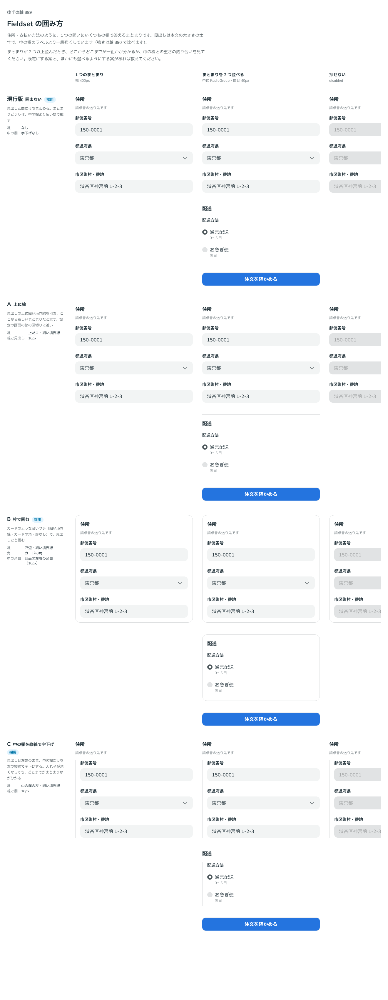

# 0370. Fieldset は囲まないのが既定。枠で囲む形と、中の欄だけを縦線で字下げする形も選べる

- ステータス: Accepted
- 日付: 2026-09-29
- ラウンド: 後半 軸 389

## 背景

Fieldset は、住所や宿泊の期間のように、1 つの問いにいくつもの欄で答えるまとまりです。見出しと中の欄をどう囲むか、まとまりが 2 つ以上並んだときにどこからどこまでが一組かをどう示すかを決めます。

## 候補

比較は、決めた時点のコミット `1637010` の比較のストーリー（`design/stories/axis-389-fieldset-frame.stories.tsx`）です。列は、1 つのまとまり・まとまりを 2 つ並べる・押せない、の 3 つです。

| 案                                      | 線                     | 角         | 中の欄                     |
| --------------------------------------- | ---------------------- | ---------- | -------------------------- |
| 現行版（囲まない。採用・既定）          | なし                   | —          | 字下げなし                 |
| A（上に線）                             | 上だけ・細い境界線     | —          | 字下げなし                 |
| B（枠で囲む。採用・選べる）             | 四辺・細い境界線       | カードの角 | 部品の左右の余白ぶん下げる |
| C（中の欄を縦線で字下げ。採用・選べる） | 中の欄の左・細い境界線 | —          | 縦線ぶん字下げ             |

## 決定

**既定は囲まない（現行版）にします。** 枠で囲む形（B）と、中の欄だけを縦線で字下げする形（C）も、`variant` で選べるようにします。A（上に線）は採りません。

- props 名は `variant: 'plain' | 'framed' | 'indented'`（既定 `'plain'`）です
- `framed` はカードのような薄いフチ（細い境界線・カードの角・影なし）で見出しごと囲みます（[原則 5](../principles.md#5-角丸は部品と包むもので分ける)）
- `indented` は見出しを左端に残し、中の欄だけを左の縦線で字下げします

## 理由

ユーザーの返事の原文です。

> 389 デフォルトは囲みなし、B と C も選べるようにしたいです。

> variant でおっけーです。

## 却下した案と理由

- **A（上に線）**: 採りませんでした。線が見出しの上だけに出ると、まとまりの始まりだけが示され、終わりが分からないためです

## 影響

- `Fieldset` に `variant`（`'plain'` | `'framed'` | `'indented'`）を足しました。既定は `'plain'`
- 比較のストーリーは消しました

## 原則への反映

原則 4 の文を書き換えました。詳細は [ADR-0372](./0372-fieldset-error.md) の「原則への反映」にまとめて書きます。

## 比較画像

決めた時点のコミットは `1637010` です。`git checkout 1637010 && pnpm storybook` で、比較のストーリー（`Design Review/389 Fieldset の囲み方`）を決めたときの部品のまま開けます。
