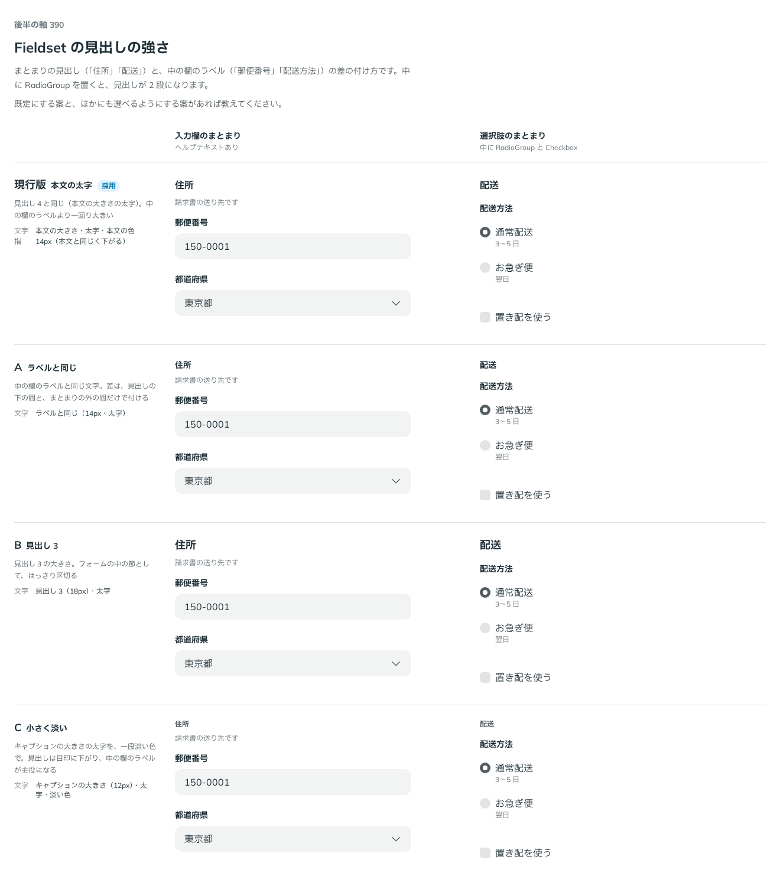

# 0371. Fieldset の見出しは本文の大きさの太字が既定。大きさは、Heading の段で選べるようにする予定

- ステータス: Accepted
- 日付: 2026-09-29
- ラウンド: 後半 軸 390

## 背景

Fieldset の見出し（「住所」「配送」）と、中の欄のラベル（「郵便番号」「配送方法」）の差の付け方を決めます。中に RadioGroup を置くと見出しが 2 段になるため、重さの釣り合いも見ます。

## 候補

比較は、決めた時点のコミット `1637010` の比較のストーリー（`design/stories/axis-390-fieldset-legend.stories.tsx`）です。列は、入力欄のまとまり・選択肢のまとまり、の 2 つです。

| 案                               | 文字                                   |
| -------------------------------- | -------------------------------------- |
| 現行版（本文の太字。採用・既定） | 本文の大きさ・太字・本文の色           |
| A（ラベルと同じ）                | 中の欄のラベルと同じ（太字）           |
| B（見出し 3）                    | 見出し 3 の大きさ・太字                |
| C（小さく淡い）                  | キャプションの大きさ・太字・一段淡い色 |

## 決定

**既定は現行版（本文の大きさの太字）のままにします。** 中の欄のラベルより一段強い見出しです。

- 見出しの大きさを段で選べるようにする props（`labelSize?: HeadingSize`、既定 `'md'`）は、Heading の大きさの段（`feat/display-type-scale`、ADR-0368・0369。Heading の `size` を `'md' | 'lg' | 'xl' | '2xl'` …に改める）の上に積んだあとで足します。今回はまだ足しません

## 理由

ユーザーの返事の原文です。

> 390 デフォルトは本文文字と同じで、今 typography-adjust agent がやっている文字サイズの段を指定できるようにしたいですね。

> セクションの見出しサイズ指定については typography-adjust agent がやっている形に合わせたいと考えています。

## 却下した案と理由

- **A（ラベルと同じ）**: 見出しと中の欄のラベルの重さが同じになり、まとまりが 2 つ以上並んだときに見出しが埋もれるため採りませんでした
- **B（見出し 3）**: 採りませんでした。フォームの中の節としては強すぎ、ページの見出しと紛れます
- **C（小さく淡い）**: 採りませんでした。見出しが目印まで下がり、まとまりの名前として弱くなります

## 影響

- 変更なし（既定の見た目は現行版のまま）。見出しの大きさの段（`labelSize`）は、Heading の大きさの段の PR（feat/display-type-scale）の上に積んだあとで足します（backlog）
- 比較のストーリーは消しました

## 原則への反映

原則 4 の文を書き換えました。詳細は [ADR-0372](./0372-fieldset-error.md) の「原則への反映」にまとめて書きます。

## 比較画像

決めた時点のコミットは `1637010` です。`git checkout 1637010 && pnpm storybook` で、比較のストーリー（`Design Review/390 Fieldset の見出しの強さ`）を決めたときの部品のまま開けます。
