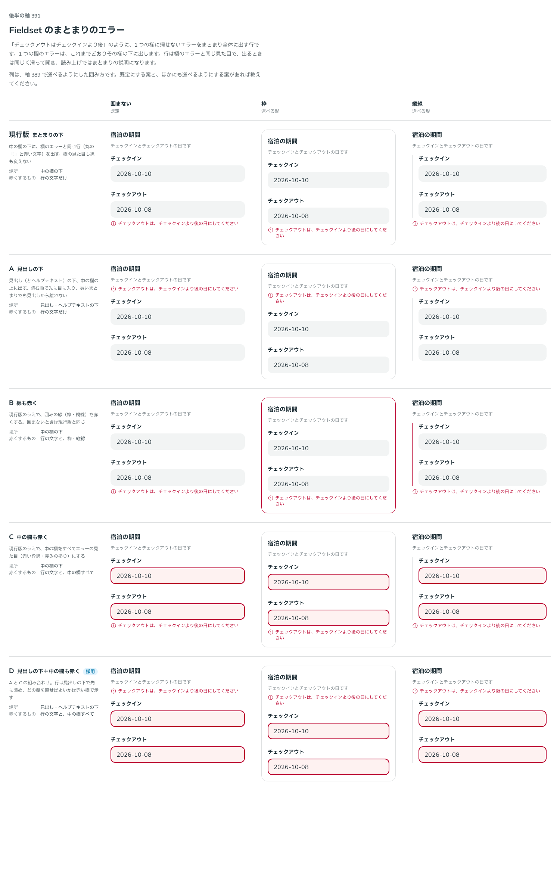

# 0372. Fieldset のまとまりのエラーは見出しの下に出し、中の欄をすべてエラーの見た目にする

- ステータス: Accepted
- 日付: 2026-09-29
- ラウンド: 後半 軸 391

## 背景

「チェックアウトはチェックインより後の日にしてください」のような、1 つの欄に帰せないエラー（欄どうしを照らし合わせた結果）を、Fieldset 全体にどう出すかを決めます。1 つの欄だけのエラーは、これまでどおりその欄の errorText に出します。

## 候補

比較は、決めた時点のコミット `5132b4b` の比較のストーリー（`design/stories/axis-391-fieldset-message.stories.tsx`）です。列は、[ADR-0370](./0370-fieldset-variant.md) で選べるようにした囲み方（囲まない・枠・縦線）です。

| 案                                  | 場所                       | 赤くするもの             |
| ----------------------------------- | -------------------------- | ------------------------ |
| 現行版（まとまりの下）              | 中の欄の下                 | 行の文字だけ             |
| A（見出しの下）                     | 見出し・ヘルプテキストの下 | 行の文字だけ             |
| B（線も赤く）                       | 中の欄の下                 | 行の文字と、枠・縦線     |
| C（中の欄も赤く）                   | 中の欄の下                 | 行の文字と、中の欄すべて |
| D（見出しの下＋中の欄も赤く。採用） | 見出し・ヘルプテキストの下 | 行の文字と、中の欄すべて |

## 決定

**D を採用します。** まとまりの errorText は見出し（とヘルプテキスト）の下に出し、中の欄をすべてエラーの見た目（赤い枠線・赤みの塗り、`aria-invalid` も付く）にします。囲みの線（枠・縦線）の色は変えません。警告・情報は、これまでどおり中の欄の見た目を変えません。1 つの欄だけのエラーは、これまでどおりその欄の errorText です。

## 理由

ユーザーの返事の原文です。

> 基本は D でいいかなと思いました。fieldset にエラーが発生しているということは、相関チェックだと思うので、すべての欄が赤くなるかつ、グループに対してエラーが所属しているように見えるDが妥当かな、という印象です。fieldset においても特定項目だけのエラーである場合は、引き続き個別の入力欄に対してだけエラーを付与できる認識です。

比較の途中で、囲まない形（現行版・B・C）だと行がまとまりの下に出るため、まとまりの最後の欄（チェックアウト）だけのエラーに見えやすいことも分かりました。見出しの下に出す A・D は、まとまり全体の話だと先に読め、この誤読を避けられます。

## 却下した案と理由

- **現行版・B・C（まとまりの下）**: 採りませんでした。行が最後の欄のすぐ下に出るため、最後の欄だけのエラーに見えやすいためです
- **A（見出しの下・文字だけ）**: 採りませんでした。相関チェックのエラーでは、どの欄を直せばよいかが分からないままです

## 影響

- `Fieldset` に `errorText`（まとまり全体のエラー）・`warningText`・`infoText` を足しました。行は見出し・ヘルプテキストの下、中の欄の上に出します
- `errorText` があるとき、`FieldsetContext` 経由で中の欄すべてに invalid（エラーの見た目・`aria-invalid`）を届けます
- 比較のストーリーと試作用のトークン（`--fieldset-line-invalid` など）は消しました

## 原則への反映

原則 4 の文を書き換えました。まとまりの見出しは中の欄のラベルより一段強いこと、欄どうしを照らし合わせた結果（まとまりのエラー）は見出しの下に出し中の欄をすべて赤くすること、1 つの欄の結果はその欄に出すことを書きました（[ADR-0370](./0370-fieldset-variant.md)・[ADR-0371](./0371-fieldset-legend.md) と合わせて 1 度の書き換えです）。

## 比較画像

決めた時点のコミットは `5132b4b` です。`git checkout 5132b4b && pnpm storybook` で、比較のストーリー（`Design Review/391 Fieldset のまとまりのエラー`）を決めたときの部品のまま開けます。
