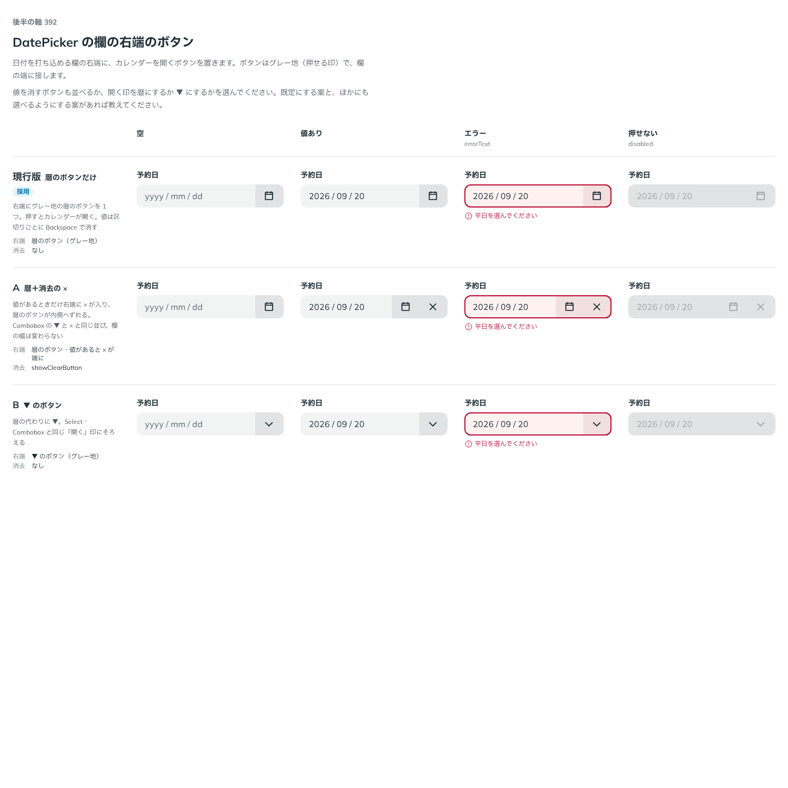
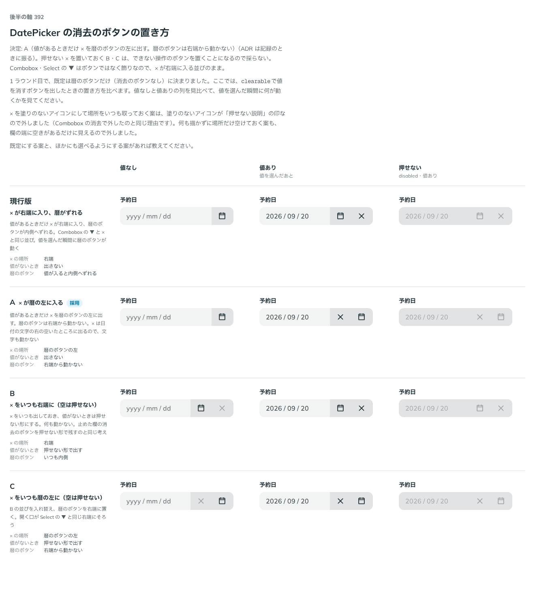

# 0374. DatePicker の消去のボタンは、値があるときだけ暦のボタンの左に出す

- ステータス: Accepted
- 日付: 2026-09-30
- ラウンド: 後半 軸 392（2 ラウンド）

## 背景

DatePicker（[ADR-0373](./0373-date-picker-foundation.md)）の、打ち込める欄（`variant="field"`）の右端に何を置くかを決めました。カレンダーを開くボタンは常に置きますが、値を消すボタン（`clearable`）も並べるかどうか、並べるならどこに置くかが軸です。

## 候補（1 ラウンド目）

比較は、コミット `e7026e8` の比較のストーリー（`design/stories/axis-392-date-picker-end-buttons.stories.tsx`）です。列は「空」「値あり」「エラー」「押せない」です。

| 案                   | 内容                                                                           |
| -------------------- | ------------------------------------------------------------------------------ |
| 現行版（採用・既定） | 右端に暦のボタンだけ。値は区切りごとに Backspace で消す。消去のボタンはなし    |
| A                    | 値があるときだけ右端に × が入り、暦のボタンが内側へずれる（`showClearButton`） |
| B                    | 暦の代わりに ▼（Select・Combobox と同じ「開く」印）                            |

## 候補（2 ラウンド目）

1 ラウンド目で、既定は暦のボタンだけ（消去のボタンなし）に決まりました。2 ラウンド目は、`clearable` で消去のボタンを出したときの置き方です。比較は、決めた時点のコミット `df9e11d` の比較のストーリー（同じファイル）です。列は「値なし」「値あり」「押せない」です。

| 案        | × の場所       | 値がないとき     | 暦のボタン             |
| --------- | -------------- | ---------------- | ---------------------- |
| 現行版    | 右端           | 出さない         | 値が入ると内側へずれる |
| A（採用） | 暦のボタンの左 | 出さない         | 右端から動かない       |
| B         | 右端           | 押せない形で出す | いつも内側             |
| C         | 暦のボタンの左 | 押せない形で出す | 右端から動かない       |

## 決定

**2 ラウンド目の A を採ります。** `clearable` にすると、値があるときだけ × を暦のボタンの左に出します。暦のボタンは右端から動きません。

- props 名は `showClearButton` ではなく **`clearable`** にします。Combobox・Autocomplete・TagsInput と同じ名前です
- 消去のボタンの名前は `clearName`（既定「日付を消去」）、暦を開くボタンの名前は `triggerName`（既定「カレンダーを開く」）です
- Combobox・Select の ▼ と × の並び（[ADR-0216](./0216-combobox-chevron-clear.md)）は変えません。Combobox・Select の ▼ はボタンではなく飾りで、グレーの領域全体が一覧を開く場所なので、▼ が内側へずれても押す場所は変わりません。DatePicker の暦のボタンは、それ自体が独立して押す場所なので、値が増えても位置を動かしません
- TimePicker（[ADR-0379](./0379-time-picker-foundation.md)）に消去のボタンを足すときも、同じ並び（A）にします

## 理由

1 ラウンド目のユーザーの返事の原文です。

> 392 Combobox を参考に考えましたが、これはボタン2つなのですね…基本は削除ボタンなしのカレンダーボタンだけでいいかなと思いましたが、削除ボタンを付けるとなったときにレイアウトシフトを考えると A 以外の選択肢も考えたい、という感じです

2 ラウンド目のユーザーの返事の原文です。

> 392 ですが、C で入力があるときに×ボタンが出てくる、でどうでしょうか。ADR-0216 が示しているのはアクションができないときにボタンを置かない、という解釈な気がします。そのうえで案を置いてみてくれますか？

このあと、Combobox・Select の ▼ が飾りであることを確かめました。

> Combobox/Select はグレーのエリア全体が選択肢を表示する領域で、▼ そのものはボタンではなく装飾にすぎません。なので、そのままが正しいです。TimePicker では同様に削除ボタンが生えるとしたら、A のパターンになります。

これにより、押せない × を置いておく B・C は「できない操作のボタンを置くことになる」ため採らず、値があるときだけ × を出す A・現行版のうち、暦のボタンを動かさない A に決まりました。

## 却下した案と理由

- **1 ラウンド目 A・B**: 既定には採りませんでした。消去のボタンを付けたときのレイアウトシフトを、2 ラウンド目で改めて比べました
- **2 ラウンド目 現行版**: 採りませんでした。暦のボタン（独立して押せるボタン）が値の有無で動くのは、指がすでに覚えた場所を変えることになります
- **2 ラウンド目 B・C（× をいつも出し、値がないときは押せない形）**: 採りませんでした。できない操作のボタンを常に置くことになります（塗りのないアイコンで「押せない意味の説明」を表す決まり（[ADR-0216](./0216-combobox-chevron-clear.md)）とも違う、押せない見た目のボタンです）
- **× を塗りのないアイコンにする案・場所だけ空けておく案**: Combobox の消去で外したのと同じ理由（塗りのないアイコンは「押せない意味の説明」の印）で外しました

## 影響

- `src/components/date-picker/DatePicker.tsx`: `clearable`（既定 `false`）・`clearName`（既定「日付を消去」）・`triggerName`（既定「カレンダーを開く」）を持ちます。× は DOM の順で暦のボタンより前に置きます（CSS の `order` で入れ替えると Tab の順と見た目の順がずれるため）
- 比べるためだけに置いた `design/stories/DatePickerAxisParts.tsx` の `clear-layout.ts`（`DatePickerClearLayout`）は、記録のコミットで消しました。部品は A の並びだけを持ちます

## 原則への反映

原則 8 の文を書き換えました。「押せない意味の説明と、値があるときだけ出るボタンが同じ端に並ぶときは、ボタンを端に置き、説明はその内側にします」の一文に続けて、もとから端にあるものが独立して押せるボタンのときは逆になる（ボタンは動かさず、あとから出るボタンを内側に挟む）ことを足しました。

## 比較画像

1 ラウンド目は、決めた時点のコミット `e7026e8` の比較のストーリーで撮りました。`git checkout e7026e8 && pnpm storybook` で、当時の部品のまま開けます。

2 ラウンド目は、決めた時点のコミット `df9e11d` の比較のストーリーで撮りました。`git checkout df9e11d && pnpm storybook` で、当時の部品のまま開けます。
