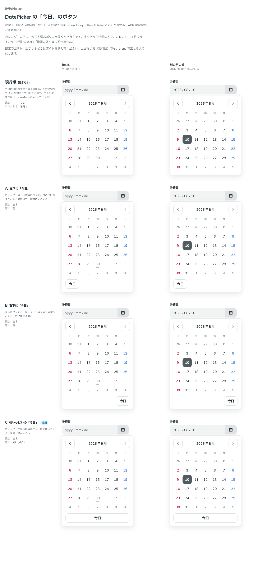

# 0376. DatePicker の「今日」のボタンは、既定で幅いっぱいに出す

- ステータス: Accepted
- 日付: 2026-09-30
- ラウンド: 後半 軸 394

## 背景

DatePicker のカレンダーの下に、今日を選ぶボタンを置くかどうかと、置くならどこに置くかを決めました。押すと今日が欄に入り、カレンダーは閉じます。今日が選べない日（範囲の外）なら押せません。

## 候補

比較は、決めた時点のコミット `df9e11d` の比較のストーリー（`design/stories/axis-394-date-picker-today-button.stories.tsx`）です。列は「値なし」「別の月の値」です。

| 案              | 既定     | 寄せ       |
| --------------- | -------- | ---------- |
| 現行版          | 出さない | （左寄せ） |
| A               | 出す     | 左         |
| B               | 出す     | 右         |
| C（採用・既定） | 出す     | 幅いっぱい |

## 決定

**C（幅いっぱいの「今日」）を既定で出します。** `showTodayButton`（既定 `true`）を `false` にすると外せます。

- 今日は日の太字と下線でも分かり、空の区切りで ↑↓ を押すと今日が入りますが、ボタンとしても出しておきます
- ボタンはカレンダーと同じ幅で、指で押しやすく、面の下端がそろいます

## 理由

ユーザーの返事の原文です。

> 394 今日ボタン以外が増えた場合どうしようと思いましたが、今日ボタンだけなら C かなと

「今日ボタン以外が増えた場合」は、まだ増えていない現時点では判断せず、backlog に残します（下の「影響」参照）。

## 却下した案と理由

- **現行版（出さない）**: 既定には採りませんでした。今日は太字と下線だけでも分かりますが、ボタンがあるほうがすぐ押せます
- **A（左下）・B（右下）**: 採りませんでした。幅いっぱい（C）のほうが指で押しやすく、面の下端もそろいます

## 影響

- `src/components/date-picker/DatePicker.tsx`: `showTodayButton`（既定 `true`）・`todayLabel`（既定「今日」）を持ちます。ボタンはカレンダーと同じ幅いっぱいで、既定でオンです
- 比べるためだけに置いた `--date-picker-footer-justify` は、切り替えを畳んだコミット（`13a5dd9`）で消し、幅いっぱいの並びに畳みました
- 比較のストーリーは消しました
- backlog に、「今日」以外のボタンが下の行に増えたときの並べ方（複数の操作をどう並べるか）を、まだ決めていないこととして足します

## 原則への反映

反映なし。原則 16 の「浮かべるときは、横に並べて端に寄せます」は、複数の操作を並べる場面の決まりです。この決定は単一のボタンを面の幅いっぱいにする決定で、並べ方そのものは扱っていません。

## 比較画像

決めた時点のコミットは `df9e11d` です。`git checkout df9e11d && pnpm storybook` で、比較のストーリー（`Design Review/394 DatePicker の「今日」のボタン`）を決めたときの部品のまま開けます。
