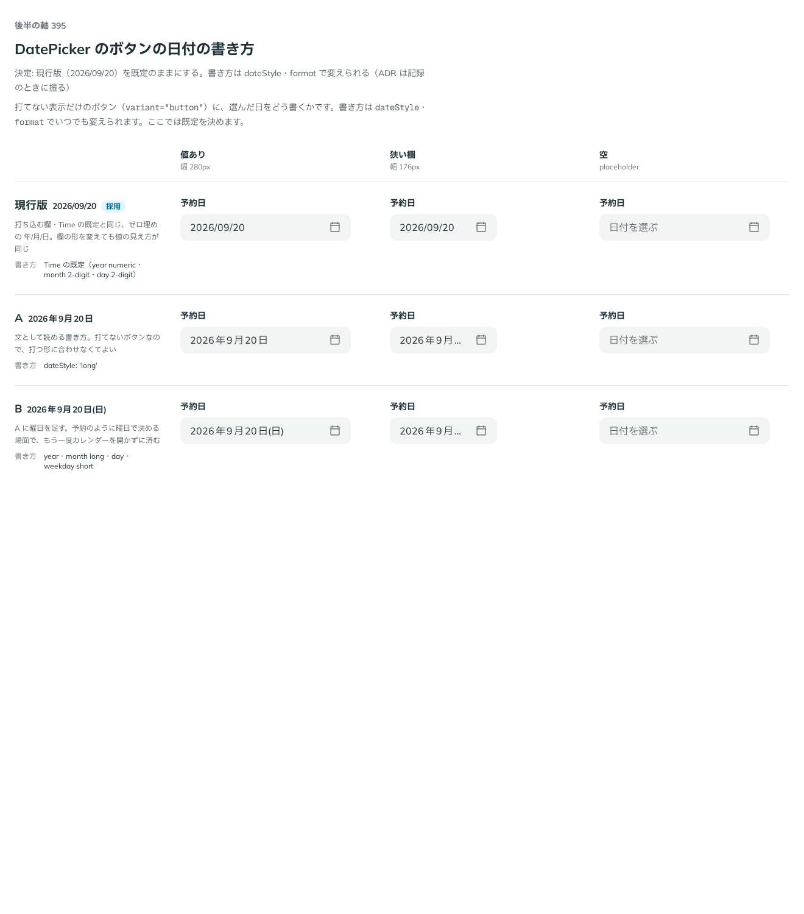

# 0377. DatePicker のボタンの日付は、現行版（2026/09/20）を既定にする

- ステータス: Accepted
- 日付: 2026-09-30
- ラウンド: 後半 軸 395

## 背景

打てない表示だけのボタン（`variant="button"`。[ADR-0373](./0373-date-picker-foundation.md)）に、選んだ日をどう書くかを決めました。書き方は `dateStyle`・`format` でいつでも変えられるので、ここでは既定を決めます。

## 候補

比較は、決めた時点のコミット `df9e11d` の比較のストーリー（`design/stories/axis-395-date-picker-button-format.stories.tsx`）です。列は「値あり」「狭い欄」「空」です。

| 案                   | 書き方                         | 例                |
| -------------------- | ------------------------------ | ----------------- |
| 現行版（採用・既定） | ゼロ埋めの年/月/日             | 2026/09/20        |
| A                    | `dateStyle: 'long'`            | 2026年9月20日     |
| B                    | year・month long・day・weekday | 2026年9月20日(日) |

## 決定

**現行版（2026/09/20）を既定のままにします。** `dateStyle`・`format` で、文として読める書き方（A）や曜日付き（B）にも変えられます。

## 理由

ユーザーの返事の原文です。

> 395 既定は現行版でいいかなと思いました。

打ち込む欄（DateField）・TimeField の既定と同じ書き方なので、欄の形（`variant="field"`・`variant="button"`）を変えても値の見え方が変わりません。

## 却下した案と理由

- **A（`dateStyle: 'long'`）・B（曜日付き）**: 既定には採りませんでした。打てないボタンだからといって、打ち込む欄と書き方を変える理由がありませんでした。文として読みたい場面や、曜日で決めたい予約の場面では `dateStyle`・`format` で選べます

## 影響

- `src/components/date-picker/DatePicker.tsx`: `dateStyle`・`format` に既定値を持たせず、`{ year: 'numeric', month: '2-digit', day: '2-digit' }`（2026/09/20）にしました
- 比較のストーリーは消しました
- Docs（`ButtonFormats` ストーリー）に、既定・2 桁指定・`dateStyle` の long・full・曜日付きの書き方を並べました

## 原則への反映

反映なし。原則 20（部品は知らないことを決めない）の「決めるときは、既定を1つ決め、ほかの形は選べるようにします」の範囲内です。日付の書式そのものは数値・書式の値で、原則には書きません。

## 比較画像

決めた時点のコミットは `df9e11d` です。`git checkout df9e11d && pnpm storybook` で、比較のストーリー（`Design Review/395 DatePicker のボタンの日付の書き方`）を決めたときの部品のまま開けます。
