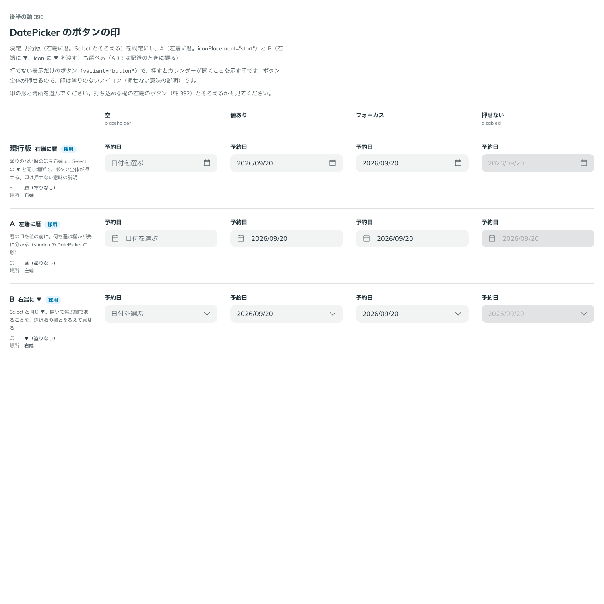

# 0378. DatePicker のボタンの印は、右端の暦が既定。左端の暦・右端の ▼ も選べる

- ステータス: Accepted
- 日付: 2026-09-30
- ラウンド: 後半 軸 396

## 背景

打てない表示だけのボタン（`variant="button"`。[ADR-0373](./0373-date-picker-foundation.md)）で、押すとカレンダーが開くことを示す印を決めました。ボタン全体が押せるので、印は塗りのないアイコン（押せない意味の説明。[原則 8](../principles.md#8-入力欄の様式は編集できるかで決まる)）です。

## 候補

比較は、決めた時点のコミット `df9e11d` の比較のストーリー（`design/stories/axis-396-date-picker-button-icon.stories.tsx`）です。列は「空」「値あり」「フォーカス」「押せない」です。

| 案                   | 印             | 場所 |
| -------------------- | -------------- | ---- |
| 現行版（採用・既定） | 暦（塗りなし） | 右端 |
| A（採用・選べる）    | 暦（塗りなし） | 左端 |
| B（採用・選べる）    | ▼（塗りなし）  | 右端 |

## 決定

**現行版（右端に暦）を既定にします。** A（左端に暦。`iconPlacement="start"`）と B（右端に ▼。`icon` に ▼ を渡す）も選べます。

- 右端の暦は、Select の ▼ と同じ場所です。打ち込める欄（`variant="field"`）の右端のボタン（[ADR-0374](./0374-date-picker-clear-button.md)）ともそろいます
- 左端の暦（A）は、何を選ぶ欄かが先に分かる並びです
- 右端の ▼（B）は、開いて選ぶ欄であることを Select とそろえて見せます

## 理由

ユーザーの返事の原文です。

> 396 デフォルトは Select に揃えて現行版でいいかなと思いました。A と B が選べても良さそうですね。

## 却下した案と理由

なし。3 案とも選べる形になりました。

## 影響

- `src/components/date-picker/DatePicker.tsx`: `icon`（既定は暦。`ReactNode` で差し替え可能）・`iconPlacement`（`'start' | 'end'`。既定 `'end'`）を持ちます
- 比べるためだけに置いた `--date-picker-icon-order` は、記録のコミットで消し、`iconPlacement="start"` を `-order-1` に畳みました
- 比較のストーリーは消しました

## 原則への反映

反映なし。塗りのないアイコンが押せない意味の説明であること（原則 8）、既定と差し替えの形（原則 20）はどちらも既存の範囲内です。

## 比較画像

決めた時点のコミットは `df9e11d` です。`git checkout df9e11d && pnpm storybook` で、比較のストーリー（`Design Review/396 DatePicker のボタンの印`）を決めたときの部品のまま開けます。
