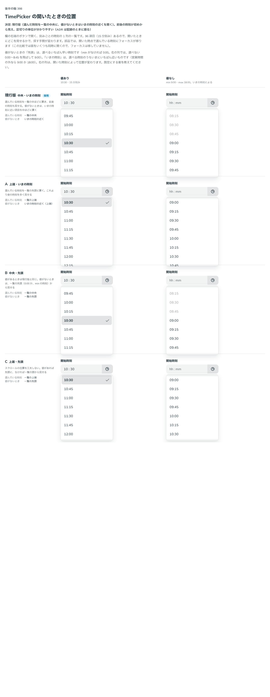

# 0380. TimePicker の一覧は、選んだ時刻を中央に開く。値がないときはいまの時刻の近く

- ステータス: Accepted
- 日付: 2026-09-30
- ラウンド: 後半 軸 398

## 背景

TimePicker（[ADR-0379](./0379-time-picker-foundation.md)）の 1 列の形は、刻みごとに項目が並ぶため（15 分刻みで 96 項目）、開いたときにどこを見せるかで探す手間が変わります。

## 候補

比較は、決めた時点のコミット `df9e11d` の比較のストーリー（`design/stories/axis-398-time-picker-scroll.stories.tsx`）です。列は「値あり」「値なし」です。

| 案                   | 選んでいる時刻 | 値がないとき             |
| -------------------- | -------------- | ------------------------ |
| 現行版（採用・既定） | 一覧の中央     | いまの時刻の近く         |
| A                    | 一覧の上端     | いまの時刻の近く（上端） |
| B                    | 一覧の中央     | 一覧の先頭               |
| C                    | 一覧の上端     | 一覧の先頭               |

## 決定

**現行版（選んだ時刻を一覧の中央に、値がないときはいまの時刻の近くを開く）を既定にします。**

- 開いた時点で、選んでいる時刻に項目のフォーカスが移ります
- 「先頭」は選べるいちばん早い時刻（`min` がなければ 0:00）、「いまの時刻」は選べる時刻のうちいまにいちばん近いものです

## 理由

ユーザーの返事の原文です。

> 398 現行の中央・いまの時刻が良いなと思いました。中央にあることで前後の時間が初めから見えており、区切られている単位が分かりやすいと思って選びました。

## 却下した案と理由

- **A・C（一覧の上端）**: 採りませんでした。これより後の時刻ばかりが見え、前の時刻が見えません
- **B・C（値がないとき一覧の先頭）**: 採りませんでした。いまの時刻の近くを開くほうが、探す手間が少なくなります

## 影響

- `src/components/time-picker/TimeListbox.tsx`: 開いたときに選んでいる項目（値がなければいまの時刻に近い項目）を一覧の中央へスクロールします
- 比べるためだけに置いた `--time-picker-scroll-align`・`--time-picker-empty-target` は、切り替えを畳んだコミット（`13a5dd9`）で消し、部品の中の決まった計算に畳みました
- 比較のストーリーは消しました

## 原則への反映

反映なし。開いたときのスクロール位置の決定で、原則が新しく扱う対象は増えていません。

## 比較画像

決めた時点のコミットは `df9e11d` です。`git checkout df9e11d && pnpm storybook` で、比較のストーリー（`Design Review/398 TimePicker の開いたときの位置`）を決めたときの部品のまま開けます。
