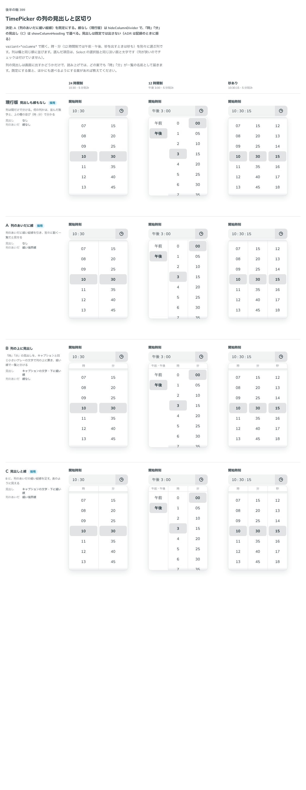

# 0381. TimePicker の列（variant="columns"）は、列のあいだに細い縦線が既定。線なし・見出しも選べる

- ステータス: Accepted
- 日付: 2026-09-30
- ラウンド: 後半 軸 399

## 背景

TimePicker の `variant="columns"`（[ADR-0379](./0379-time-picker-foundation.md)）で開く、時・分（12 時間制では午前・午後、秒を出すときは秒も）を別々に選ぶ列の、見出しと区切りを決めました。

## 候補

比較は、決めた時点のコミット `df9e11d` の比較のストーリー（`design/stories/axis-399-time-picker-columns.stories.tsx`）です。列は「24 時間制」「12 時間制」「秒あり」です。

| 案              | 見出し                         | 列のあいだ |
| --------------- | ------------------------------ | ---------- |
| 現行版          | なし                           | 線なし     |
| A（採用・既定） | なし                           | 細い境界線 |
| B               | キャプションの文字・下に細い線 | 線なし     |
| C               | キャプションの文字・下に細い線 | 細い境界線 |

## 決定

**A（列のあいだに細い縦線）を既定にします。** 線なし（現行版）は `hideColumnDivider` で、「時」「分」の見出しは `showColumnHeading` で、それぞれ独立に選べます（見出しは既定では出しません）。

- 見出しを画面に出すかどうかだけで、読み上げでは、どの案でも「時」「分」が一覧の名前として届きます

## 理由

ユーザーの返事の原文です。

> 399 A で、線なしも選べると良さそうです。時分秒の見出しがあると嬉しい時があるか気になりますね。

見出しについては、追加の確認（AskUserQuestion）で決まりました。

> 見出し: 基本は出さず、出せるようにはしておくと良さそうです。

## 却下した案と理由

- **B・C（見出しを既定で出す）**: 既定には採りませんでした。列は欄と同じ順に並び、選んだ項目も淡い面と太字で分かるため、見出しがなくても何の列か分かります。見出しが要る場面では `showColumnHeading` で出せます

## 影響

- `src/components/time-picker/TimePickerPanel.tsx`: `hideColumnDivider`（既定 `false`）・`showColumnHeading`（既定 `false`）を持ちます
- 比べるためだけに置いた `--time-picker-column-heading-display`・`--time-picker-column-divider` は、切り替えを畳んだコミット（`13a5dd9`）で消し、`tv` の variant（表示するかしないか）に畳みました
- 比較のストーリーは消しました

## 原則への反映

反映なし。列のあいだの区切りと見出しの決定で、既定と選べる形（原則 20）は既存の範囲内です。

## 比較画像

決めた時点のコミットは `df9e11d` です。`git checkout df9e11d && pnpm storybook` で、比較のストーリー（`Design Review/399 TimePicker の列の見出しと区切り`）を決めたときの部品のまま開けます。
