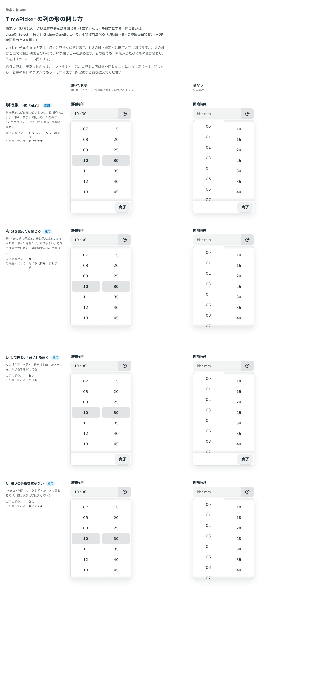

# 0382. TimePicker の列（variant="columns"）は、いちばん小さい単位を選んだら閉じるのが既定

- ステータス: Accepted
- 日付: 2026-09-30
- ラウンド: 後半 軸 400

## 背景

TimePicker の `variant="columns"`（[ADR-0379](./0379-time-picker-foundation.md)）は、1 列の形と違って 1 回選んだだけでは値が決まりません（時を選んでから分を選ぶ）。いつ閉じるかと、「完了」のボタンを置くかを決めました。どの案でも、列を選ぶたびに欄の値は変わり、外を押すか Esc でも閉じます。

## 候補

比較は、決めた時点のコミット `df9e11d` の比較のストーリー（`design/stories/axis-400-time-picker-close.stories.tsx`）です。列は「開いた状態」「値なし」です。

| 案              | 完了のボタン | 分（いちばん小さい単位）を選んだとき |
| --------------- | ------------ | ------------------------------------ |
| 現行版          | あり         | 開いたまま                           |
| A（採用・既定） | なし         | 閉じる                               |
| B               | あり         | 閉じる                               |
| C               | なし         | 開いたまま                           |

## 決定

**A（いちばん小さい単位を選んだら閉じる・「完了」なし）を既定にします。** 閉じるかどうかは `closeOnSelect`（既定 `true`）、「完了」ボタンを置くかは `showDoneButton`（既定 `false`）で、それぞれ独立に選べます（現行版・B・C の組み合わせもこの 2 つの props で作れます）。

- 秒を出すときは、秒がいちばん小さい単位です
- 時だけを選び直したいときは、外を押すか Esc で閉じます

## 理由

ユーザーの返事の原文です。

> 400 欄がどれくらいの数設置されているかにもよりますが、A がデフォルトで、閉じる閉じない・ボタンあるなしが選べる、がいいかなと思いました。

## 却下した案と理由

- **現行版・B（「完了」あり）**: 既定には採りませんでした。ボタンを置かないほうが面が小さくなります
- **現行版・C（開いたまま）**: 既定には採りませんでした。分を選んだ時点で値は決まっているので、閉じてよいと判断しました

## 影響

- `src/components/time-picker/TimePicker.tsx`: `closeOnSelect`（既定 `true`）・`showDoneButton`（既定 `false`）・`doneLabel`（既定「完了」）を持ちます
- 比べるためだけに置いた `--time-picker-done-display`・`--time-picker-close-on-last` は、切り替えを畳んだコミット（`13a5dd9`）で消し、props に応じて出し分ける形に畳みました
- 比較のストーリーは消しました

## 原則への反映

反映なし。選ぶと閉じる決まりは、Select・Combobox の一覧がすでに持つ挙動と同じで、TimePicker の列の形は「いちばん小さい単位を選んだとき」を同じ契機とみなしただけです。既定と選べる形（原則 20）の範囲内です。

## 比較画像

決めた時点のコミットは `df9e11d` です。`git checkout df9e11d && pnpm storybook` で、比較のストーリー（`Design Review/400 TimePicker の列の形の閉じ方`）を決めたときの部品のまま開けます。
