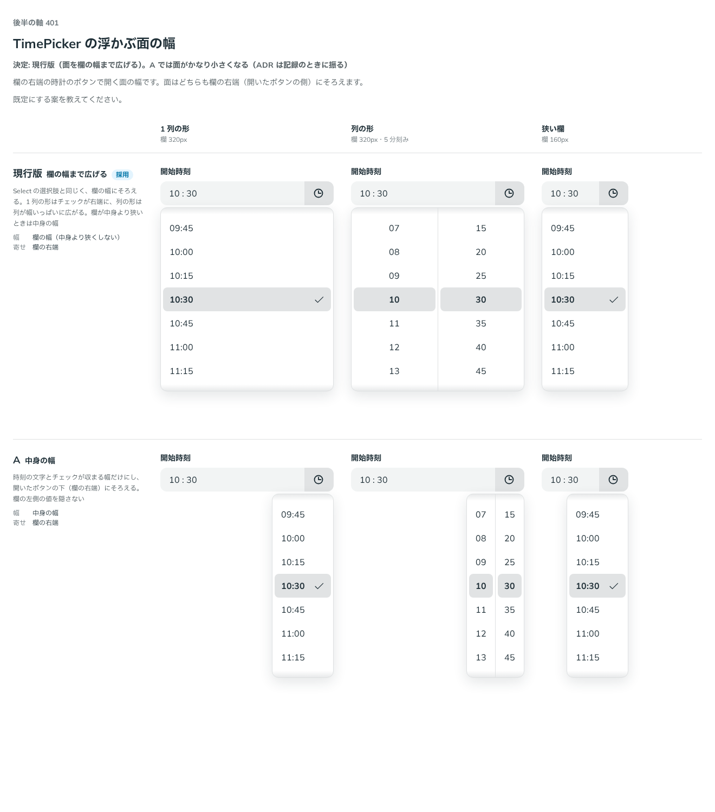

# 0383. TimePicker の面は、欄の幅まで広げる（現行版）

- ステータス: Accepted
- 日付: 2026-09-30
- ラウンド: 後半 軸 401

## 背景

TimePicker の欄の右端のボタンで開く面の幅を決めました。面はどちらの案でも、欄の右端（開いたボタンの側）にそろえます。

## 候補

比較は、決めた時点のコミット `df9e11d` の比較のストーリー（`design/stories/axis-401-time-picker-width.stories.tsx`）です。列は「1 列の形」「列の形」「狭い欄」です。

| 案                   | 幅                           |
| -------------------- | ---------------------------- |
| 現行版（採用・既定） | 欄の幅（中身より狭くしない） |
| A                    | 中身の幅                     |

## 決定

**現行版（面を欄の幅まで広げる）を既定にします。** Select の選択肢と同じく、欄の幅にそろえます。1 列の形はチェックが右端に、列の形は列が幅いっぱいに広がります。欄が中身より狭いときは中身の幅にします。

## 理由

ユーザーの返事の原文です。

> 401 現行版がいいかなと思いました。A だとかなり小さくなりますね。

## 却下した案と理由

- **A（中身の幅）**: 採りませんでした。欄が広いときに面がかなり小さくなり、Select・Combobox の一覧（欄の幅にそろえる）ともそろいません（[ADR-0036](./0036-select-popup.md)）

## 影響

- `src/internal/picker/PickerOverlay.tsx`: 面は `min-w-(--anchor-width)`（欄の幅を最小値にする）です
- 比べるためだけに置いた `--time-picker-popup-fill` は、記録のコミットで消しました
- 比較のストーリーは消しました

## 原則への反映

反映なし。Select の浮かぶ選択肢の見た目（[ADR-0036](./0036-select-popup.md)）にそろえただけの決定です。

## 比較画像

決めた時点のコミットは `df9e11d` です。`git checkout df9e11d && pnpm storybook` で、比較のストーリー（`Design Review/401 TimePicker の浮かぶ面の幅`）を決めたときの部品のまま開けます。
