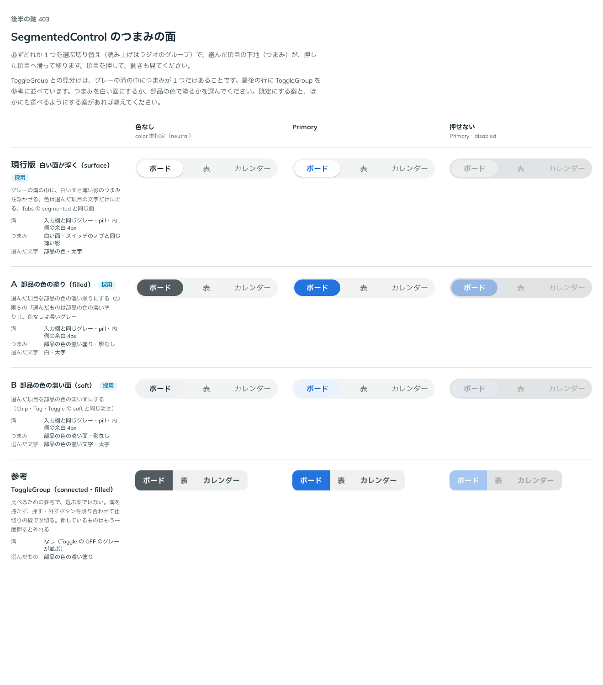
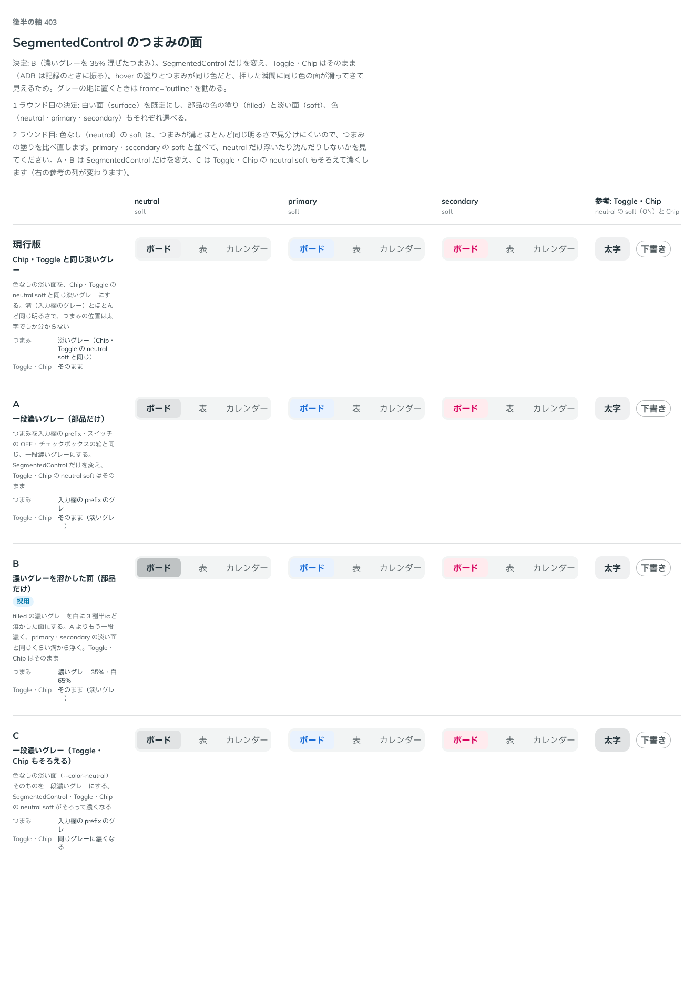

# 0385. SegmentedControl のつまみの面は、白い面（surface）が既定。塗り・淡い面と色も選べる

- ステータス: Accepted
- 日付: 2026-09-30
- ラウンド: 後半 軸 403（2 ラウンド）

## 背景

SegmentedControl（[ADR-0384](./0384-segmented-control-foundation.md)）の、選んだ項目の下地（つまみ）の面を決めました。

## 候補（1 ラウンド目）

比較は、コミット `9fd9e87` の比較のストーリー（`design/stories/axis-403-segmented-control-knob.stories.tsx`）です。列は「色なし」「Primary」「押せない」で、参考として ToggleGroup（connected・filled）も並べました。

| 案                   | つまみ                                        |
| -------------------- | --------------------------------------------- |
| 現行版（採用・既定） | 白い面・スイッチのノブと同じ薄い影（surface） |
| A（採用・選べる）    | 部品の色の濃い塗り・影なし（filled）          |
| B（採用・選べる）    | 部品の色の淡い面・影なし（soft）              |

## 決定（1 ラウンド目）

**現行版（白い面が浮く。`variant="surface"`）を既定にします。** 部品の色の濃い塗り（`variant="filled"`）と淡い面（`variant="soft"`）も選べ、色（`color`。neutral・primary・secondary）もそれぞれ選べます。

## 候補（2 ラウンド目）

1 ラウンド目のあと、色なし（neutral）の `variant="soft"` は、つまみが溝（入力欄のグレー）とほとんど同じ明るさで見分けにくいことが分かりました。比較は、決めた時点のコミット `df9e11d` の比較のストーリー（同じファイル）です。列は「neutral」「primary」「secondary」（いずれも soft）と「参考: Toggle・Chip」です。

| 案                            | つまみ                                                           | Toggle・Chip の neutral soft |
| ----------------------------- | ---------------------------------------------------------------- | ---------------------------- |
| 現行版                        | Chip・Toggle の neutral soft と同じ淡いグレー                    | そのまま                     |
| A                             | 入力欄の prefix と同じ、一段濃いグレー（部品だけ）               | そのまま                     |
| B（採用・既定。この部品だけ） | 濃いグレーを白に 35% 混ぜた面（部品だけ）                        | そのまま                     |
| C                             | 入力欄の prefix と同じ、一段濃いグレー（`--color-neutral` ごと） | 同じグレーに濃くなる         |

## 決定（2 ラウンド目）

**B（濃いグレーを 35% 混ぜたつまみ）を採ります。** SegmentedControl だけの値（`--segmented-control-neutral-subtle`）を変え、Toggle・Chip の neutral soft はそのままにします。グレーの地に置くときは `frame="outline"`（[ADR-0388](./0388-segmented-control-track.md)）を勧めます。

## 理由

1 ラウンド目のユーザーの返事の原文です。

> 403 デフォルトは現行で、他のコンポーネントと同様に soft, filled, color をそれぞれ選べると良さそうですね。neutral の soft はほとんどわからないですね。

2 ラウンド目のユーザーの返事の原文です。

> 403 neutral について、ホバー色と選択色が同じだと、クリックした瞬間に同じ色の背景が動いてきて動きが奇妙に見えました。B案はこの観点で一番良さそうに見えました。ただグレー背景のsoftは非推奨かもしれませんね（outline を使ってもらう）

hover の塗り（選んでいない項目に載せたときの淡い塗り）と、選んだつまみの塗りが同じ色だと、押した瞬間に「同じ色の面がもう一枚滑ってきた」ように見えます。B はつまみを hover よりはっきり濃くすることで、この重なりを避けます。C（Toggle・Chip もそろえて濃くする）は、SegmentedControl 以外の見た目まで変えることになるため見送り、この部品だけの値にしました。

## 却下した案と理由

- **1 ラウンド目 A（filled 固定）・B（soft 固定）**: 既定には採りませんでした。ほかの部品と同じく、色の塗りの強さを variant で選べるようにする方針です
- **2 ラウンド目 現行版**: 採りませんでした。つまみが溝とほとんど同じ明るさで、位置が太字でしか分かりません
- **2 ラウンド目 A**: 採りませんでした。B ほど溝から浮かず、hover の塗りとの差が小さいままです
- **2 ラウンド目 C**: 採りませんでした。Toggle・Chip の neutral soft まで濃くなり、SegmentedControl 以外の見た目に影響します

## 影響

- `src/components/segmented-control/SegmentedControl.tsx`: `variant`（`'surface'`（既定）・`'filled'`・`'soft'`）・`color`（`'neutral'`（既定）・`'primary'`・`'secondary'`）を持ちます
- `design/tokens.css`: `--segmented-control-neutral-subtle` を `color-mix(in oklab, var(--color-neutral-strong) 35%, var(--color-surface))` にしました
- SegmentedControl の Docs に、グレーの地では `frame="outline"` を勧める文を書きました
- 比較のストーリーは消しました

## 原則への反映

反映なし。選んでいることを部品の色の塗り・淡い面で示すこと（原則 6）、hover は手応え・選んでいることは状態として分けること（原則 3）は、いずれも既存の原則の範囲内です。つまみの具体的な塗りの値は、hover の塗りと衝突しないための調整で、tokens.css にだけ書きます。

## 比較画像

1 ラウンド目は、決めた時点のコミット `9fd9e87` の比較のストーリーで撮りました。`git checkout 9fd9e87 && pnpm storybook` で、当時の部品のまま開けます。

2 ラウンド目は、決めた時点のコミット `df9e11d` の比較のストーリーで撮りました。`git checkout df9e11d && pnpm storybook` で、当時の部品のまま開けます。
