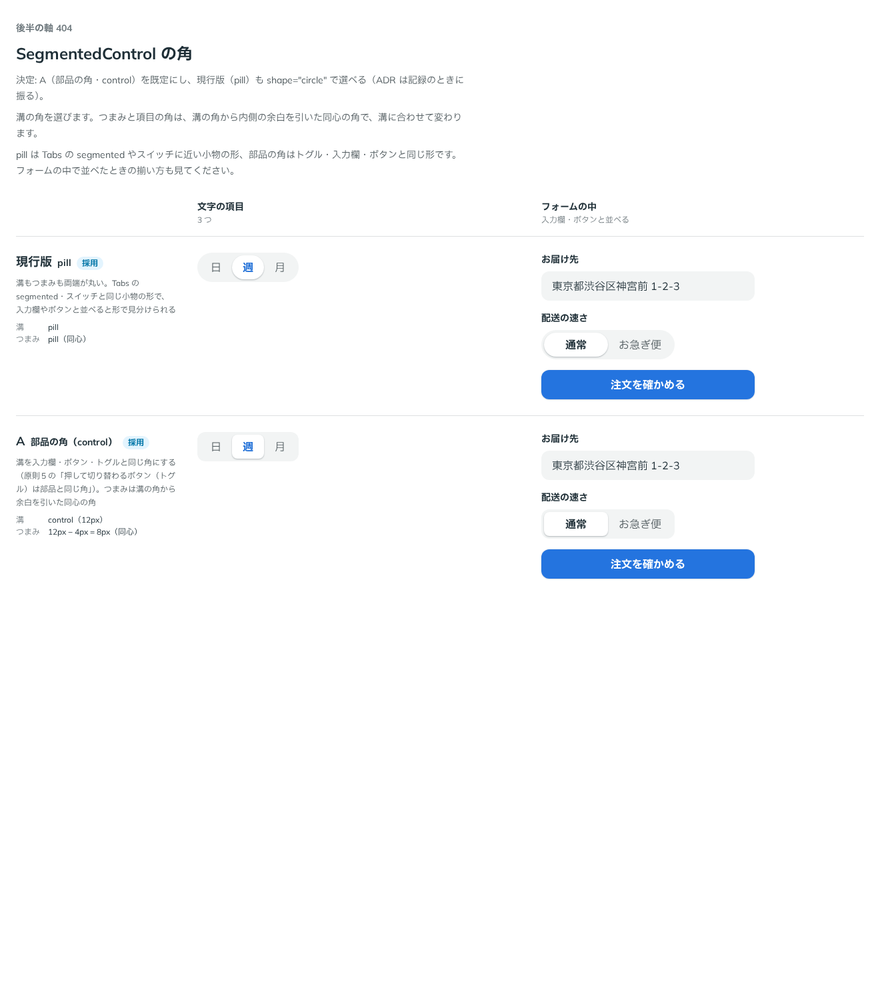

# 0386. SegmentedControl の角は、部品の角（shape="square"）が既定。丸（circle）も選べる

- ステータス: Accepted
- 日付: 2026-09-30
- ラウンド: 後半 軸 404

## 背景

SegmentedControl の溝の角を決めました。つまみと項目の角は、溝の角から内側の余白（`--segmented-control-pad`）を引いた同心の角です（[原則 5](../principles.md#5-角丸は部品と包むもので分ける)の「何かの内側に収めるものの角は、外側の角から余白を引いた同心の角」）。

## 候補

比較は、決めた時点のコミット `df9e11d` の比較のストーリー（`design/stories/axis-404-segmented-control-radius.stories.tsx`）です。列は「文字の項目」「フォームの中（入力欄・ボタンと並べる）」です。

| 案                     | 溝                  | つまみ（同心）   |
| ---------------------- | ------------------- | ---------------- |
| 現行版（採用・選べる） | pill（両端が丸い）  | pill             |
| A（採用・既定）        | 部品の角（control） | 12px − 4px = 8px |

## 決定

**A（部品の角。`shape="square"`）を既定にします。** 現行版（pill）も `shape="circle"` で選べます。

- 溝を入力欄・ボタン・トグルと同じ角にします。フォームの中で入力欄・ボタンと並べたとき、角の形がそろいます
- pill（`shape="circle"`）は、Tabs の segmented やスイッチに近い、小物としての見た目です

## 理由

ユーザーの返事の原文です。

> 404 pill と control の原則ってどうなってるんでしたっけ。入力欄として扱うなら control デフォルトの方が正しいような気もしますが…

追加の確認（AskUserQuestion）で決まりました。

> 404: control 既定・pill も選べる (Recommended)

props 名についても、あわせて確かめました。

> control or pill は radius より shape の方がいいかも？と思いましたが、語彙だとどういう扱いになっていますか？

props 名は **`radius` ではなく `shape`** にしました。`shape` は輪郭の形を表す語で、値は `circle`・`square` です（[ADR-0238](./0238-shape.md)）。Pagination の番号の形（[ADR-0178](./0178-pagination-shape.md)）と同じ語彙です。

## 却下した案と理由

なし。両案とも選べる形になりました。

## 影響

- `src/components/segmented-control/SegmentedControl.tsx`: `shape`（`SegmentedControlShape`。`'square'`（既定）・`'circle'`）を持ちます
- `design/tokens.css`: 比べるためだけに置いた `--segmented-control-radius` は、記録のコミットで消し、`shape` の variant に畳みました
- 比較のストーリーは消しました

## 原則への反映

反映なし。原則 5 の「押して切り替わるボタン（トグル）は、部品と同じ角です」は、SegmentedControl のような切り替えの部品にもそのまま当てはまります。pill を選べるようにした決定も、原則 5 の「小物は pill」の範囲内です。

## 比較画像

決めた時点のコミットは `df9e11d` です。`git checkout df9e11d && pnpm storybook` で、比較のストーリー（`Design Review/404 SegmentedControl の角`）を決めたときの部品のまま開けます。
