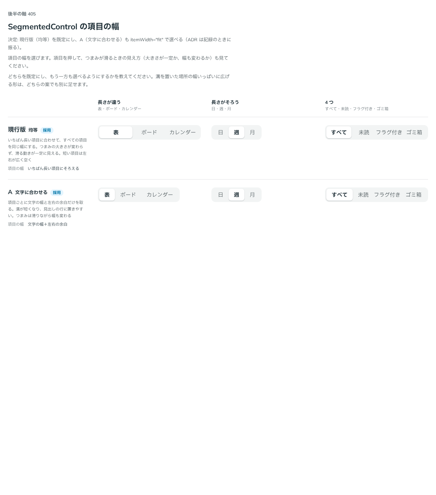

# 0387. SegmentedControl の項目の幅は、均等が既定。文字に合わせる形も選べる

- ステータス: Accepted
- 日付: 2026-09-30
- ラウンド: 後半 軸 405

## 背景

SegmentedControl の項目の幅（溝のグリッドの列の幅）を決めました。

## 候補

比較は、決めた時点のコミット `df9e11d` の比較のストーリー（`design/stories/axis-405-segmented-control-width.stories.tsx`）です。列は「長さが違う（表・ボード・カレンダー）」「長さがそろう（日・週・月）」「4 つ（すべて・未読・フラグ付き・ゴミ箱）」です。

| 案                   | 項目の幅                   |
| -------------------- | -------------------------- |
| 現行版（採用・既定） | いちばん長い項目にそろえる |
| A（採用・選べる）    | 文字の幅＋左右の余白       |

## 決定

**現行版（均等）を既定にします。** A（文字に合わせる）も `itemWidth="fit"` で選べます。

- 均等はつまみの大きさが変わらず、滑る動きが一定に見えます。短い項目は左右が広く空きます
- 文字に合わせる形は溝が短くなり、見出しの行に置きやすくなります。つまみは滑りながら幅も変わります

## 理由

ユーザーの返事の原文です。

> 405 基本は均等で、文字に合わせるのも選べると良さそうです。

## 却下した案と理由

なし。両案とも選べる形になりました。

## 影響

- `src/components/segmented-control/SegmentedControl.tsx`: `itemWidth`（`'equal'`（既定）・`'fit'`）を持ちます
- 比べるためだけに置いた `--segmented-control-columns` は、記録のコミットで消し、`auto-cols-fr`・`auto-cols-auto` を `itemWidth` の variant に畳みました
- 比較のストーリーは消しました

## 原則への反映

反映なし。項目の幅の決定で、原則が新しく扱う対象は増えていません。既定と選べる形（原則 20）の範囲内です。

## 比較画像

決めた時点のコミットは `df9e11d` です。`git checkout df9e11d && pnpm storybook` で、比較のストーリー（`Design Review/405 SegmentedControl の項目の幅`）を決めたときの部品のまま開けます。
