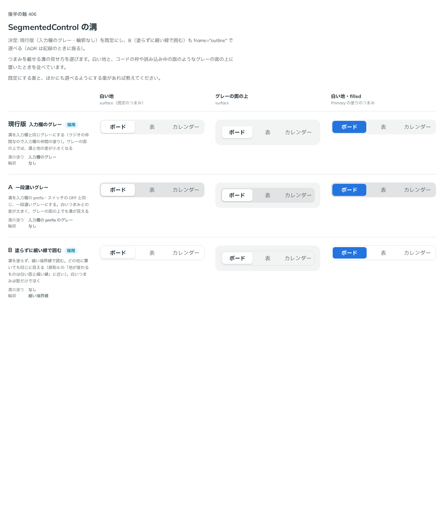

# 0388. SegmentedControl の溝は、入力欄のグレーが既定。塗らず線で囲む形も選べる

- ステータス: Accepted
- 日付: 2026-09-30
- ラウンド: 後半 軸 406

## 背景

SegmentedControl の、つまみを載せる溝の塗りと輪郭を決めました。白い地だけでなく、グレーの面（コードの枠や読み込み中の面と同じ地）の上に置いたときも比べました。

## 候補

比較は、決めた時点のコミット `df9e11d` の比較のストーリー（`design/stories/axis-406-segmented-control-track.stories.tsx`）です。列は「白い地」「グレーの面の上」「白い地・filled」です。

| 案                   | 溝の塗り                 | 輪郭       |
| -------------------- | ------------------------ | ---------- |
| 現行版（採用・既定） | 入力欄のグレー           | なし       |
| A                    | 入力欄の prefix のグレー | なし       |
| B（採用・選べる）    | なし                     | 細い境界線 |

## 決定

**現行版（入力欄のグレー・輪郭なし）を既定にします。** B（塗らずに細い線で囲む）も `frame="outline"` で選べます。

- 溝は入力欄と同じグレーです。SegmentedControl はラジオの仲間なので、入力欄の仲間の塗り（[原則 8](../principles.md#8-入力欄の様式は編集できるかで決まる)）に合わせます
- `outline` は、白い面にして文字と同じ色相の細い縁を引く形（[原則 6](../principles.md#6-色は役割で持つ)の「置かれる地で決める」）で、置く場所によって地が変わっても同じに見えます。グレーの地に置くときに勧める形です（[ADR-0385](./0385-segmented-control-knob.md)）

## 理由

ユーザーの返事の原文です。

> 406 現行デフォルトで、B も選べたほうがいいかも？と思いました。一段濃いグレーって他のパーツでは塗りに使われることありましたっけ？

追加の確認（AskUserQuestion）で決まりました。

> 406: 現行（入力欄のグレー）既定・B も選べる

## 却下した案と理由

- **A（一段濃いグレー）**: 採りませんでした。入力欄の prefix・スイッチの OFF と同じ濃さは、ほかの部品では「押せるボタンの地」や「値が入っている印」として使っており、SegmentedControl の溝（押せない土台）に転用すると意味が混ざります

## 影響

- `src/components/segmented-control/SegmentedControl.tsx`: `frame`（`'field'`（既定）・`'outline'`）を持ちます
- 比べるためだけに置いた `--segmented-control-track-bg`・`--segmented-control-track-border-width` は、切り替えを畳んだコミット（`13a5dd9`）で消し、`frame` の variant に畳みました
- SegmentedControl の Docs に、グレーの地では `frame="outline"` を勧める文を書きました（[ADR-0385](./0385-segmented-control-knob.md)）

## 原則への反映

反映なし。置かれる地によって、淡い塗りにするか白い面と細い縁にするかを選ぶ考え方は、原則 6 にすでに書いています。SegmentedControl はその適用先が増えただけです。

## 比較画像

決めた時点のコミットは `df9e11d` です。`git checkout df9e11d && pnpm storybook` で、比較のストーリー（`Design Review/406 SegmentedControl の溝`）を決めたときの部品のまま開けます。
