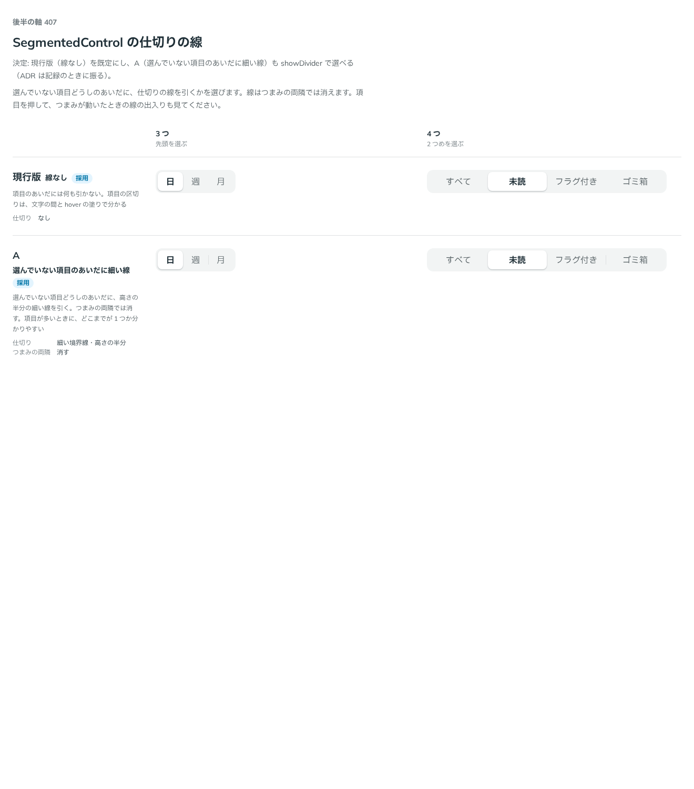

# 0389. SegmentedControl の仕切りの線は、なしが既定。選んでいない項目のあいだの線も選べる

- ステータス: Accepted
- 日付: 2026-09-30
- ラウンド: 後半 軸 407

## 背景

SegmentedControl で、選んでいない項目どうしのあいだに仕切りの線を引くかを決めました。

## 候補

比較は、決めた時点のコミット `df9e11d` の比較のストーリー（`design/stories/axis-407-segmented-control-divider.stories.tsx`）です。列は「3 つ」「4 つ」です。

| 案                   | 仕切り                                                                   |
| -------------------- | ------------------------------------------------------------------------ |
| 現行版（採用・既定） | なし                                                                     |
| A（採用・選べる）    | 選んでいない項目のあいだに細い境界線（高さの半分・つまみの両隣では消す） |

## 決定

**現行版（線なし）を既定にします。** A（選んでいない項目のあいだに細い線）も `showDivider` で選べます。

- 項目の区切りは、文字の間と hover の塗りだけで分かります
- 線は、項目が多いときにどこまでが 1 つか分かりやすくします。つまみの両隣では消え、つまみとぶつかりません

## 理由

ユーザーの返事の原文です。

> 407 デフォルトは現行で、線ありも選べると良さそうです。

## 却下した案と理由

なし。両案とも選べる形になりました。

## 影響

- `src/components/segmented-control/SegmentedControl.tsx`: `showDivider`（既定 `false`）を持ちます
- 比べるためだけに置いた `--segmented-control-divider-width` は、記録のコミットで消し、`showDivider` の variant に畳みました
- 比較のストーリーは消しました

## 原則への反映

反映なし。仕切りの線の有無の決定で、原則が新しく扱う対象は増えていません。既定と選べる形（原則 20）の範囲内です。

## 比較画像

決めた時点のコミットは `df9e11d` です。`git checkout df9e11d && pnpm storybook` で、比較のストーリー（`Design Review/407 SegmentedControl の仕切りの線`）を決めたときの部品のまま開けます。
