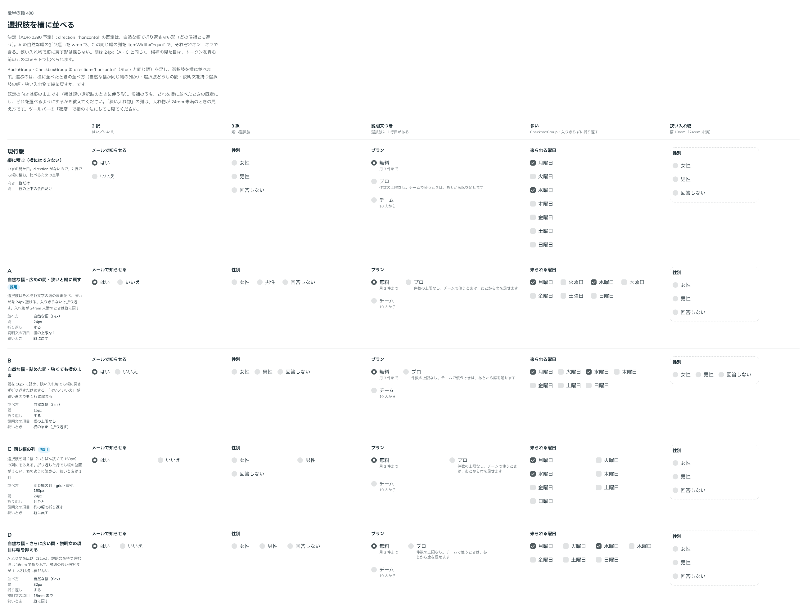

# 0391. RadioGroup・CheckboxGroup の横並びは、wrap で折り返しをオン・オフできる（既定はオフ）

- ステータス: Accepted
- 日付: 2026-10-01
- ラウンド: 後半 軸 408

## 背景

横に並べた選択肢（[ADR-0390](./0390-choice-group-horizontal.md)）が、入れ物より長くなったときにどうするかを決めました。曜日のように数が多い CheckboxGroup は、折り返さないと入れ物からはみ出します。

## 候補

比較は [ADR-0390](./0390-choice-group-horizontal.md) と同じ軸 408 の比較のストーリー（決めた時点のコミット `244dd6a`）です。A・B・D が「中身の幅で並べて折り返す」形です。

## 決定

**既定は折り返さない形にします。** 折り返す形（A の並べ方）は `wrap` で選べます（既定 `false`）。

- 選択肢が少なく、1 行に収まると分かっているときは、折り返さないほうが予期しない崩れがありません
- 数が多い、または入れ物の幅が分からないときに、使う側が `wrap` を付けます

## 理由

ユーザーの返事の原文です。

> 408「デフォルトは折り返しなしとして、自動折り返し・等幅オンオフを選べるようにしたいですね。等幅は説明が長い場合にもアンバランスにならなくてよいなと思いました。columns は指定できるようにするか迷いますね。」

出どころは、トリアージの F11 です。

## 却下した案と理由

なし。折り返す形は選べる形になりました。

## 影響

- `RadioGroup`・`CheckboxGroup`: `wrap`（既定 `false`）を持ちます

## 原則への反映

反映なし。既定を 1 つ決めてほかを選べる形にする考え方（原則 20）の範囲内です。

## 比較画像

[ADR-0390](./0390-choice-group-horizontal.md) と同じ画像です。決めた時点のコミットは、比較が `244dd6a`、実装が `65da03e` です。
