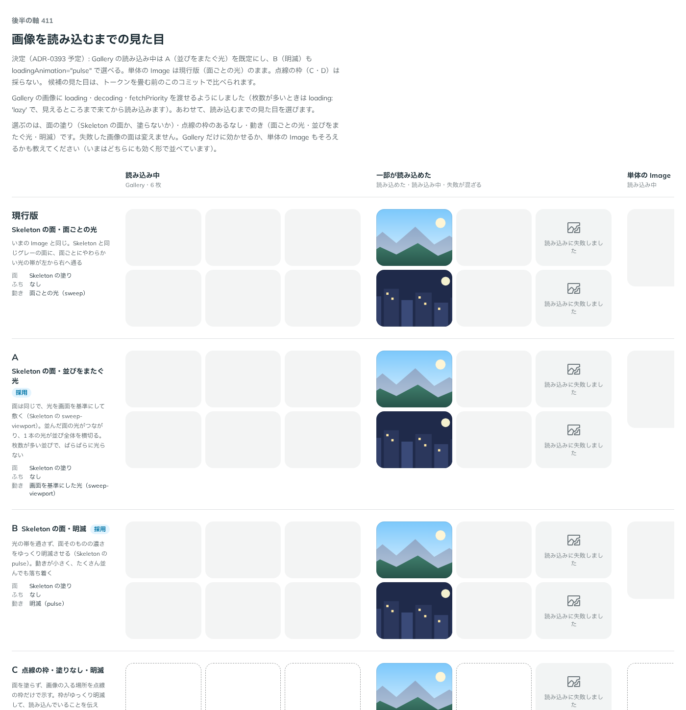

# 0396. Gallery の読み込み中は、格子全体を 1 本の光が横切る。loadingAnimation="pulse" も選べる

- ステータス: Accepted
- 日付: 2026-10-01
- ラウンド: 後半 軸 411

## 背景

Gallery の画像が読み込まれるまでの面の見た目を決めました。単体の Image は、面ごとにやわらかい光が通ります。Gallery は枚数が多く、面ごとに光るとばらばらに見えます。

## 候補

比較は、決めた時点のコミット `3148cf6` の比較のストーリー（`design/stories/axis-411-gallery-loading.stories.tsx`）です。列は「読み込み中」「一部が読み込めた」「単体の Image」です。

| 案                | 面              | ふち | 動き                             |
| ----------------- | --------------- | ---- | -------------------------------- |
| 現行版            | Skeleton の塗り | なし | 面ごとの光                       |
| A（採用・既定）   | Skeleton の塗り | なし | 並びをまたぐ光（sweep-viewport） |
| B（採用・選べる） | Skeleton の塗り | なし | 明滅（pulse）                    |
| C                 | 塗りなし        | 点線 | 明滅                             |
| D                 | Skeleton の塗り | 点線 | 面ごとの光                       |

## 決定

**Gallery の読み込み中は、A（格子全体を 1 本の光が横切る）を既定にします。** B（明滅）は `loadingAnimation="pulse"` で選べます。**単体の Image は今のまま**（画像ごとの光）です。点線の枠（C・D）は採りません。

- 並んだ面の光がつながり、枚数が多くてもばらばらに光りません
- 明滅は動きが小さく、落ち着いて見せたいときに選びます
- `GalleryItem` の `loading` は、`img` の属性の名前のままにします（読み込みのタイミングの指定で、見た目の指定ではありません）

## 理由

ユーザーの返事の原文です。

> 411「Gallery は A で、Bも選べる、Image は現行版のまま、でよさそうです。loading のままでいいかなあ、と思いました。」

出どころは、トリアージの F50 です。

## 却下した案と理由

- **C・D（点線の枠）**: 採りませんでした。面が読み込み中と分かるには塗りだけで足ります
- **単体の Image を A にそろえる**: 採りませんでした。1 枚だけのときは、光が並びをまたぐ意味がありません

## 影響

- `src/components/gallery/`: `loadingAnimation`（`'sweep-viewport'`（既定）・`'pulse'`）を持ちます
- `Image` は変えません
- 比べるためだけに置いた `--image-placeholder-*` の切り替えのトークンは、切り替えを畳んだコミット（`a373082`）で消しました
- 比較のストーリーは消しました

## 原則への反映

反映なし。読み込み中の動きで待ちを伝える考え方（原則 14）の範囲内で、Gallery の適用先が増えただけです。

## 比較画像

決めた時点のコミットは、比較が `3148cf6`、実装が `a373082` です。`git checkout 3148cf6 && pnpm storybook` で、比較のストーリー（`Design Review/411 画像を読み込むまでの見た目`）を、トークンを畳む前の部品のまま開けます。
