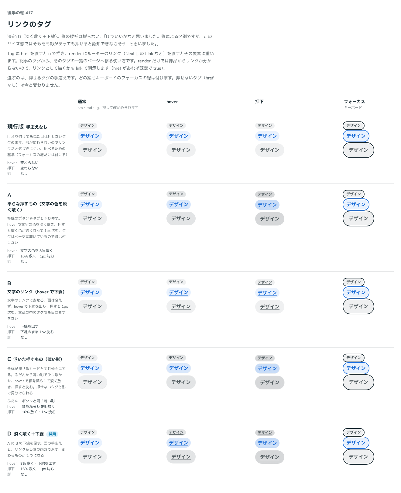

# 0397. リンクの Tag は、影のない平らな押すもの。hover で淡く敷いて下線を出し、押すと濃く敷いて沈む

- ステータス: Accepted
- 日付: 2026-10-01
- ラウンド: 後半 軸 417

## 背景

Tag に `href` を渡してリンクにしたとき、押せることをどう見せるかを決めました。押せないタグと形が同じだと、リンクだと気づけません。

## 候補

比較は、決めた時点のコミット `9429d10` の比較のストーリー（`design/stories/axis-417-tag-link.stories.tsx`）です。列は「通常」「hover」「押下」「フォーカス」です。

| 案        | 手応え                                                                     |
| --------- | -------------------------------------------------------------------------- |
| 現行版    | 変わらない（フォーカスの線だけ）                                           |
| A         | 平らな押すもの。hover で文字の色を淡く敷き、押すと濃く敷いて沈む。影なし   |
| B         | 文字のリンクに寄せる。hover で下線を出し、押すと沈む                       |
| C         | 浮いた押すもの。ふだんから薄い影、hover で影を減らして淡く敷き、押すと沈む |
| D（採用） | A に B の下線を足す。淡く敷いて下線を出し、押すと濃く敷いて沈む。影なし    |

## 決定

**D を採ります。** リンクの Tag は平らな押すものです。hover で文字の色を淡く敷いて下線を出し、押すと敷く色が濃くなって沈みます。影は付けません。

- 面の手応えと下線の両方で、押せることを返します
- 押せないタグ（`href` なし）の見た目は変わりません

## 理由

ユーザーの返事の原文です。

> D でいいかなと思いました。影による区別ですが、このサイズ感ではそもそも影があっても押せると認知できなさそう…と思いました。

## 却下した案と理由

- 現行版: 押せることが形から分からない
- A・B: 片方の手応えだけで、D より押せることが伝わりにくい
- C: 小さな部品では、影があっても押せると見分けにくい

## 影響

- `src/components/tag/Tag.tsx`: `link` の variant に、hover・押下の敷き方と下線、沈みを持ちます
- 比べるためだけに置いた `--tag-link-*` のトークンは、畳んで消しました（実装のコミット `8351dfd`）
- 比較のストーリーは消しました

## 原則への反映

原則 3 に、小さな押すものは影で浮かせず、平らな手応えに下線を添える、と書き足しました。

## 比較画像

決めた時点のコミットは `9429d10` です。`git checkout 9429d10 && pnpm storybook` で、比較のストーリー（`Design Review/417 リンクのタグ`）を決めたときの部品のまま開けます。
