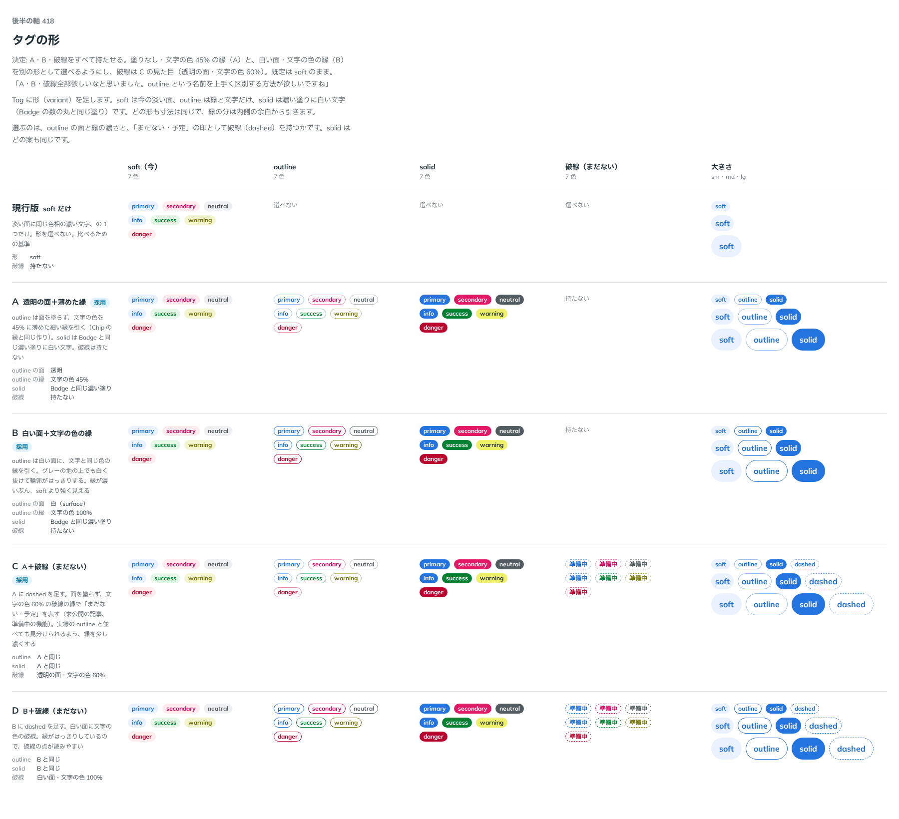

# 0398. Tag の形は soft（既定）・outline・surface・solid・dashed。outline と surface の呼び分けは Radix Themes の Badge に倣う

- ステータス: Accepted
- 日付: 2026-10-01
- ラウンド: 後半 軸 418

## 背景

Tag は淡い面の 1 つの形だけでした。形を選べるようにし、面なしの縁の形を 2 通りと、「まだない・予定」を表す破線の形を持つかを決めました。

## 候補

比較は、決めた時点のコミット `f4015bb` の比較のストーリー（`design/stories/axis-418-tag-variant.stories.tsx`）です。列は soft・outline・solid・破線・大きさです。

| 案        | outline                   | 破線                        |
| --------- | ------------------------- | --------------------------- |
| 現行版    | 選べない                  | 持たない                    |
| A（採用） | 面なし・文字の色 45% の縁 | 持たない                    |
| B（採用） | 白い面・文字の色の縁      | 持たない                    |
| C（採用） | A と同じ                  | 面なし・文字の色 60% の破線 |
| D         | B と同じ                  | 白い面・文字の色の破線      |

## 決定

**A・B・破線を、すべて持たせます。** 既定は `soft` のままです。

| variant   | 見た目                                        |
| --------- | --------------------------------------------- |
| `soft`    | 淡い面に同じ色相の濃い文字（既定）            |
| `outline` | 面なし・文字の色 45% の縁（A）                |
| `surface` | 白い面・文字の色の縁（B）                     |
| `solid`   | 濃い塗りに白い文字                            |
| `dashed`  | 面なし・文字の色 60% の破線の縁（C の見た目） |

- `outline` と `surface` の呼び分けは、Radix Themes の Badge に倣います。面を塗らず縁だけの形を `outline`、白い面に縁を引く形を `surface` とします
- `dashed` は、未公開の記事・準備中の機能のような、まだない・予定のものに使います

## 理由

ユーザーの返事の原文です。

> A・B・破線全部欲しいなと思いました。outline という名前を上手く区別する方法が欲しいですね

## 却下した案と理由

- D（白い面の破線）: 破線の見た目は面なしの C にしました
- 現行版（soft だけ）: 形を選べない

## 影響

- `src/components/tag/Tag.tsx`: `variant`（`soft`・`outline`・`surface`・`solid`・`dashed`、既定 `soft`）を持ちます
- 比べるためだけに置いた `--tag-outline-bg` は、畳んで消しました（実装のコミット `8815271`）
- 比較のストーリーは消しました

## 原則への反映

反映なし。形の追加で、原則 7（塗りか枠線か）の考えは変わりません。

## 比較画像

決めた時点のコミットは `f4015bb` です。`git checkout f4015bb && pnpm storybook` で、比較のストーリー（`Design Review/418 タグの形`）を決めたときの部品のまま開けます。
