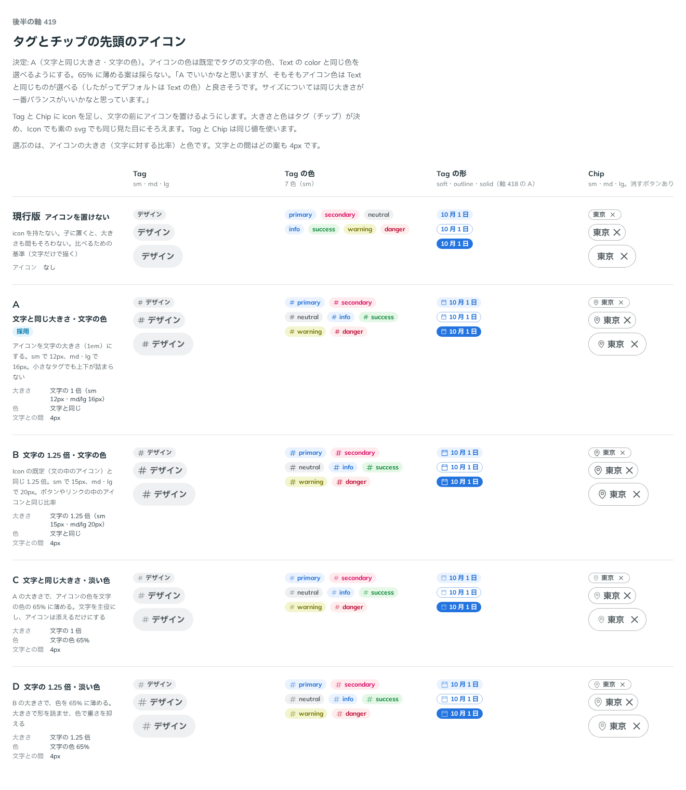

# 0399. Tag・Chip の先頭のアイコンは、文字と同じ大きさ。色は既定で文字の色で、iconColor で選べる

- ステータス: Accepted
- 日付: 2026-10-01
- ラウンド: 後半 軸 419

## 背景

Tag と Chip の文字の前に置くアイコンの、大きさと色を決めました。

## 候補

比較は、決めた時点のコミット `9429d10` の比較のストーリー（`design/stories/axis-419-small-parts-icon.stories.tsx`）です。列は Tag・Tag の色・Tag の形・Chip です。

| 案        | 大きさ         | 色             |
| --------- | -------------- | -------------- |
| 現行版    | アイコンなし   | なし           |
| A（採用） | 文字と同じ     | 文字の色       |
| B         | 文字の 1.25 倍 | 文字の色       |
| C         | 文字と同じ     | 文字の色の 65% |
| D         | 文字の 1.25 倍 | 文字の色の 65% |

## 決定

**A を採ります。** 先頭のアイコンは文字と同じ大きさで、色は既定で文字の色です。

- `iconColor` で、`color` と同じ色から選べます
- 65% に薄める案は採りません
- `solid` では `iconColor` を効かせません。濃い塗りの上では、文字と同じ白にします

## 理由

ユーザーの返事の原文です。

> A でいいかなと思いますが、そもそもアイコン色は Text と同じものが選べる（したがってデフォルトは Text の色）と良さそうです。サイズについては同じ大きさが一番バランスがいいかなと思っています。

## 却下した案と理由

- B・D: 文字の 1.25 倍は採りません。同じ大きさが一番バランスがよいと判断しました
- C・D: 65% に薄める案は採りません。既定は文字の色で、色は `iconColor` で選べます

## 影響

- `src/components/tag/Tag.tsx`・`src/components/chip/Chip.tsx`: `icon` と `iconColor` を持ちます
- `src/internal/small-parts-leading.ts`: Tag と Chip が使う先頭のアイコンの見た目です
- 比べるためだけに置いた `--small-parts-icon-scale`・`--small-parts-icon-mix` は、畳んで消しました（実装のコミット `8351dfd`）
- 比較のストーリーは消しました

## 原則への反映

原則 21 に、小物の中のアイコンは文字と同じ大きさで、色は文字の色、と書き足しました。

## 比較画像

決めた時点のコミットは `9429d10` です。`git checkout 9429d10 && pnpm storybook` で、比較のストーリー（`Design Review/419 タグとチップの先頭のアイコン`）を決めたときの部品のまま開けます。
