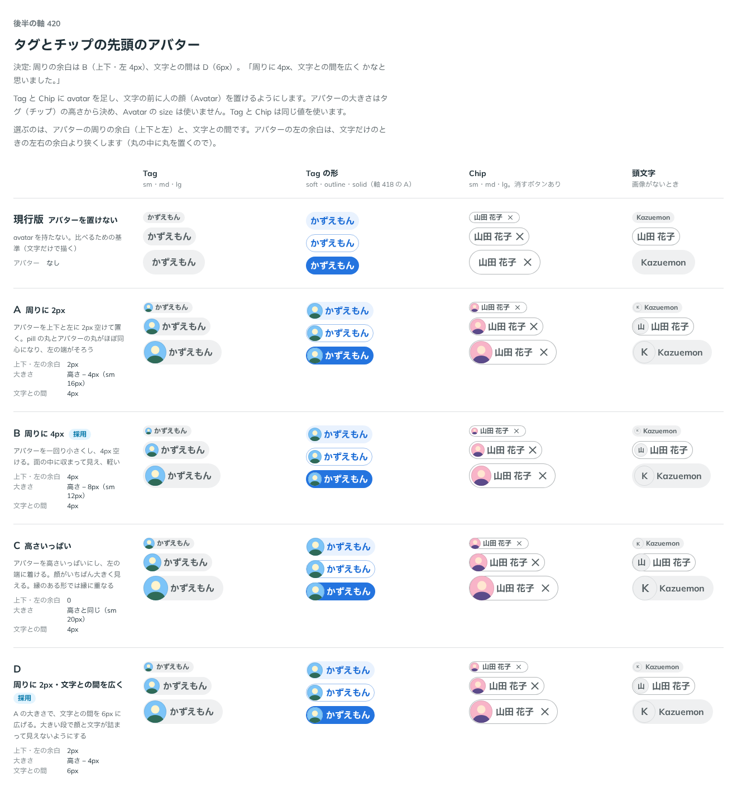

# 0400. Tag・Chip の先頭のアバターは、上下と左に 4px、文字との間は 6px

- ステータス: Accepted
- 日付: 2026-10-01
- ラウンド: 後半 軸 420

## 背景

Tag と Chip の文字の前に置くアバターの、周りの余白と文字との間を決めました。

## 候補

比較は、決めた時点のコミット `f4015bb` の比較のストーリー（`design/stories/axis-420-small-parts-avatar.stories.tsx`）です。列は Tag・Tag の形・Chip・頭文字です。

| 案        | 上下・左の余白 | 文字との間 |
| --------- | -------------- | ---------- |
| 現行版    | アバターなし   | なし       |
| A         | 2px            | 4px        |
| B（採用） | 4px            | 4px        |
| C         | 0              | 4px        |
| D（採用） | 2px            | 6px        |

## 決定

**周りの余白は B（4px）、文字との間は D（6px）を採ります。** アバターは一回り小さく、面の中に収まり、文字との間は広めです。

## 理由

ユーザーの返事の原文です。

> 周りに4px、文字との間を広く かなと思いました。

## 却下した案と理由

- A: 余白は 2px でなく 4px を採りました
- C: 縁のある形では縁に重なる

## 影響

- `src/internal/small-parts-leading.ts`: アバターの余白と文字との間を持ちます（Tag・Chip で共通）
- 比べるためだけに置いたトークンは、決めた値に畳みました（実装のコミット `8815271`）
- 比較のストーリーは消しました

## 原則への反映

反映なし。部品の中の余白の決定で、原則の文は変わりません。

## 比較画像

決めた時点のコミットは `f4015bb` です。`git checkout f4015bb && pnpm storybook` で、比較のストーリー（`Design Review/420 タグとチップの先頭のアバター`）を決めたときの部品のまま開けます。
