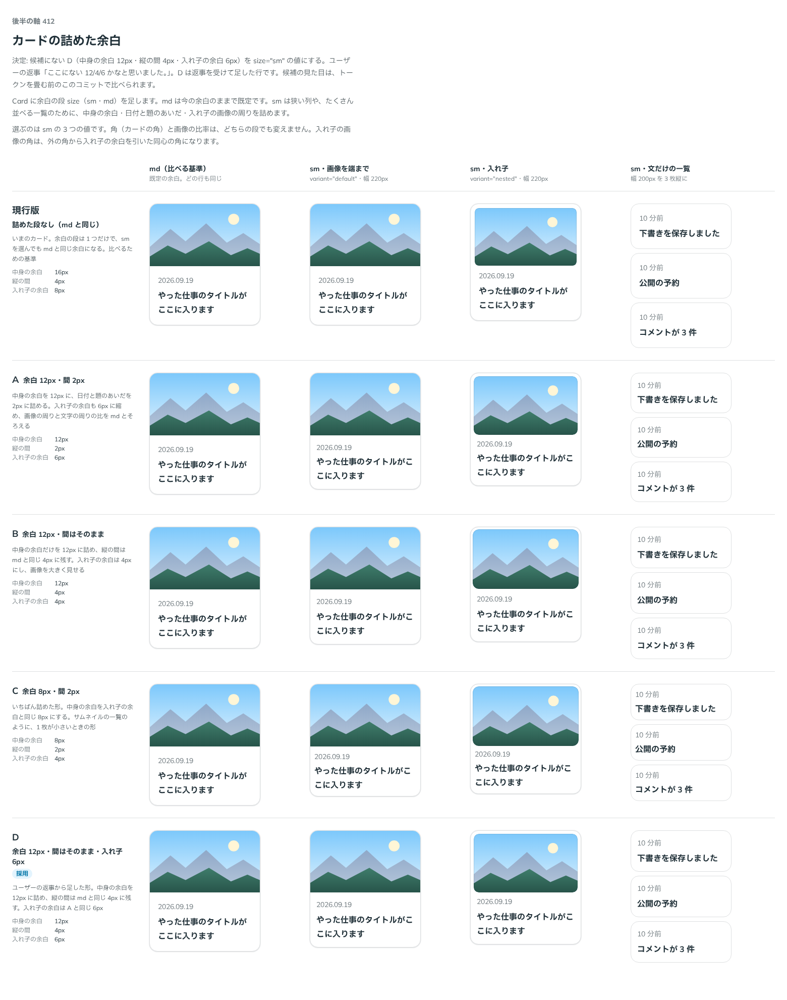

# 0402. Card の size="sm" は、中身の余白 12px・縦の間 4px・入れ子の余白 6px

- ステータス: Accepted
- 日付: 2026-10-01
- ラウンド: 後半 軸 412

## 背景

Card に、狭い列やたくさん並べる一覧のための詰めた余白の段（size="sm"）を足すにあたり、その値を決めました。md（既定）は今の余白のままです。

## 候補

比較は、比較のコミット `e5c7799` の比較のストーリー（`design/stories/axis-412-card-size.stories.tsx`）です。列は「md（比べる基準）」「sm・画像を端まで」「sm・入れ子」「sm・文だけの一覧」です。

| 案                              | 中身の余白 | 縦の間 | 入れ子の余白 |
| ------------------------------- | ---------- | ------ | ------------ |
| 現行版（md と同じ）             | 16px       | 4px    | 8px          |
| A                               | 12px       | 2px    | 6px          |
| B                               | 12px       | 4px    | 4px          |
| C                               | 8px        | 2px    | 4px          |
| D（採用・返事を受けて足した行） | 12px       | 4px    | 6px          |

## 決定

**D を size="sm" の値にします。** 中身の余白は 12px、縦の間は md と同じ 4px、入れ子の余白は 6px です。どの候補とも違う値です。

- 中身の余白だけを詰め、日付と題の間は md のまま保ちます
- 入れ子の余白は、画像の周りと文字の周りの比を md とそろえる値です
- 角と画像の比率は、どちらの段でも変えません

## 理由

ユーザーの返事の原文です。

> 412 ここにない 12/4/6 かなと思いました。

## 却下した案と理由

候補 A（間 2px）・B（入れ子 4px）・C（余白 8px）は、どれも候補の一部だけが合い、ユーザーの値と違いました。D の行は、返事を受けて足したものです。

## 影響

- `src/components/card/Card.tsx`: `size`（`sm`・`md`、既定 `md`）を持ちます
- `design/tokens.css`: `--card-padding-sm`・`--card-nested-inset-sm` を持ちます。縦の間の比較用だった `--card-gap-sm` は、md と同じになったので消しました
- 比較のストーリーは消しました

## 原則への反映

反映なし。余白の段を足す決定で、原則が新しく扱う対象は増えていません。

## 比較画像

決めた時点のコミットは比較が `e5c7799`、実装が `4bb49dc` です。`git checkout e5c7799 && pnpm storybook` で、比較のストーリー（`Design Review/412 カードの詰めた余白`）を決めたときの部品のまま開けます。
