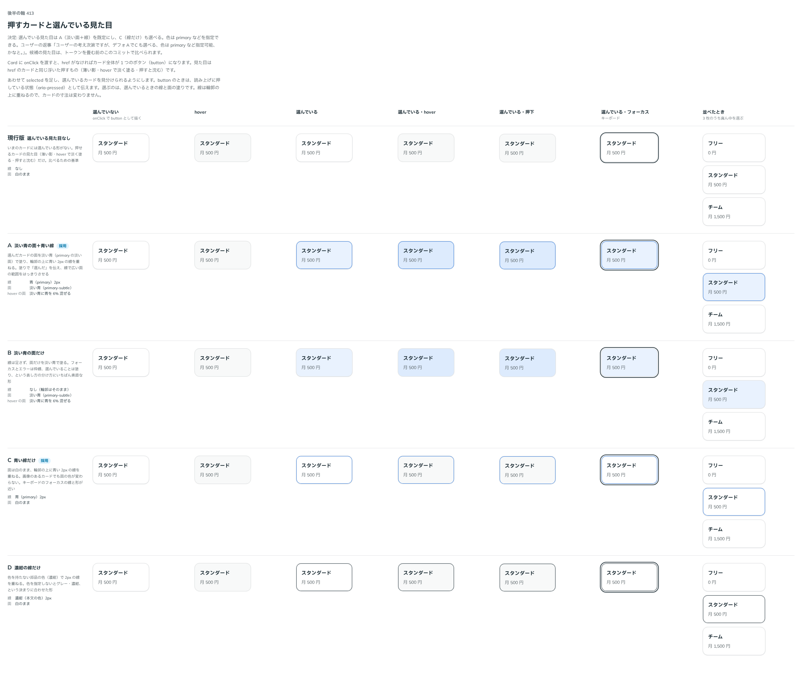

# 0403. Card の選んでいる見た目は、淡い面と線の重ねが既定。線だけも選べる

- ステータス: Accepted
- 日付: 2026-10-01
- ラウンド: 後半 軸 413

## 背景

押せるカード（onClick）で、選んでいるカードを見分ける見た目を決めました。選ぶのは、選んでいるときの線と面の塗りです。線は輪郭の上に重ねるので、カードの寸法は変わりません。

## 候補

比較は、比較のコミット `473bff0` の比較のストーリー（`design/stories/axis-413-card-selected.stories.tsx`）です。列は、選んでいない・hover・選んでいる・選んでいる＋hover・選んでいる＋押下・選んでいる＋フォーカス・3 枚並べたときです。

| 案                | 線       | 面       |
| ----------------- | -------- | -------- |
| 現行版            | なし     | 白のまま |
| A（採用・既定）   | 青 2px   | 淡い青   |
| B                 | なし     | 淡い青   |
| C（採用・選べる） | 青 2px   | 白のまま |
| D                 | 濃紺 2px | 白のまま |

## 決定

**A（淡い面＋輪郭に重ねる 2px の線）を既定にします。** C（線だけ）は `selectedIndicator="line"` で選べます。

## 理由

ユーザーの返事の原文です。

> 413 ユーザーの考え次第ですが、デフォAでCも選べる、色は primary など指定可能、かなと。

## 却下した案と理由

- B（面だけ）: ユーザーは選びませんでした（返事は A と C）
- D（濃紺の線だけ）: 濃紺の線は、色の選び方（[0404](./0404-card-selected-color.md)）の neutral に当たります

## 影響

- `src/components/card/Card.tsx`: `selected`・`selectedIndicator`（`fill`・`line`、既定 `fill`）を持ちます
- `design/tokens.css`: `--card-selected-line-width`・`--card-selected-hover-mix` を持ちます。比べるためだった線・面の色のトークンは消し、色は `color` から部品が作ります

## 原則への反映

反映なし。選んでいることを部品の色の塗りや印で示す決まり（原則 6）の範囲内です。まとめて原則に書くかは、0404 の「原則への反映」にあります。

## 比較画像

決めた時点のコミットは比較が `473bff0`、実装が `e3f28a0` です。`git checkout 473bff0 && pnpm storybook` で、比較のストーリー（`Design Review/413 押すカードと選んでいる見た目`）を決めたときの部品のまま開けます。
