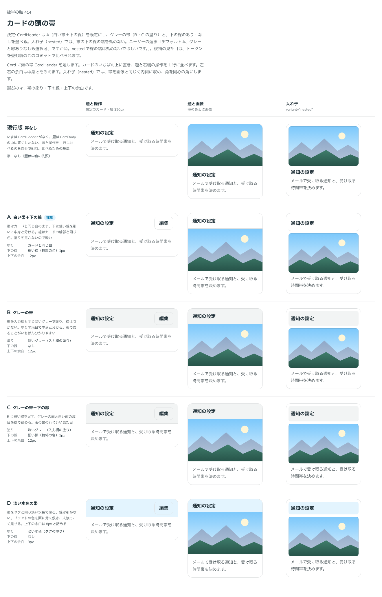

# 0405. CardHeader は、カードの面のままで下に細い線が既定。グレーの帯と線なしも選べる

- ステータス: Accepted
- 日付: 2026-10-01
- ラウンド: 後半 軸 414

## 背景

Card の頭の帯（CardHeader）の塗りと下の線を決めました。帯はカードのいちばん上に置き、題と右端の操作を 1 行に並べます。

## 候補

比較は、比較のコミット `473bff0` の比較のストーリー（`design/stories/axis-414-card-header.stories.tsx`）です。列は「題と操作」「題と画像」「入れ子」です。

| 案                | 塗り         | 下の線 | 上下の余白 |
| ----------------- | ------------ | ------ | ---------- |
| 現行版            | 帯なし       | -      | -          |
| A（採用・既定）   | カードと同じ | 細線   | 12px       |
| B（採用・選べる） | 淡いグレー   | なし   | 12px       |
| C                 | 淡いグレー   | 細線   | 12px       |
| D                 | 淡い水色     | なし   | 8px        |

## 決定

**A（カードの面のまま＋下の細い線）を既定にします。** `variant="filled"` でグレーの帯（B の塗り）になり、`hideDivider` で下の線を消せます。

## 理由

ユーザーの返事の原文です。

> 414 デフォルトA、グレーと線ありなしも選択可、ですかね。nested で線の端は丸めないでほしいです。

## 却下した案と理由

- C（グレー＋線）は、`variant="filled"` と線の組み合わせで作れます
- D（淡い水色）: ユーザーは選びませんでした（返事は A と、グレー・線の有無の選択）

## 影響

- `src/components/card/Card.tsx`: `CardHeader` の `variant`（`default`・`filled`、既定 `default`）と `hideDivider`（既定 `false`）を持ちます
- `design/tokens.css`: `--card-header-padding-y`・`--card-header-gap` を持ちます。帯の塗り・線のトークンは、部品が決めるので消しました

## 原則への反映

反映なし。面の塗りか線かの使い分け（原則 7）の範囲内です。

## 比較画像

決めた時点のコミットは比較が `473bff0`、実装が `e3f28a0` です。`git checkout 473bff0 && pnpm storybook` で、比較のストーリー（`Design Review/414 カードの頭の帯`）を決めたときの部品のまま開けます。
