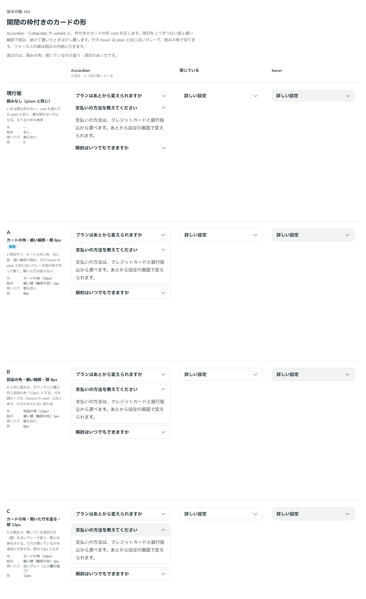

# 0407. Collapsible・Accordion の variant="card" は、カードの角・開いた行は塗らない・項目の間 8px が既定。開いた行を塗る指定も選べる

- ステータス: Accepted
- 日付: 2026-10-01
- ラウンド: 後半 軸 416

## 背景

Collapsible・Accordion に枠付きのカードの形（variant="card"）を足すにあたり、角・開いた行の塗り・項目の間を決めました。項目を 1 つずつ白い面と細い輪郭で囲み、続けて置いたときは少し離します。

## 候補

比較は、比較のコミット `473bff0` の比較のストーリー（`design/stories/axis-416-collapsible-card.stories.tsx`）です。列は「Accordion」「閉じている」「hover」です。

| 案                 | 角         | 開いた行   | 項目の間 |
| ------------------ | ---------- | ---------- | -------- |
| 現行版（囲みなし） | -          | 塗らない   | 0        |
| A（採用・既定）    | カードの角 | 塗らない   | 8px      |
| B                  | 部品の角   | 塗らない   | 8px      |
| C（塗りは選べる）  | カードの角 | 淡いグレー | 12px     |

## 決定

**A（カードの角・開いた行は塗らない・項目の間 8px）を既定にします。** `openFilled` で、開いた行を淡いグレーで塗る形（C の塗り）も選べます。

## 理由

ユーザーの返事の原文です。

> 416 カードの角、デフォルト塗りなし、塗りあり選択可。項目間8px、backlog で密度調整検討を足してください。

## 却下した案と理由

- B（部品の角）: ユーザーは「カードの角」を選びました
- C の間 12px: 間は 8px にしました。密度で間を変えるかは backlog に残しました

## 影響

- `src/internal/collapsible-styles.ts`・`src/components/collapsible/Collapsible.tsx`・`src/components/accordion/Accordion.tsx`: `variant="card"` と `openFilled`（既定 `false`）を持ちます
- Collapsible で行を中身の下に置く（`triggerPlacement="bottom"`）カードの形では、開いているあいだ行の上の角を丸めず、下の角を丸めます
- `design/tokens.css`: `--collapsible-card-gap` を持ちます。角・輪郭・面はカードと同じなので、比べるためだったトークンは消しました

## 原則への反映

反映なし。角はカードの角（原則 5）の範囲内です。

## 比較画像

決めた時点のコミットは比較が `473bff0`、実装が `e3f28a0` です。`git checkout 473bff0 && pnpm storybook` で、比較のストーリー（`Design Review/416 開閉の枠付きのカードの形`）を決めたときの部品のまま開けます。
