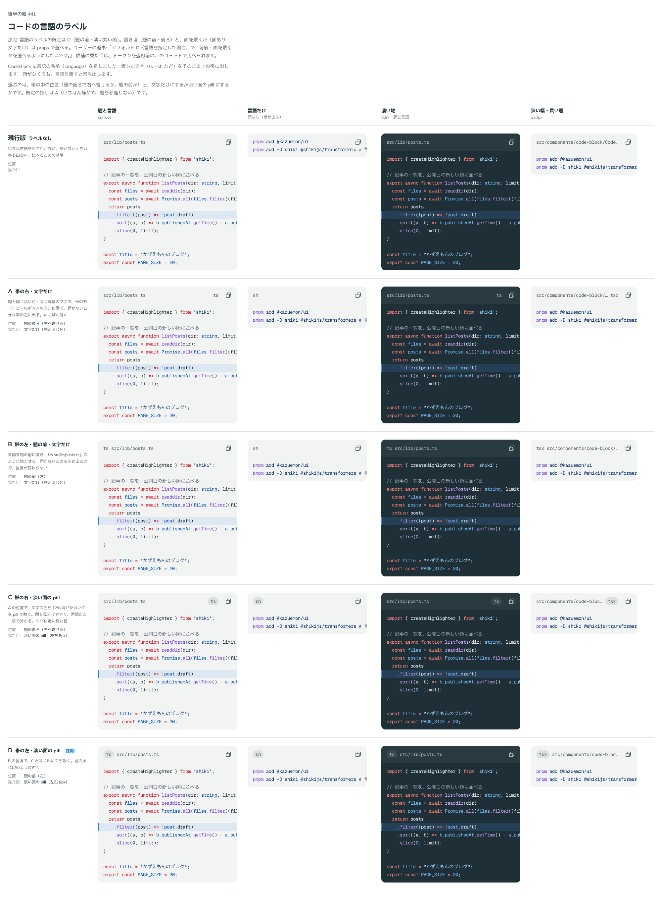

# 0408. CodeBlock の言語のラベルの既定は、題の前に淡い丸い面を敷く形。位置と面は選べる

- ステータス: Accepted
- 日付: 2026-10-01
- ラウンド: 後半 軸 441

## 背景

CodeBlock に言語の名前（`language`）を足すにあたり、帯の中の位置（題の前・後ろ）と、文字だけにするか淡い面を敷くかを決めました。題がなくても、言語を渡すと帯が出ます。

## 候補

比較は、決めた時点のコミット `8cf8d0d` の比較のストーリー（`design/stories/axis-441-code-block-language.stories.tsx`）です。列は「題と言語」「言語だけ」「濃い地」「狭い幅・長い題」です。

| 案              | 位置                       | 見た目     |
| --------------- | -------------------------- | ---------- |
| 現行版          | なし（言語を出す口がない） | なし       |
| A               | 題の後ろ（帯の右）         | 文字だけ   |
| B               | 題の前（帯の左）           | 文字だけ   |
| C               | 題の後ろ（帯の右）         | 淡い丸い面 |
| D（採用・既定） | 題の前（帯の左）           | 淡い丸い面 |

## 決定

**D（題の前・淡い丸い面）を既定にします。** 位置は `languagePlacement`（`start` が既定・`end`）で、面は `hideLanguageBackground` で、それぞれ選べます。

- 言語を指定したときだけ、題の頭に印のように付きます。題がなくても帯が出ます
- 面の色は文字の色を混ぜて作るので、濃い地でも同じ割合で淡く見えます
- 題の後ろ（`end`）や文字だけ（`hideLanguageBackground`）にもできます。コピーのボタンの左に静かに置きたいときに使います

## 理由

ユーザーの返事の原文です。

> 441 デフォルト D（言語を指定した場合）で、前後・面を敷くかを選べるようにしたいです。

## 却下した案と理由

A・B・C は、選べる形として残りました。既定にしなかった理由は、題と見分けがつきやすく、言語が一目で分かる D を選んだためです。

## 影響

- `src/components/code-block/CodeBlock.tsx`: `language`・`languagePlacement`（既定 `start`）・`hideLanguageBackground`（既定 `false`）を持ちます
- 比べるためだけに置いた `--codeblock-language-*` の 4 つの切り替えのトークンは、決まった値に畳み、tokens.css から消しました
- 比較のストーリーは消しました

## 原則への反映

反映なし。言語のラベルの置き方の決定で、原則が新しく扱う対象は増えていません。既定と選べる形（原則 20）の範囲内です。

## 比較画像

決めた時点のコミットは、比較が `8cf8d0d`、実装が `fee413b` です。`git checkout 8cf8d0d && pnpm storybook` で、比較のストーリー（`Design Review/441 コードの言語のラベル`）を決めたときの部品のまま開けます。
